我一直认为，学了编译原理，最后却没亲手写一个编译器出来，和没有学没什么区别。

懂的道理一大堆，题目都是秒杀，各种零碎的知识点信手拈来。而真要写代码的时候，直接嗝屁，多少有几分当年纸上谈兵的风采。难不成编译器不是在电脑上跑的? 在脑子里跑得再快，能快得过每秒$10^9$数量级的运算次数吗?

话说回来，同样的道理也可以用在数据库和操作系统上。尽管数据库我已经想好要怎么用编译原理的部分处理查询语句并执行查询，但操作系统果然还是需要更多知识才可以写出来。某种意义上来说，第一段的发言也算是站着说话不腰疼了吧。

## Outline

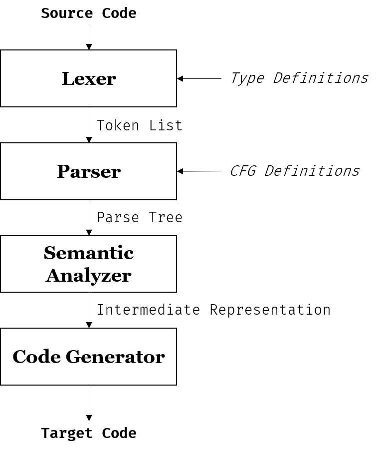

偷懒，所以没有写优化部分。

## Lexer

Lexer负责扫描输入字符串，根据正则表达式进行匹配。每匹配到一个token，就将该token加入到结果列表中。这就是所谓的Lexical Analysis。稍微上网搜了一下，似乎也有Scanner的叫法。

一个简单通俗的例子就是SQL中hello world级别的语句:

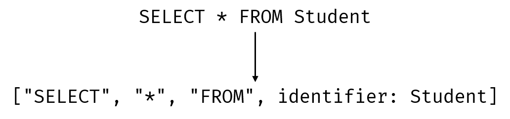

它会把输入字符串切分成若干个部分，并标注每个部分的类型。像是最后一个部分就是*标识符*。

再来看一个更加混乱的例子:

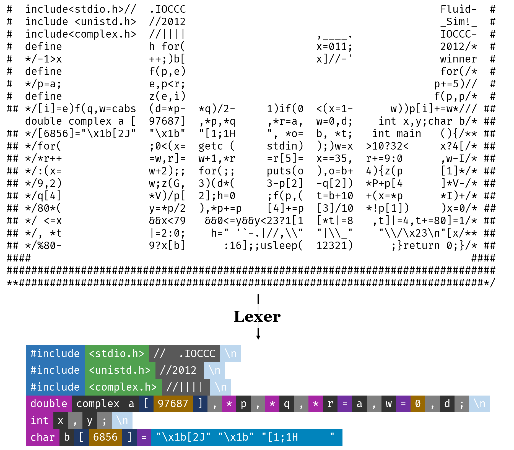

源代码来自[IOCCC](http://ioccc.org/2012/endoh1/hint.html)，作者是Yusuke Endoh。这是一段使用ASCII字符模拟液体流动的程序。由于是IOCCC的参赛作品，因此可以看到源代码着实混乱不堪。

在经过Lexer扫描过后，就会变成下半部分所展示的那样，被划分成了许多个类型不同的Token。每个Token的背景色代表着不同的类型。简单地对照表如下:

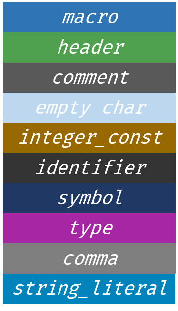

我希望能通过这样极度混乱的例子，说明Lexer的必要性。

当然，在实际的实现中并不会利用颜色来确定类型，而是会输出类似如下的内容:


上面出现的`Types.INT_CONSTANT, Types.MULTIPLY`等就是实际的类型了。

对于每个类型，我们都会定义一条正则表达式，说明其匹配规则。比如*标识符(identifier)*，可以用`r"\b([a-zA-z]|\_)([a-zA-z]|[0-9]|\_){0,32}\b"`来描述。

因此，单独使用一个枚举类，来定义所有类型:

```python
from enum import Enum


class Types(Enum):
    BLOCK_COMMENT = r"/(\*)(.|\n)*\*/"
    LINE_COMMENT = r"//.*"
    DOUBLE_CONSTANT = r"\b(-?)(0|([1-9][0-9]*))\.([0-9]+)?\b"
    LONG_CONSTANT = r"\b(-?)(0|[1-9]\d*)(L|l)\b"
    INT_CONSTANT = r"\b(-?)(0|[1-9]\d*)\b"
    INT = r"\bint\b"
    IDENTIFIER = r"\b([a-zA-z]|\_)([a-zA-z]|[0-9]|\_){0,32}\b"
    # ...
```

在定义好每个类型之后，就可以动手实现Lexer了。

若是按照书上的讲法，也就是手敲一个自动机出来，那应该先手写一个`graph.py`，再手写一个`automata.py`才对。但是我左思右想，这样好像还得写个正则表达式解析器，着实麻烦，也没有学习的价值。于是就直接抄轮子了。

```python
import re
from core.Types import Types
from core.myToken import Token


def parse(src_code):
    """
    return a list of Token object, generated by the input src_code
    """
    result = []
    token_regex = '|'.join('(?P<%s>%s)' % (_.name, _.value) for _ in Types)
    for mo in re.finditer(token_regex, src_code):
        if mo.lastgroup != 'SPACE':
            result.append(Token(mo[0], Types[mo.lastgroup]))
    return result
```

这里，通过`token_regex = '|'.join(...)`，把所有预先定义好的类型对应的正则表达式连接起来，方便轮子识别。

之后就是通过`re.finditer()`自动匹配即可。可以说是相当偷懒的做法了。

值得注意的是，所有在类型定义中出现的类型都是Terminal。不明白的话没有关系，在Parser部分会简单讲解。

## Parser

解析器。任务是将输入的Token List转换为一棵Parsing Tree。

举个例子，输入的是一条简单的SQL查询语句: `SELECT * FROM Student`，也就是选择`Student`表中所有的元素。

它对应的AST大致如下:

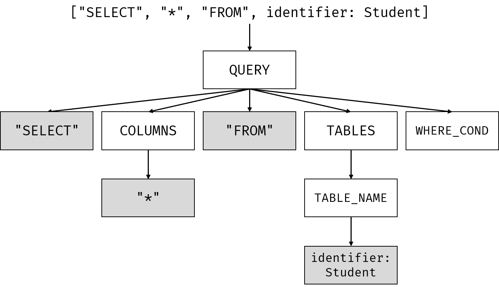

显然，AST中出现了一些输入串中没有声明过的东西，像是`WHERE_COND`，`TABLES`，`COLUMNS`等。这就涉及到[**上下文无关文法**](https://en.wikipedia.org/wiki/Context-free_grammar)了。

### CFG

严格的定义网上有很多，这里就不复制粘贴了----几个例子应该足以说明。

首先，为了简单地说明，所以使用一个非常简单的文法作为例子:

```
S -> "a"
```

其中，`S`是**non-terminal**，`"a"`是**terminal**。它们以`->`作为链接符，合起来就是一个**产生式**。

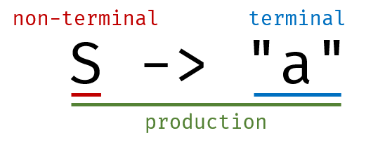

之所以叫这样的名字，是因为terminal不可能出现在`->`左侧。也就是说，它不可能再通过箭头，转变成其他什么内容，因而它可以被形象地理解为*终点*，也就是*terminal*。

而non terminal还可以通过上面这样的产生式，转换成箭头右边的内容。

上述的*"转换"*，有更加专业的术语，叫作***推导***。

所以，对于输入串`a`，可以简单地画出如下AST:

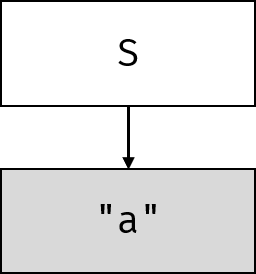

*注: 尽管没有强制要求，但是为了写代码的时候方便识别，所以我擅自规定了如下文法书写规范:*

- *terminal要在两旁加上双引号*
- *其他的符号都是non terminal，但尽量使用全大写字母和下划线来命名*
- *所有符号使用空格分割*

接下来稍微改写一下这一文法:

```
S -> S "a" | "a"
```

其中，`|`表示或。也就是说，对于符号`S`，既可以推导成`S "a"`，也可以推导成`"a"`。

所以，对于输入串`"aaa"`，可以简单地获得如下AST:

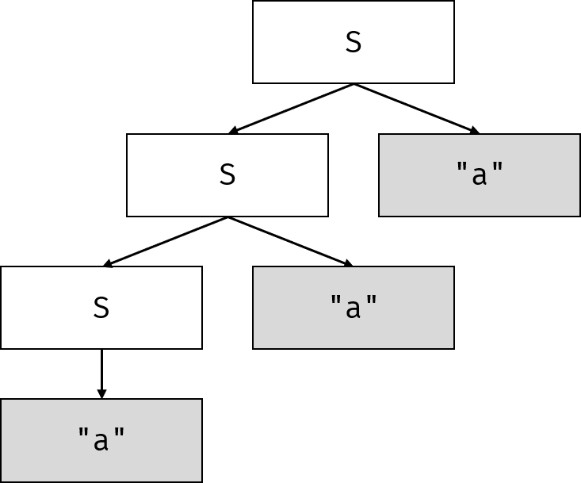

进阶一点，来看一个简易计算器的文法:

```
E -> E "+" T | E "-" T | T
T -> T "*" F | F
F -> "(" E ")" | "int_const"
```

由于在文法中融合了运算符优先级，因此不是那么好懂，但是仔细看看也还是能明白的。

考虑输入串`(2 + 3) * 5 - (7 + 11)`，它的AST如下:

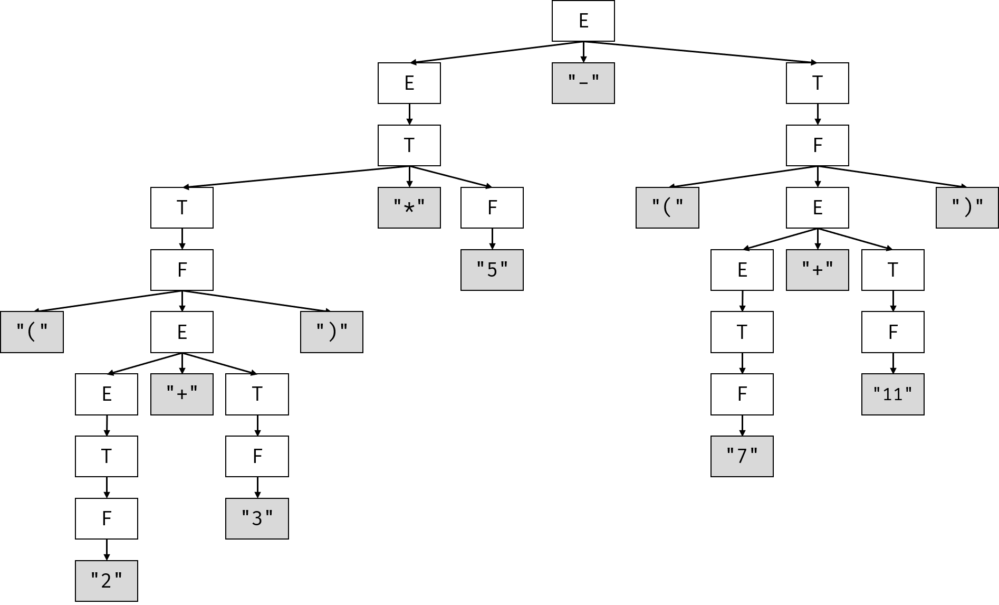

看起来稍微有点复杂，不过仔细观察一下多少也能看出几分意思来。

现在回头看看本节开头的SQL的AST，是否多少能明白其中的non-terminal的含义了呢?

作为参考，这里给出一份已简化的SQL的CFG定义:

```
START -> QUERY
QUERY -> "SELECT" COLUMNS "FROM" TABLES WHERE_COND
COLUMNS -> COLUMNS "," COLUMN | "*" | COLUMN
COLUMN -> COLUMN_NAME | TABLE_NAME "." COLUMN_NAME
COLUMN_NAME -> "identifier"
TABLES -> TABLES "," TABLE_NAME | TABLE_NAME
TABLE_NAME -> "identifier"
WHERE_COND -> "WHERE" EXPR | ""
...
```

其中，本节开头的AST，使用了以下产生式:

- `QUERY -> "SELECT" COLUMNS "FROM" TABLES WHERE_COND`
- `COLUMNS -> "*"`
- `TABLES -> TABLE_NAME`
- `TABLE_NAME -> "identifier"`
- `WHERE_COND -> ""`

值得注意的是，最后一条`WHERE_COND -> ""`将`WHERE_COND`推导成了空串。

*注: 这里为了我自己写代码方便，所以使用了`""`的形式表示空串。在正规的教程中，通常是使用$\varepsilon$来表示空串。因此，上述产生式若是严格书写，应当是如下形式:*
$$
\text{WHERE_COND} \to \varepsilon
$$

### Parsing Algorithms

为了生成AST，我们需要确定token list中的每个token分别应该放进哪个non terminal内，而这些non terminal又该放进哪个更高一层的non terminal内。这一过程被称为parsing，也就是分析。

最简单的方法自然是DFS枚举了。然而这样做，时间复杂度会非常可怕。分析所花费的时间会随着输入规模和文法复杂度的增加呈指数级的增长速度*（待证明）*。因此需要更快的分析方式。

LL(1)和LR(1)分别代指两种分析方法。它们都旨在对文法进行分析，生成状态转移表，进而提升解析速度。

我在代码中仅实现了LR(1)分析方法，所以讲道理是不用说明LL(1)分析方法的。但是，LR(1)使用了LL(1)中的`first`函数，因而有必要对这个函数简要加以介绍。

### 关于LL(1)和LR(1)的名字...

尽管大部分人都不会特别关注术语名字的由来，我还是认为简要的解释一下会更加有助于理解。

对于LL(1)，第一个*L*表示从**左**到右扫描token list，第二个*L*表示产生的是最**左**推导。括号中的1表示向前**展望**一个符号。*现在不理解展望不要紧，之后说明LR(1)分析方法的时候会再详细讲解。*

类似的，LR(1)的*R*表示产生的是最**右**推导。

这里的最左推导是指，总是选择当前产生式的最左non-terminal进行推导。相对的，最右推导就是指总是选择当前产生式的最右non-terminal进行推导。

对于非二义的文法来说，不论是最左推导还是最右推导，都不会因为二义性产生出不同的AST，因而在这里不会再详细叙述最左或最右推导的例子。

### First Set

`first`函数是用来求出对于**给定的符号序列**，**第一个可能出现的terminal**的集合的。

比方说，对于文法:

```
S -> "a" S | "b" S | "c" S
```

那么`first(S "d") = {"a", "b", "c"}`，因为`S`**可能推导出**`"a"`，`"b"`和`"c"`。

---

再来看更复杂一点的例子:

```
S -> V "=" E | E
E -> V
V -> "id" | "*" E
```

那么`first(S) = first(V "=" E) | first(E)`，`first(E) = first(V)`，`first(V) = {"id", "*"}`。

因此`first(V "=" E) = first(V)`，所以`first(S) = first(V) = first(E) = {"id", "*"}`。

*值得注意的是，`first(V "=" E) = first(V)`成立是因为`first(V)`不含$\varepsilon$，即空串。包含空串的情况更加复杂一些，稍后会解释。*

---

是不是以为`first`只看第一个符号就完事了? naïve!

由于空串的存在，问题变得复杂了起来。比方说对于文法:

```
S -> A B C
A -> "a" A | ""
B -> "b" B | ""
C -> "c"
```

由于`A -> ""`和`B -> ""`，所以产生式可能会变成`S -> B C`或者`S -> C`这样的情况。因此，`first(S) = {"a", "b", "c"}`。

上面的`first(V "=" E)`，如果有`V -> ""`这样的产生式存在的话，那么`first(V "=" E)`就等于`first(V) - {""} + first("=")`了。

因此，对于一条产生式`S -> A0 A1 A2 A3 A4 ... An-1`，可以简单地用如下代码说明`first(S)`的计算方式:

```python
EMPTY = ""

def first_of_sequence(sequence) -> dict:
    result = set()
    for i in range(n):
        has_empty = False
        current_symbol_first_set = first_of_non_terminal(sequence[i])
        if EMPTY in current_symbol_first_set:
            has_empty = True
        current_symbol_first_set.discard(EMPTY)
        result |= current_symbol_first_set
        if not has_empty:
            break
    return result
            
def first_of_non_terminal(non_terminal) -> dict:
    result = {}
    for production in productions[non_terminal]:
        result |= first_of_sequence(production)
    return result
```

还有一种情况需要考虑，如果`A0 ~ An-1`全部可以产生出空串的话，那这条产生式也可能产生出空串来。因此，需要在上述代码的基础上稍加改动:

```python
def first_of_sequence(sequence):
    result = set()
    all_has_empty = True
    for i in range(n):
        # ...
        if not has_empty:
            all_has_empty = False
            break
    if all_has_empty:
        result.add(EMPTY)
    return result
```

因此最后再稍加修缮，就能获得两个漂亮的函数。不过由于太长，这里就不贴了。详细实现请参见[`firstOfSym`](https://github.com/medioqrity/newCompilerTest/blob/master/Parser.py#L14)以及[`firstOfSeq`](https://github.com/medioqrity/newCompilerTest/blob/master/Parser.py#L30)。

尽管能够正确地求first了，但还是要注意，这两个函数是**不能处理包含左递归的文法的**情况的。

#### 什么是左递归?

很简单，这样的文法，就算是左递归了:

```
E -> E + T
```

来考虑对这一文法执行上述函数会发生什么样的情况。

在调用`firstOfSym(E)`的时候，会调用`firstOfSeq(E + T)`。而由于[`for sym in sequence`](https://github.com/medioqrity/newCompilerTest/blob/master/Parser.py#L40)和[`elif cfg.isNonTerminal(sym):`](https://github.com/medioqrity/newCompilerTest/blob/master/Parser.py#L44)以及[`allNonTerminalHasEmpty &= firstOfSym(result, cfg, sym, firstDict)
`](https://github.com/medioqrity/newCompilerTest/blob/master/Parser.py#L50)，它会又一次调用`firstOfSym(E)`，以上过程会无限循环，直到栈溢出。

因此，需要消除左递归。

#### 消除左递归的方法

对于$\textbf{S} \to \textbf{S}\alpha_0 \,|\, \textbf{S}\alpha_1 \,|\, ... \,|\, \textbf{S}\alpha_n \,|\, \beta_0 \,|\, \beta_1 \,|\, ... \,|\, \beta_m$，只需要将文法该写成如下形式:

$$
\begin{align*}
\textbf{S} &\to \beta_0\textbf{S'}
\,|\, \beta_1\textbf{S'} \,|\, \dots \,|\, \beta_{m}\textbf{S'} \\
\textbf{S'} &\to \alpha_0\textbf{S'} \,|\, \alpha_1\textbf{S'} \,|\, \dots \,|\, \alpha_{n}\textbf{S'} \,|\, \varepsilon
\end{align*}
$$


其中，$\alpha_i$和$\beta_i$均表示多个符号（terminal和non-terminal的统称）。

代码实现有些冗长，如有需求，请参阅[源码](https://github.com/medioqrity/newCompilerTest/blob/master/cfg.py#L138).

### LR(1) Parsing Algorithm Overview

首先，根据CFG计算Action和Goto表。比方说，对于文法:

```
START
START -> E
E -> E "+" T | E "-" T | T
T -> T "*" F | F
F -> "(" E ")" | "int_const"
```

我们可以通过**LR(1) Item Set自动机**获得如下**Action & Goto表**:

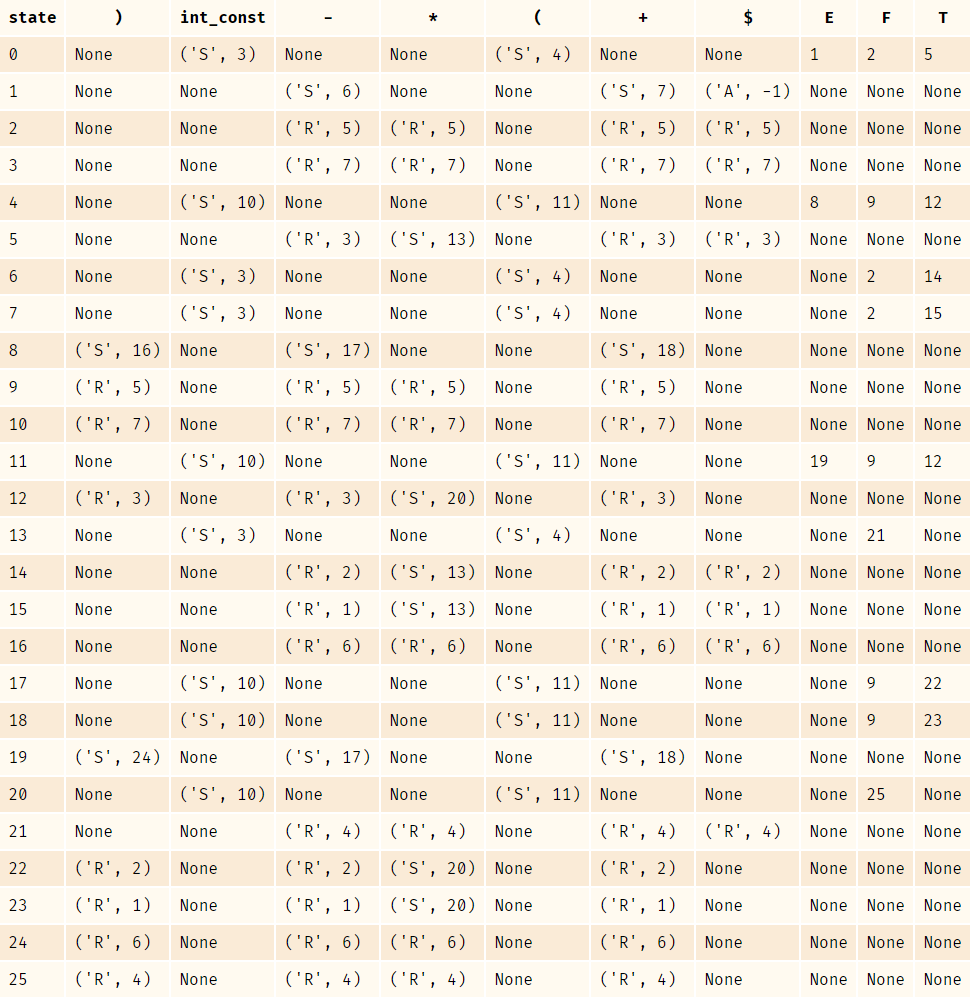

之后，根据处理好的Action & Goto表，利用**符号栈**和**状态栈**进行Shift & Reduce，即移进规约。以`1 * (2 + 3 * 4)`为例，符号栈和状态栈的状态变化如下:

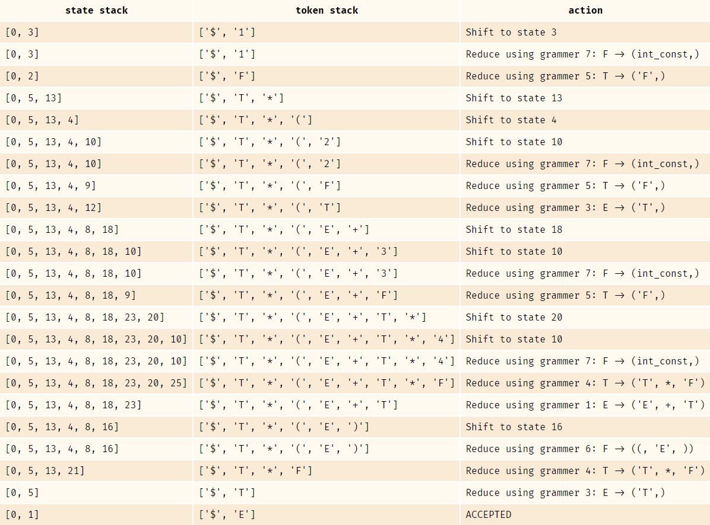

接下来简单说明一下LR(1) Item Set。

### LR(1) Item Set

首先给出结构:

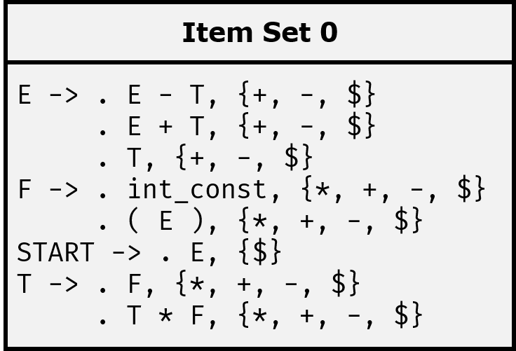

一个LR(1)项目集由多个LR(1)项目组成，也就是LR(1)Item。上图中，`E -> . E - T, {+, -, $}`、`E -> . E + T, {+, -, $}`都是LR(1)Item。

不过，为了能够让同属于一个non-terminal的LR(1) item都聚集在一起，我没有按照*LR(1)项目*和*LR(1)项目集*来实现。取而代之，我采用了grammar和production来描述多个拥有同一左侧non-terminal的LR(1) item:

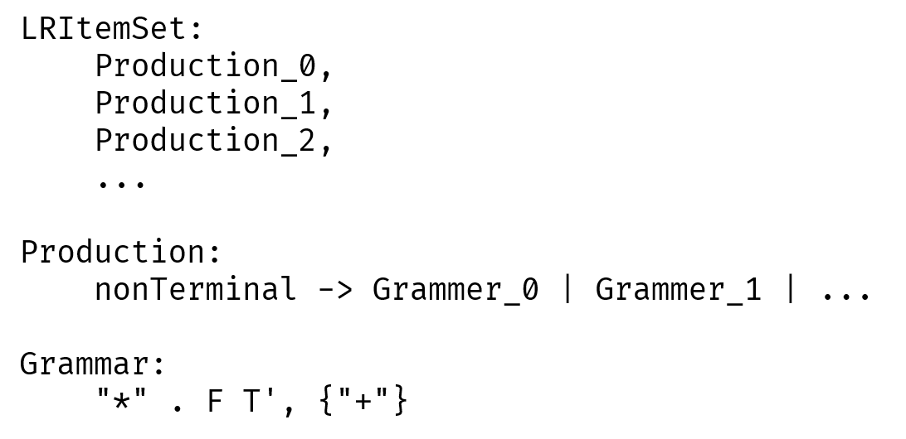

其中，Grammar由以下三部分组成:

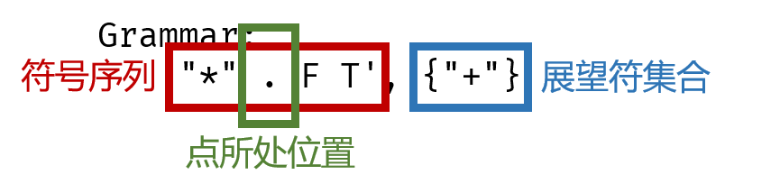

#### 为什么要加点?

每个项目中的点，表示parser在输入token list中所处的位置。

比方说，假定我们正在扫描SQL的最基本的查询语句:

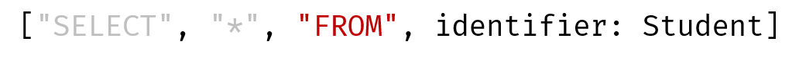

假定我们已经扫描完了`"SELECT"`和`"*"`，那么下一个将要扫描的token就是`"FROM"`。因此，按照文法`QUERY -> "SELECT" COLUMNS "FROM" TABLES WHERE_COND`来看的话，就应该把点放在`"FROM"`前。因而，对应的LR(1) Item Set就是这样:

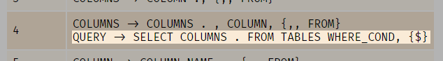

#### 为什么LR(1) Item Set有多个LR(1) Item?

我个人理解为，这是在**枚举所有可能的情况**。比方说，对于文法:

```
START
START -> E
E -> E "+" T | E "-" T | T
T -> T "*" F | F
F -> "(" E ")" | "int_const"
```

它的初始项目集在上面已经出现过，即:


在初始状态时，我们不能确定下一个token究竟是`E`还是`T`或者是`int_const`。因此，所有可能的情况都被列在这里。当确定了下一个token的时候，再计算下一个Item Set。

比方说，对于该初始项目集，如果下一个token是`int_const`，那么就应该获得`F -> int_const ., {*, +, -, $}`这样的LR(1)项目。

#### 为什么要使用展望符?

简而言之: 为了**确定规约条件**。

当一个项目可以规约的时候，它的**点**应该处于**产生式的末尾**。

比方说当到达了包含`F -> int_const .`的状态时，就可以将**符号栈**顶的`int_const`给pop掉，再把`F`给push进栈中。对应地，将状态栈的栈顶pop掉后，要根据新的栈顶状态，通过查询Goto表，确定该状态通过`F`能够到达的状态，并将该状态push进状态栈。

尽管我已经尽可能用简短地语言来描述，总归还是不是那么容易理解的。因此，来看看下面的例子:

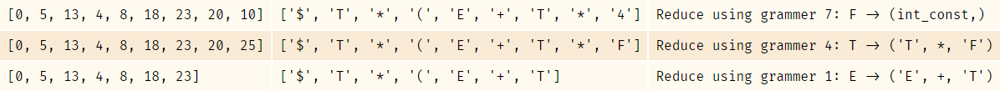

在第一行中，符号栈栈顶是`4`，状态栈栈顶是10。在表中没有体现，但下一个输入字符是`)`。

根据Action表:

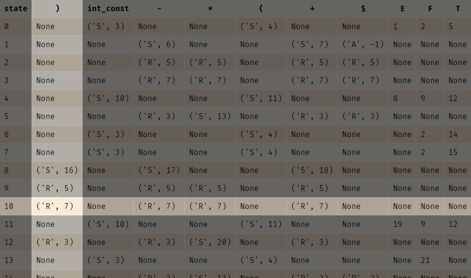

`('R', 7)`表示按照第7个语法进行规约(**R**educe)，也就是`F -> int_const`。因此，符号栈栈顶从`4`变成了`F`。

状态栈在pop掉状态10之后，要查看从新的栈顶出发，经由`F`能够到达哪个状态。因此，根据Goto表:

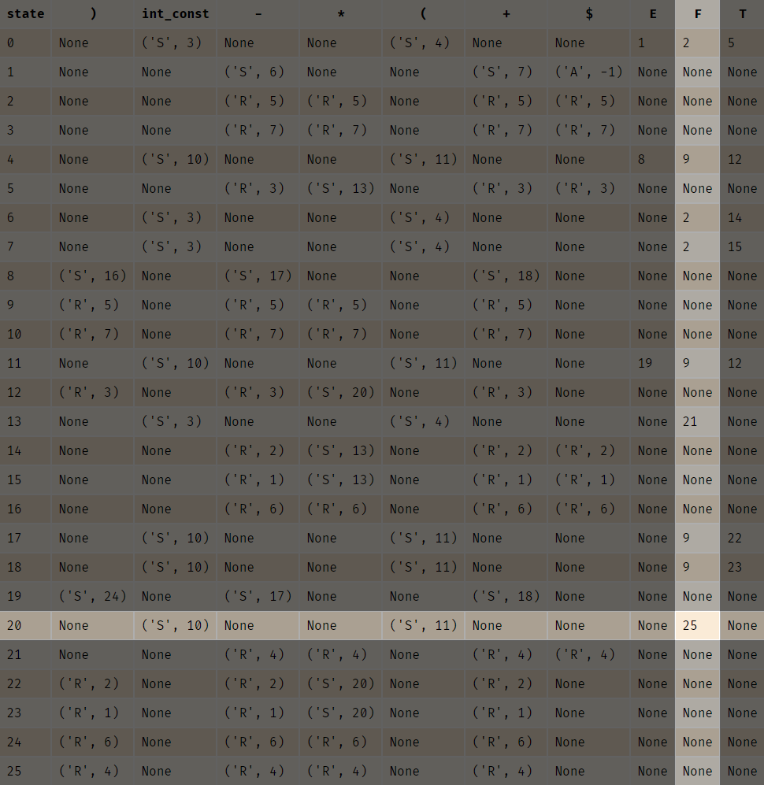

答案是前往状态25。因此，状态栈栈顶变成了25。

但是，**并不是所有点在末尾的情况都是可以规约的**。

考虑如下CFG:

```
S -> A "=" B
A -> "identifier"
B -> "int_const"
```

如果输入是`a = 2 = 3`的话，那么在按照`B -> "int_const"`规约的时候，会发现token list中下一个token是`=`。

显然，对于`B`来说，只有下一个token是`$`，也就是输入串的末尾时，才应该规约。因此，尽管这里出现了点在末尾的情况，但如果下一个token不是`$`，就应该报错。

这就是展望符的作用: **确定在当前产生式后面可能跟着哪些token**。

它的计算方式也很简单。只不过因为涉及到项目集**闭包**的计算，因此会放到后面一起说明。在说明完了结构之后，就可以开始实现了。

首先是Grammar类:

```python
class Grammar:
    """
    consists of a sequence of terminals and non-terminals, 
    with additional dotPosition and look forward set offered for LR(1) analyze.
    """
    def __init__(self, sequence, dotPosition = 0, lookForward = None):
        self.sequence = sequence
        self.dotPosition = dotPosition
        if lookForward is None:
            lookForward = set()
        self.lookForward = lookForward
    
    def __eq__(self, other):
        return self.sequence == other.sequence and \
               self.dotPosition == other.dotPosition and \
               self.lookForward == other.lookForward
        
    def __hash__(self):
        return hash((self.sequence, self.dotPosition, \
                     tuple(sorted(self.lookForward))))
    
    def __str__(self):
        return "%s, {%s}" % (
            ' '.join(
                [str(_) for _ in self.sequence[:self.dotPosition]] + 
                ["."] +
                [str(_) for _ in self.sequence[self.dotPosition:]]),
            ', '.join([str(_) for _ in self.lookForward])
        )
    
    def __repr__(self):
        return "'%s'" % str(self)
    
    def __iter__(self):
        yield self.sequence
        yield self.dotPosition
        yield self.lookForward
    
    def __lt__(self, other):
        return (self.sequence, self.dotPosition, len(self.lookForward)) < \
            (other.sequence, other.dotPosition, len(other.lookForward))
```

然后是Production类:

```python
class Production:

    def __init__(self, left, right):
        """
        Initialize a Production instance.
        left: Nonterminal
        right: (grammar0, grammar1, grammar2, ...)
        """
        self.left, self.right = left, right

    def __hash__(self):
        return hash((self.left, self.right))

    def __eq__(self, other):
        return self.left == other.left and self.right == other.right

    def __repr__(self):
        return "%s -> %s" % (self.left, ('\n' + ' ' * (len(self.left) + len(' -> '))).join([str(_) for _ in sorted(self.right)]))

    def __str__(self):
        return repr(self)

    def __lt__(self, other):
        if self.left == other.left:
            return self.right < other.right
        return self.left < other.left

    def __iter__(self):
        yield self.left
        yield self.right
```

#### LR(1) Item Set Closure

对于LR(1) Item `E -> . E + T, {$}`来说，点后面跟着的是non-terminal `E`。因为LR(1) Item Set是在**枚举所有可能的情况**，所以这个`E`需要展开。由于`E -> E + T | E - T | T`，因而在*一次*迭代后，它会变成:

```
E -> . E + T, {$}
E -> . E + T, {+}
E -> . E - T, {+}
E -> . T, {+}
```

注意到产生了展望符为`{+}`的LR(1) Item。这是因为，对于`E -> . E + T, {$}`来说，在当前点位置后，向后展望**一**个符号，得到的是`+`。

更规范的说，展望符的求法如下:

对于产生式$\textbf{S} \to \alpha_0 \alpha_1\, ... \, \alpha_n \cdot \textbf{T} \beta_0 \beta_1 \, ... \, \beta_m, \{\gamma_0, \,...,\, \gamma_v\}$，其中$\forall i \in [0, n], \forall j \in [0, m] $，$\alpha_i, \beta_j$均任意指代terminal或non-terminal或者$\varepsilon$、$\forall k \in [0, v]$，$\gamma_k$均指代任意terminal。那么在求闭包时，应当加入如下LR(1) Item: $\forall i, \textbf{T} \to \cdots, \text{first(}\beta_0 \beta_1 \, ... \, \beta_n \gamma_i\text{)}$。

这是很显然的，因为`first`函数求出的是这一序列可能出现的第一个terminal的集合，而这序列又是在**当前符号后可能出现的所有符号**。因此，**对$\beta_0\beta_1\,...\,\beta_n\gamma_i$所求得的`first`集就等同于*点*到达当前产生式右部末尾时，后面可能出现的terminal的集合。**只有下一个token处在该terminal集合中，才可以进行规约。

我们可以根据这个简单地写出代码:

```python
class LRItemSet:
    
    def updateClosure(self, assistFirstDict=None):
        """
        update the self.productions to its closure
        """
        result = {}
        que = deque([(nonTerminal, grammar) for nonTerminal, grammarList in self.productions for grammar in grammarList])

        while que:
            nonTerminal, grammar = que.popleft()
            result.setdefault(nonTerminal, set()).add(grammar)
            currentSymbol = grammar.getElementAtPosition()
            for currentNextSymbol in grammar.lookForward:
                nextSymbols = calculateFirstOfSequence(
                    self.cfg,
                    grammar.getElementsAfterPosition(offset=1) + (currentNextSymbol, ), 
                    assistFirstDict
                )
                if currentSymbol in self.cfg.keys():
                    for sequence in self.cfg[currentSymbol]:
                        for nextSymbol in nextSymbols:
                            if nextSymbol != EMPTY:
                                newGrammar = Grammar(sequence, lookForward={nextSymbol})
                                if currentSymbol not in result or newGrammar not in result[currentSymbol]:
                                    que.append((currentSymbol, newGrammar))
        for k, v in result.items():
            self.productions.add(Production(k, tuple(v)))
        self.reduceForward()
```

其中`grammar.getElementAfterPosition()`实现如下:

```python
class Grammar:

    def getElementsAfterPosition(self, position = None, offset = 0):
        if position is None:
            position = self.dotPosition
        position += offset
        if position >= len(self.sequence):
            return tuple()
        return self.sequence[position:]
```

不过求完闭包之后，会出现产生式右侧相同，差别仅有展望符集合的LR Item。像是:

```
E -> . E + T, {$}
E -> . E + T, {+}
```

这两个LR(1) Item就可以被合并为`E -> . E + T, {$, +}`

因此需要将它们合并:

```python
    def reduceForward(self):
        result = {}
        for nonTerminal, grammarList in self.productions:
            temp = {}
            for sequence, dotPosition, lookForward in grammarList:
                temp.setdefault((sequence, dotPosition), set())
                temp[(sequence, dotPosition)] |= lookForward
            l = set()
            for (sequence, dotPosition), lookForward in temp.items():
                l.add(Grammar(sequence, dotPosition, lookForward))
            result.setdefault(nonTerminal, set())
            result[nonTerminal] |= l
        self.productions.clear()
        for nonTerminal, grammarList in result.items():
            self.productions.add(Production(nonTerminal, tuple(grammarList)))
```

接下来补全剩下的部分就好。

```python
class LRItemSet:

    def __init__(self, cfg):
        self.productions = set()
        self.cfg = cfg
    
    def add(self, production):
        assert isinstance(production, Production)
        self.productions.add(production)

    def __hash__(self):
        return hash(tuple(self.productions))

    def __str__(self):
        return '\n'.join([str(_) for _ in sorted(self.productions)])

    def __repr__(self):
        return "'%s'" % str(self)

    def __eq__(self, other):
        return self.productions == other.productions

```

### LR(1) Item Set Automata

所谓自动机，就是从状态通过一定条件跳转到其他状态。

下图非常直观的展示了不同LR(1) Item Set之间的关系，以及它们是如何形成自动机的:

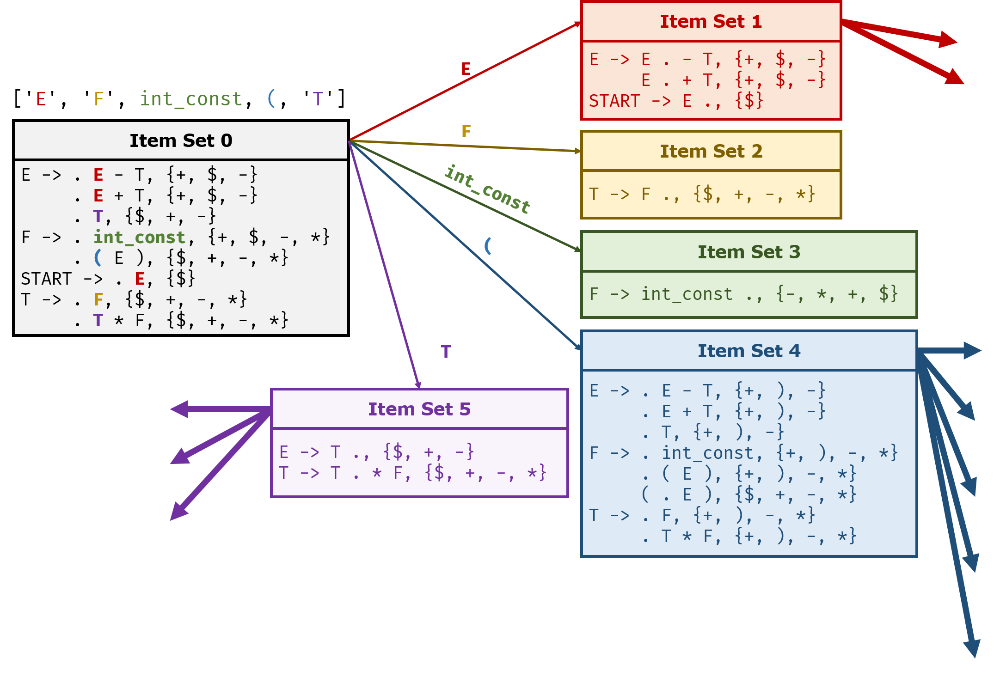

显然，我们可以通过BFS来完成对所有项目集的搜索。使用伪代码说明，大致如下:

```python
queue = deque([initItemSet])  # double ended queue
visitedItemSet = set(initItemSet)
while queue:
    currentItemSet = queue.front()
    queue.popFront();
    for nextSymbol currentItemSet.getNextSymbol():
        newItemSet = currentItemSet.goto(nextSymbol)
        if newItemSet not in visitedItemSet:
            visitedItemSet.add(newItemSet)
            queue.pushBack(newItemSet)
```

这里的`currentItemSet.getNextSymbol()`是用于获取所有可能的**出边**的，也就是类似于上面的`['E', 'F', int_const, (, 'T']`这种:

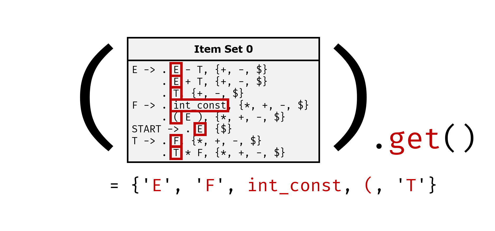

这只需要获取每个Production的出边，取并集即可。代码如下:

```python
class LRItemSet:

    def get(self):
        """
        return a set containing every character next to the dot
        """
        result = set()
        for production in self.productions:
            result |= production.get()
        result.discard(EMPTY)
        return result
```

其中，`production.get()`的实现如下:

```python
class Production:
    
    def get(self) -> set:
        """
        get every char at the dot Position
        """
        result = set()
        for grammar in self.right:
            result.add(grammar.getElementAtPosition())
        result.discard(None)
        return result
```

`grammar.getElementAtPosition()`实现如下:

```python
class Grammar:

    def getElementAtPosition(self, position = None, offset = 0):
        """
        grammar.getElementAtPosition(offset=1) -> look 1 element forward, LR(1)
        """
        if position is None:
            position = self.dotPosition
        position += offset
        if position >= len(self.sequence):
            return None
        return self.sequence[position]
```

另外一个非常重要的方法就是`goto()`:

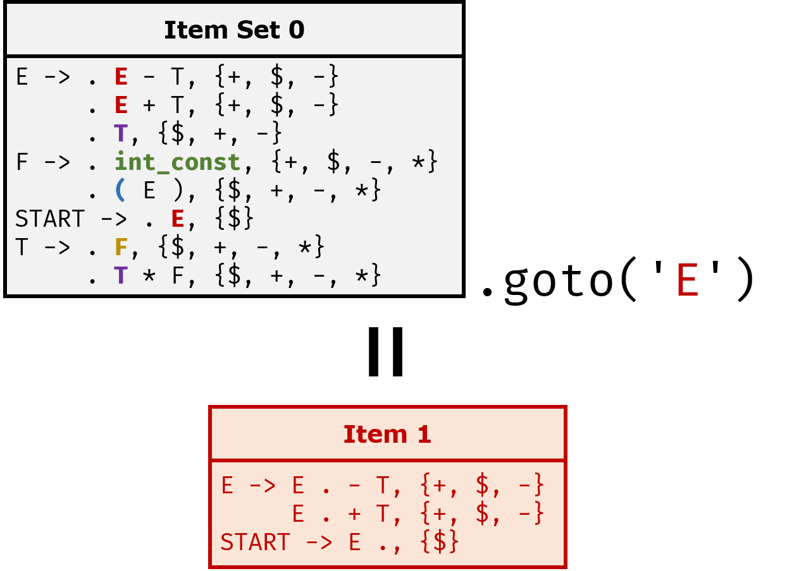

它的实现如下:

```python
class LRItemSet:

    def goto(self, step, assistFirstDict=None):
        """
        return a new LRItem object which is the result of applying `goto` on every production
        assistant First Dictionary is used for accelerating the calculation speed
        """
        result = LRItemSet(self.cfg)
        for production in self.productions:
            newProduction = production.goto(step)
            if newProduction is not None:
                result.add(newProduction)
        result.updateClosure(assistFirstDict)
        return result
```

其中，`production.goto(step)`实现如下:

```python
class Production:

    def goto(self, step):
        result = []
        for grammar in self.right:
            if step == grammar.getElementAtPosition():
                result.append(Grammar(grammar.sequence, grammar.dotPosition + 1, grammar.lookForward))
        return Production(self.left, tuple(result)) if result else None
```

这样，我们就可以将上述BFS通过代码实现:

```python
def generateActionAndGoto(cfg, cfgForFirst=None):

    initProduction = Production(START_SYMBOL, (Grammar(cfg[START_SYMBOL][0], lookForward={Types.TERMINAL}), ))

    item = LRItemSet(cfg)
    item.add(initProduction)
    item.updateClosure(firstDict)

    acceptItem = item.goto(min(initProduction.get()), firstDict)  # min(...) means to get the only item in the set

    # BFS
    itemToID = {}  # map LRItem to an id
    que = deque()
    que.append(item)
    edges = []

    while que:
        cur = que.popleft()
        if cur not in itemToID:
            itemToID[cur] = len(itemToID)
        for nextStep in sorted(cur.get()):
            nextItem = cur.goto(nextStep, firstDict)
            if nextItem not in itemToID:
                que.append(nextItem)
            edges.append((cur, nextStep, nextItem))
```

~~因为偷懒，所以所有的Item Set都被简写成了Item，毕竟我用的是production和grammar来描述Item Set的，不用担心和Item重名的情况。~~

注意到这里使用了一个字典`itemToID`来记录已经出现过的LR Item Set，而不是一个普通的`set`，这是因为需要给每个状态进行编号。

#### `if nextItem not in itemToID?`

另外一个值得注意的细节就是这里的`in`关键字了。python dict到底是怎么判定一个自定义的类对象是否存在于字典中的呢?

因为以前一直不太清楚python dict lookup algorithm，所以在一开始自定义LRItemSet的时候只写了`__hash__()`，却没有写`__eq__()`，于是会出现那种明明是已经出现过的元素，却会被判定为没有出现过，于是又加入队列中，导致无尽BFS。

后来去看了一下python的[源代码](https://github.com/python/cpython/blob/master/Objects/dictobject.c):

```c
static Py_ssize_t _Py_HOT_FUNCTION
lookdict(PyDictObject *mp, PyObject *key,
         Py_hash_t hash, PyObject **value_addr)
{
    size_t i, mask, perturb;
    PyDictKeysObject *dk;
    PyDictKeyEntry *ep0;

top:
    dk = mp->ma_keys;
    ep0 = DK_ENTRIES(dk);
    mask = DK_MASK(dk);
    perturb = hash;
    i = (size_t)hash & mask;

    for (;;) {
        Py_ssize_t ix = dictkeys_get_index(dk, i);
        if (ix == DKIX_EMPTY) {
            *value_addr = NULL;
            return ix;
        }
        if (ix >= 0) {
            PyDictKeyEntry *ep = &ep0[ix];
            assert(ep->me_key != NULL);
            if (ep->me_key == key) {
                *value_addr = ep->me_value;
                return ix;
            }
            if (ep->me_hash == hash) {
                PyObject *startkey = ep->me_key;
                Py_INCREF(startkey);
                int cmp = PyObject_RichCompareBool(startkey, key, Py_EQ);
                Py_DECREF(startkey);
                if (cmp < 0) {
                    *value_addr = NULL;
                    return DKIX_ERROR;
                }
                if (dk == mp->ma_keys && ep->me_key == startkey) {
                    if (cmp > 0) {
                        *value_addr = ep->me_value;
                        return ix;
                    }
                }
                else {
                    /* The dict was mutated, restart */
                    goto top;
                }
            }
        }
        perturb >>= PERTURB_SHIFT;
        i = (i*5 + perturb + 1) & mask;
    }
    Py_UNREACHABLE();
}
```

因此，首先python会计算key的hash值，然后在计算出hash值后，需要进行如下判断:

- 如果这个hash值对应的位置是空的，说明这个值还没有被加入

- 否则:

    - 如果两个key的地址都是一样的（`PyObject *key, PyDictEntryKey *ep->me_key`），等价于python中的`key is me_key`，说明是同一个object，自然得返回下标了。

        为了确定`ep->me_key`的类型，我去找了一下，这是`PyDictEntryKey`的[定义](https://github.com/python/cpython/blob/master/Objects/dict-common.h):

        ```c
        #ifndef Py_DICT_COMMON_H
        #define Py_DICT_COMMON_H
        
        typedef struct {
            /* Cached hash code of me_key. */
            Py_hash_t me_hash;
            PyObject *me_key;
            PyObject *me_value; /* This field is only meaningful for combined tables */
        } PyDictKeyEntry;
        ```

        可以看到，`ep->me_key`确实是一个`PyObject *`，所以`key == ep->me_key`等于在比较地址。

    - 如果不是同一个object，就判断一下hash值是否相同。

        只是hash相同是不够的，因为可能出现hash冲突的问题，因此还需要调用`__eq__()`方法，也就是上面代码中的`int cmp = PyObject_RichCompareBool(startkey, key, Py_EQ);`。

因此，光提供`__hash__()`方法是不够的，还需要提供`__eq__()`方法。

所以，在`Grammar, Production, LRItemSet`类中，我都提供了`__hash__()`和`__eq__()`方法:

```python
class Grammar:
        
    def __hash__(self):
        return hash((self.sequence, self.dotPosition, \
                     tuple(sorted(self.lookForward))))
    
    def __eq__(self, other):
        return self.sequence == other.sequence and \
               self.dotPosition == other.dotPosition and \
               self.lookForward == other.lookForward

class Production:

    def __hash__(self):
        return hash((self.left, self.right))

    def __eq__(self, other):
        return self.left == other.left and self.right == other.right

class LRItemSet:

    def __hash__(self):
        return hash(tuple(self.productions))

    def __eq__(self, other):
        return self.productions == other.productions
```

### Action & Goto

Action表是记录每个状态对应不同**terminal**所要做的动作的。表项格式如下:

`(Action, State / Grammar ID)`

更具体地说，`('S', 7)`表示**S**hift to state **7**，`('R', 5)`表示**R**educe by grammar id **5**，`('A', -1)`表示输入串已经**A**ccepted，解析完成。

很显然，既然自动机可以看作一个有向图，那么有向图中每条terminal的边都是Shift，毕竟是从某个状态转移到其他状态。

对于规约，也就是Reduce，每个项目集中，点处在产生式末尾的LR(1) Item，都是可供规约的。所以，不难写出如下代码:

```python
    for source, step, destination in edges:
        if step in cfg.terminals:
            action[itemToID[source]][step] = ("S", itemToID[destination])
    for k, v in itemToID.items():
        for nonTerminal, grammarList in k.productions:
            for sequence, dotPosition, lookForward in grammarList:
                if sequence == ("", ) or dotPosition == len(sequence):  # reduce
                    for forwardSymbol in lookForward:
                        action[v][forwardSymbol] = ("R", cfg.grammarID[(nonTerminal, sequence)])
```

Goto表是记录每个状态对应不同**non-terminal**所要转移到的状态的，因此只需要稍微改一下上述代码即可:

```python
    for source, step, destination in edges:
        if step in cfg.terminals:
            action[itemToID[source]][step] = ("S", itemToID[destination])
        else:
            goto[itemToID[source]][step] = itemToID[destination]
```

最后返回这两个表即可:

```python
    return action, goto
```

在实现了`__str__()`之后，就能看到漂亮的输出啦:

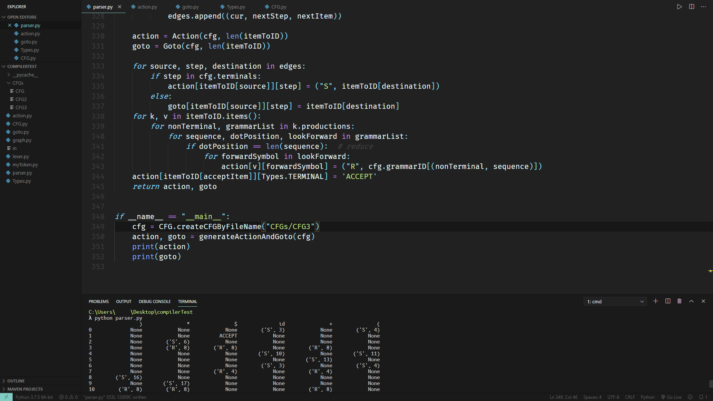

### Building Parse Tree

总而言之就是:

```
把每个token都跑一遍:
    动作 = 查表
    if 动作 == 移进:
        移进
    elif 动作 == 规约:
        规约
        把pop出来的节点作为子节点连到新建的父节点上
    elif 动作 == Accepted:
        Accepted
    else:
        assert(False)
```

上述代码的实现非常冗长，因此如有需要请参阅[源码](https://github.com/medioqrity/newCompilerTest/blob/master/Parser.py#L372)。

取消第382行的注释就会看到类似于这种结果:

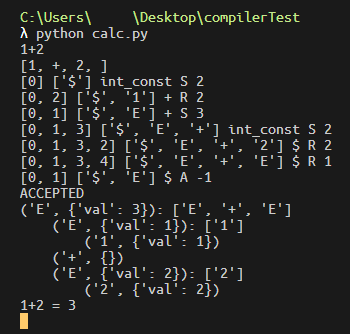

可以看到输出了`1+2 = 3`，这就是接下来Semantic Analysis的内容了。

总而言之，确实能够建出Parse Tree，可喜可贺。

为了确定自己代码写得足够健壮，我利用了CCSP 2019的SQL查询的SQL定义，测试了对SQL查询语句进行parsing的能力。 结果还是很不错的:

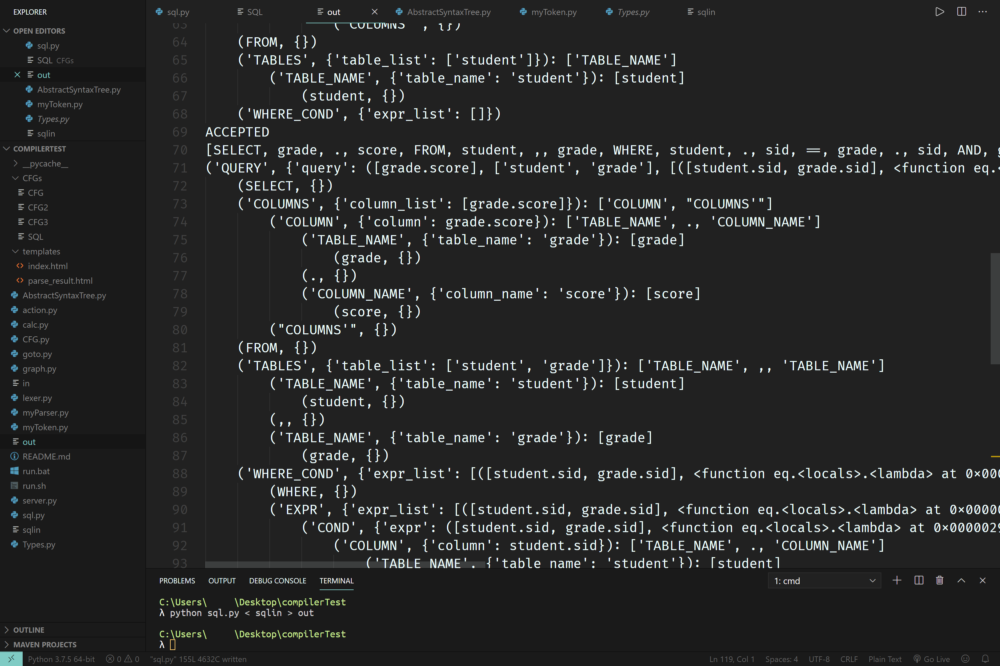

*可以看到截图中`ParseTree.py`的名字还不是现在这样，而是`AbstractSyntaxTree.py`。这是早期由于认知上的偏差导致的命名错误，现在已经改正。*

## References

- https://lagunita.stanford.edu/courses/Engineering/Compilers/Fall2014/course/
