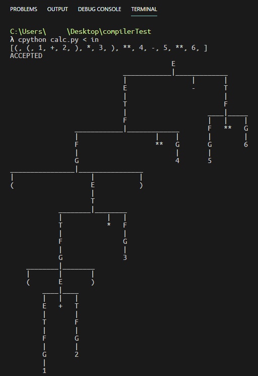
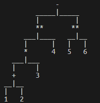
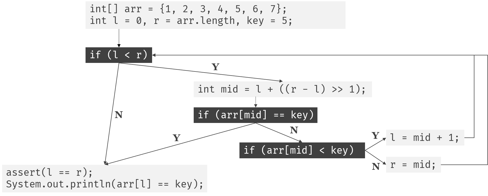
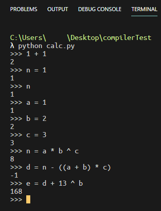
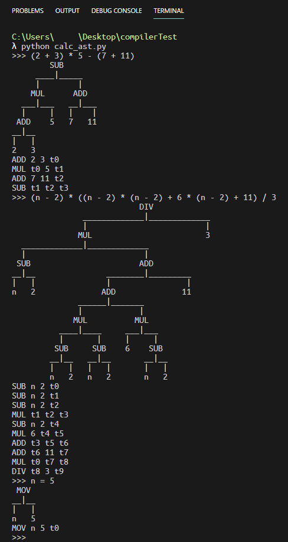
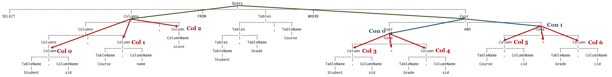
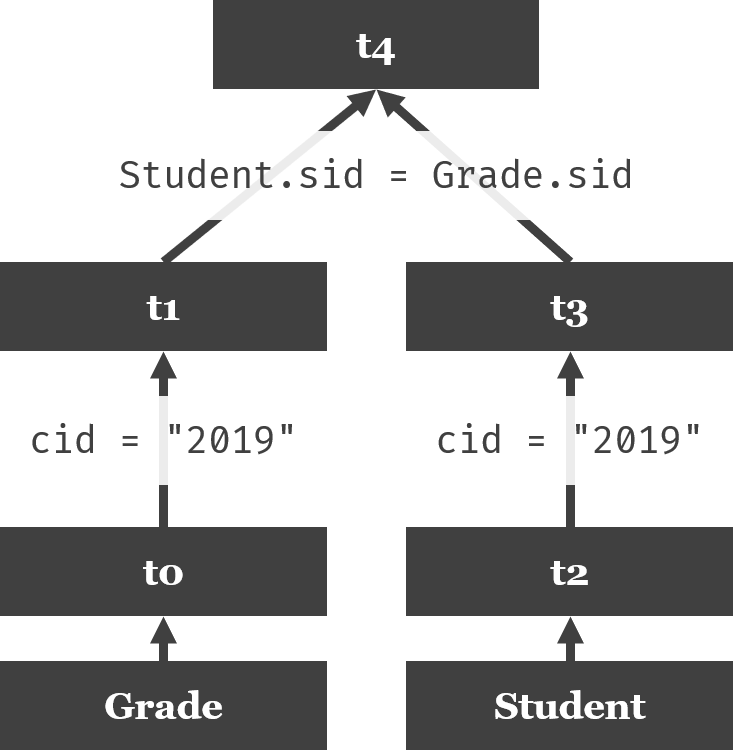
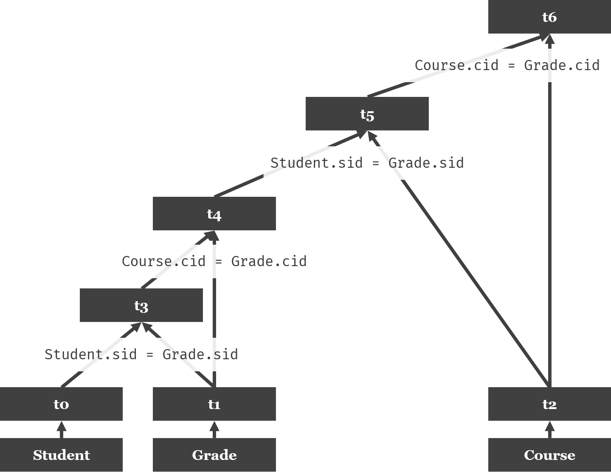
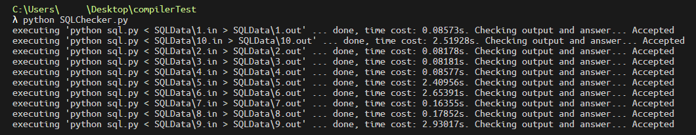
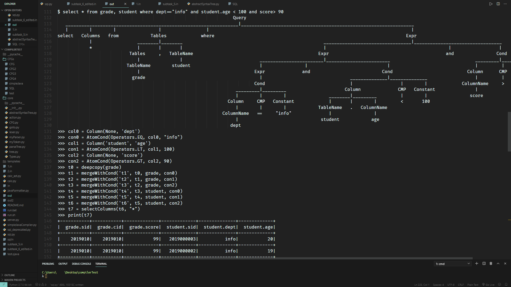

## Review & Overview

在前一篇[文章](/zh/build-a-compiler-1/)中，我已经实现了Lexer, Parser，并且已经能够建立Parse Tree了。

接下来就是利用Semantic Analysis，也就是语义分析，创建Intermediate Representation，即中间表示。值得注意的是，可能会产生多种中间表示。

由于不同的应用所需要做的事情不尽相同，因此在简要说明SA和IR之后，就会进入实例部分，通过两个实际能够运行的简单应用来说明SA与IR是如何工作的。

## IR

我觉得抛开IR，上来就干讲语义分析，多少会让人有种*"我为啥要学这些"*的疑惑。即便已经事先知道SA是用来产生IR的，但是因为对IR的具体细节了解甚少，所以学的时候依然会感到十分困惑，没有目的性。

所以我在这里先简单说明一下一些简单且常见的IR。

### AST

全称Abstract Syntax Tree，语义树。

它和Parse Tree的最大区别就在于，**AST略去了很多没必要的节点**。

举个例子，考虑如下计算器文法:

```
START
START -> E
E -> E "+" T | E "-" T | T
T -> T "*" F | T "/" F | F
F -> F "**" G | G
G -> "(" E ")" | "int_const"
```

其中`**`代表幂。再考虑`((1 + 2) * 3) ** 4 - 5 ** 6`这样略复杂的输入串。

由于`()`和`**`都需要从`E`推导多次才能够到达，因此这个语法产生的Parse Tree相比之下非常臃肿:



相比之下，它的AST就很简单了:



### Control-Flow Graph

控制流图。似乎当初学校教C语言的时候有用这个来说明结构化程序。

来看看用java实现的二分搜索的例子:

```java
public class test {
    public static void main(String[] args) {
        int[] arr = {1, 2, 3, 4, 5, 6, 7};
        int l = 0, r = arr.length, key = 5;
        while (l < r) {
            int mid = l + ((r - l) >> 1);
            if (arr[mid] == key) break;
            else if (arr[mid] < key) l = mid + 1;
            else r = mid;
        }
        assert(l == r);
        System.out.println(arr[l] == key);
    }
}
```

对应的控制流图如下:



### Three-Address Code

三地址代码。格式大致是`a = b op c`。

比方说对于:

```c
int test(int n) {
    return (n - 2) * ((n - 2) * (n - 2) + 6 * (n - 2) + 11) / 3;
}
```

只关注`return`后的表达式的话，它的三地址代码应该是:

```
t0 = n - 2
t1 = n - 2
t2 = n - 2
t3 = t1 * t2
t4 = n - 2
t5 = 6 * t4
t6 = t3 + t5
t7 = t6 + 11
t8 = t0 * t7
t9 = t8 / 3
```

当然上面的写法只是为了好看，实际上是使用tuple来存储以上信息的:

```
(SUB, n, 2, t0)
(SUB, n, 2, t1)
(SUB, n, 2, t2)
(MUL, t1, t2, t3)
(SUB, n, 2, t4)
(MUL, 6, t4, t5)
(ADD, t3, t5, t6)
(ADD, t6, 11, t7)
(MUL, t0, t7, t8)
(DIV, t8, 3, t9)
```

### 其他IR

包括但不限于:

- Dependence Graph
- Call Graph
- Single Static Assignment Form
- Hybrid
    - Control-Flow Graph & TAC Blocks

## Semantic Analysis

语义分析。它出现的原因是，有时我们需要用到上下文相关的信息，而CFG产生的Parse Tree不能提供这些。

毕竟是*Context-Free* Grammar。

因此，我们需要在CFG的基础上，通过额外的信息，来使信息能够在上下文无关的Parse Tree的**不同节点中传递**，进而实现**上下文相关**的分析。

举一个非常常见的例子: **类型系统**。

在上下文无关文法中，仅凭Parse Tree是无法明确每个变量的类型的。因此，类似如下的代码可以通过Parser:

```java
String a = "123";
int b = 5 + a;
```

但是怎么可能让一个`int`和`String`相加呢? 仅从逻辑上来看，就可以知道不会有任何有意义的结果。

所以，在对`5 + a`进行分析的时候，就要检查它们的类型相加之后是否合法。由于`a`的类型是上文定义的，因此是上下文相关的分析。

另外一个例子就是**作用域**。显然你不能跨域访问变量:

```java
for (int i = 0; i < 5; ++i);
System.out.println(i);
```

上述代码显然是可以通过Parser的，但是确实是非法的代码。

那么要怎么在不同节点间传递数据呢? 语义分析又要怎么和IR联系起来呢?

### 属性文法

简单来说，就是给Parse Tree的节点附加属性，并且给这些属性提供操作。通过预先定义的动作，我们可以建立AST，建立中间变量，生成TAC序列，生成Control-Flow Graph，建立符号表，建立作用域符号表等。

回到最简单的计算器的例子，我们可以给每个文法加上对应的动作，来计算答案:

```
START
START -> STMT
STMT -> Assignment                 { print(Assignment.val) }
      | E                          { print(E.val) }
E -> E "+" T                       { E.val = E1.val + T.val }
   | E "-" T                       { E.val = E1.val - T.val }
   | T                             { E.val = T.val}
T -> T "*" F                       { T.val = T1.val * F.val }
   | T "/" F                       { T.val = T1.val / F.val }
   | F                             { T.val = F.val }
F -> F "**" G                      { F.val = F1.val ** G.val }
   | G                             { F.val = G.val }
G -> "(" E ")"                     { G.val = E.val }
   | "int_const"                   { G.val = int(int_const.lexString) }
   | "id"                          { G.val = d[id.lexString]}
Assignment -> "id" "=" "int_const" { d[id.lexString] = int(int_const.lexString) 
                                     Assignment.val = d[id.lexString] }
```

这样就可以实现最简单的交互式计算器。

有的时候，文法需要在产生式中间使用，比方说:

```
Declaration -> Type { id.type = Type.lexString } "id"
```

这种情况下，一般会需要根据前面已经计算出来的属性，去设置后面那些节点的属性。

*如果去看教科书，可能还会看到利用依赖图和拓扑排序算出计算顺序的。不过目前在我的项目里还没看到。*

### 实现Parse Tree

核心是正确地实现Parse Tree，确保它能够支持属性文法。同时，尽可能让编写动作变得简单易懂，可读性强。

为了能够在Parse Tree Node中设置必要的属性，而不用每次都通过`node["..."]`这样的繁琐操作来对属性进行设置，需要实现`__setattr__`和`__getattr__`方法。

又考虑到AST可能也要用到基于属性文法的翻译，因此建立两个基类: [`TreeNode`](https://github.com/medioqrity/newCompilerTest/blob/master/tree.py#L1)和[`Tree`](https://github.com/medioqrity/newCompilerTest/blob/master/tree.py#L168)。

```python
class TreeNode:

    SPLIT_LENGTH = 3

    def __init__(self, content):
        super().__setattr__("__content", content)
        super().__setattr__("__d", {})
        super().__setattr__("__childs", [])


class Tree:

    def __init__(self, root):
        assert isinstance(root, TreeNode)
        self.__root = root
```

通过`__d`记录属性名值对的映射关系。

*注: 这里，如果不用`super().__setattr__()`和`__getattribute__()`的话，会因为获取`self.__d`导致无限递归。*

其中占很长一部分的`def format(self)`是用来打印**以当前节点为根节点的整棵树**的方法。因为要使得输出美观，有非常多的变量需要控制，因此实在繁琐; 又因为与编译没有太大关系，倒更像是计算机图形学的内容，因此没有做注释。

接下来是[`PTNode`](https://github.com/medioqrity/newCompilerTest/blob/master/parseTree.py#L4)，即Parse Tree Node:

```python
from core.myToken import Token
from core.Types import Types
from core.tree import TreeNode, Tree


class PTNode(TreeNode):

    def __init__(self, content, isTerminal=False, terminalType=None, grammarID=-1):
        # content may be either Token or Str
        super().__init__(content)
        super().setAttribute("__grammarID", grammarID)
```

额外记录了grammar ID，也就是在说明当前节点和它的子节点对应着哪个产生式。

然后是用于将函数注册到对应产生式上的[`ParseTreeActionRegister`](https://github.com/medioqrity/newCompilerTest/blob/master/parseTree.py#L30)类:

```python
class ParseTreeActionRegister:

    def __init__(self, cfg):
        self.__productionToAction = {}
        self.__cfg = cfg

    def production(self, *productions, index=-1):
        def decorate(function):
            for prod in productions:
                self.__productionToAction.\
                    setdefault(self.__cfg.getIDByRawGrammar(prod), {})\
                        [index] = function
            return function
        return decorate
```

我将`production`方法写成了装饰器。这样，就不用做出类似于*定义一大堆函数然后再用一个手动维护的字典来说明函数和产生式的对应情况*这种维护起来非常麻烦的事情了。

光有注册的工具还不够，需要明确[`ParseTree`](https://github.com/medioqrity/newCompilerTest/blob/master/parseTree.py#L56)内部是怎么使用`ActionRegister`提供的函数的，才能够写出正确的动作:

```python
class ParseTree(Tree):

    def evaluate(self, ar, currentNode=None):
	# get mapping
        productionToAction = ar.getProductionMapping()

        # get current node
        if currentNode is None:
            currentNode = self.getRoot()
        
        # try to perform action when iterating
        grammarID = currentNode.getGrammarID()
        for i, child in enumerate(currentNode.getChilds()):
            productionToAction[grammarID][i](currentNode, *currentNode.getChilds())
            self.evaluate(ar=ar, currentNode=child)
```

通过`evaluate(ar=register)`方法，就可以对整棵树应用预先定义好的规则了。

由于`productionToAction[grammarID][i]`的返回值是一个函数，不妨记为`func`，那么调用方式就是`func(currentNode, *currentNode.getChilds())`。后面一个参数使用了*自动解包*，这么做的好处很快就能看到。

## 带变量存储功能的简易表达式计算器

在写完Parse Tree之后，就可以来实现一个简单的计算器了。

在一切开始之前，首先书写CFG:

```
START
START -> Statement
Statement -> Assignment | E
E -> E "+" T | E "-" T | T
T -> T "*" F | T "/" F | T "%" F | F
F -> F "^" G | G
G -> "(" E ")" | "int_const" | "id"
Assignment -> "id" "=" E
```

接下来就可以开始写代码了。第一步，建立CFG、生成该CFG对应的Action & Goto表、并声明Action Register:

```python
cfg = CFG.createCFGByFileName("CFGs/CFG4")
action, goto = myParser.generateActionAndGoto(cfg)
ar = ActionRegister(cfg)
```

由于要存储变量，因此设定一个字典:

```python
global d
d = {}
```

然后注册对应的动作:

```python
@ar.production('Statement -> E', 'Statement -> Assignment')
def __stmt(stmt, _):
    print(_.val)

@ar.production('E -> E "+" T')
def __e0(e, e1, _, t):
    e.val = e1.val + t.val

@ar.production('E -> E "-" T')
def __e1(e, e1, _, t):
    e.val = e1.val - t.val

# omitted

@ar.production('G -> "int_const"')
def __g1(g, int_const):
    g.val = int(int_const.getContent())

@ar.production('G -> "id"')
def __g2(g, id_):
    global d
    g.val = d[id_.getContent()]

@ar.production('Assignment -> "id" "=" E')
def __assign(assi, id_, _, E):
    d[id_.getContent()] = E.val
    assi.val = d[id_.getContent()]
```

通过*自动解包*，直接将子节点作为参数传进来，省去了`t1, _, f = t.getChilds()`这类的臃肿且重复的语句，写起来确实很方便。

最后写一个`while`循环就可以实现读入，建树并求值的过程了:

```python
while True:
    try:
        inputString = input(">>> ")
        tokenList = lexer.parse(inputString)
        pt = myParser.parse(cfg, tokenList, action, goto)
        pt.evaluate(ar)
    except EOFError:
        break
```

来看看实际的结果:



这个项目中，只涉及到了翻译。不过，只需稍微改变一点文法，就可以将它与AST结合起来，生成三地址代码:

```python
@ar.production('E -> E "+" T')
def __e0(e, e1, _, t):
    e.node = ASTNode("ADD", e1.node, t.node)

@ar.production('E -> E "-" T')
def __e1(e, e1, _, t):
    e.node = ASTNode("SUB", e1.node, t.node)

# ...
```

建立ASTNode后，声明一个用于生成三地址代码的函数:

```python
def dfs(cur, childs):
    global count
    if not childs:
        cur.varName = cur.getContent()
    else:
        cur.varName = "t%d" % count
        count += 1
        l, r = childs
        print("%s %s %s %s" % (cur.getContent(), l.varName, r.varName, cur.varName))
```

最后，稍微修改一下`while`主循环部分，建AST并应用该函数即可:

```python
while True:
    try:
        count = 0
        inputString = input(">>> ")
        tokenList = lexer.parse(inputString)
        pt = myParser.parse(cfg, tokenList, action, goto)
        pt.evaluate(ar)
        ast = AbstractSyntaxTree(pt.getRoot().node)
        print(ast)
        ast.apply(dfs)

    except EOFError:
        break
```

得到的结果大致如下:



## 简易数据库查询引擎

CCSP 2019的那道[SQL查询](https://medioqrity.github.io/2019/10/17/CCSP-2019%E6%B8%B8%E8%AE%B0/#SQL-Query)一直是我心心念念想要补的题。

我想，也许现在我终于有战胜它的能力了。

---

### 原题题干

顿顿想要建立一个简单的教务管理数据库，用于存储学生的考试成绩并支持一些基本的查询操作。

#### 数据格式

该数据库包含以下五张**数据表**：

```
Student(sid, dept, age)
```

学生信息表：`sid` 为主键，表示学生 ID；`dept` 表示学生所在院系名称；`age` 表示学生的年龄。

```
Course(cid, name)
```

课程信息表：`cid` 为主键，表示课程 ID；`name` 表示课程名称。

```
Teacher(tid, dept, age)
```

教师信息表：`tid` 为主键，表示教师 ID；`dept` 表示教师所在院系名称；`age` 表示教师的年龄。

```
Grade(sid, cid, score)
```

成绩信息表：`sid` 和 `cid` 分别来自 `Student` 表和 `Course` 表的主键（即每条**记录**中的 `sid` 和 `cid` 一定存在于相应的**表**中，下同），二者一起作为该表的主键；`score` 表示该学生这门课程的成绩。


```
Teach(cid, tid)
```

授课信息表：`cid` 和 `tid` 分别来自 `Course` 表和 `Teacher` 表的主键，二者一起作为该表的主键；需要注意的是，一门课程可以有多个老师授课。

注：**主键（Primary Key）**可以唯一标识表中的每条记录，换言之在一张表中所有记录的主键互不相同。

在上述表中，`age` 和 `score` 是 $[0,100]$ 的整数，其余都是长度小于等于 $10$ 的非空字符串。其中三个主键 `sid`、`cid` 和 `tid` 由数字 `0...9` 组成，而 `name` 和 `dept` 则由大小写字母组成。

#### 查询语句

该数据库支持使用一种简单的 `SELECT` 语句进行查询，文法定义如下所述。最终所有的查询语句都可以由 `QUERY` 符号推导而来。

在所有定义中，`::=` 表示其左侧的符号可以推导为右侧的符号串，其中带单引号的符号表示此符号为固定的字符串，不带引号的则表示符号还需要进行进一步推导。`[]` 表示文法中的可选内容。如果一个符号存在多种推导方式 `A ::= B` 和 `A ::= C`，则可以简写为 `A ::= B | C`。

```
QUERY ::= 'SELECT' '*' 'FROM' TABLES ['WHERE' EXPR]
QUERY ::= 'SELECT' COLUMNS 'FROM' TABLES ['WHERE' EXPR]
```

从指定的**表**（`TABLES`）中查询满足**筛选条件**（`EXPR`）的**记录**，并按照指定的**列**（`COLUMNS`）输出。如果没有给出**筛选条件**，则返回所有的**记录**。

```
TABLES ::= TABLE_NAME | TABLE_NAME ',' TABLE_NAME
TABLE_NAME ::= 'Student' | 'Grade' | 'Course' | 'Teach' | 'Teacher'
```

`TABLES` 可以包含多张**表**，此时新表中的**列**是这些表中列的笛卡尔积，一个例子如下所示。

```
+---------+ +---------+ +------------+ +------------+
| Table A | | Table B | | Table A, B | | Table B, A |
+---------+ +---------+ +------------+ +------------+
| a1      | | b1      | | a1, b1     | | b1, a1     |
| a2      | | b2      | | a1, b2     | | b1, a2     |
+---------+ | b3      | | a1, b3     | | b2, a1     |
            +---------+ | a2, b1     | | b2, a2     |
                        | a2, b2     | | b3, a1     |
                        | a2, b3     | | b3, a2     |
                        +------------+ +------------+
```

本题中约定 `TABLES` **仅会包含一张或两张不同的表**。

```
COLUMNS ::= COLUMN | COLUMNS ',' COLUMN
COLUMN ::= [TABLE_NAME '.'] COLUMN_NAME
COLUMN_NAME ::= 'sid' | 'cid' | 'tid' | 'age' | 'score' | 'dept' | 'name'
```

`COLUMNS` 也是递归定义，即由逗号分隔的至少一个 `COLUMN` 组成。在无歧义时（即 `TABLES` 中只有**唯一的表**含有该**列**），`COLUMN` 中的 `TABLE_NAME` 是可选的。`SELECT age FROM Student, Teacher` 是一种典型的歧义句式，因为无法确定其中想要选取的 `age` 是学生还是教师的年龄。

虽然在文法上一个 `COLUMN` 可以由任意 `TABLE_NAME` 和 `COLUMN_NAME` 组合而成，但在实际处理时，这两者需要符合上面定义的表结构。比如 `Course.sid` 就是一种错误的写法，因为 `Course` 表中并没有 `sid` 这一列。

```
EXPR ::= COND | EXPR 'AND' COND
COND ::= COLUMN CMP CONSTANT | COLUMN '=' COLUMN
CMP ::= '>' | '=' | '<'
```

其中：

* `EXPR` 是一个合取布尔表达式，由若干个**比较条件**（`COND`）用 `AND` 连接而成，表示**筛选条件**（即满足该条件的**记录**才会被输出）。
* `CONSTANT` 没有文法定义，它表示一个**常量**，且其类型和数据范围与相比较的 `COLUMN` 一致；如果是字符串类型，还需用双引号括起（例如 `"Sam"`）。

这里我们额外规定：

* **列**与**常量**进行比较时（`COLUMN CMP CONSTANT`），整数类型（`age`、`score`）可以进行大于、小于和等于三种判断，字符串类型只能做等于判断；
* 两**列**进行比较时（`COLUMN = COLUMN`），它们需来自不同的**表**且二者的**列名**（`COLUMN_NAME`）必须相同；
* 在一个 `EXPR` 中，`COLUMN CMP CONSTANT` 类型的 `COND` 个数不限，但 `COLUMN = COLUMN` 最多只能出现一次。

查询语句大小写敏感，全部的**保留字**包括：

```
SELECT, *, FROM, WHERE, AND, Student, Course, Teacher, Grade, Teach
sid, cid, tid, dept, name, age, score
```

全部的**分隔符**包括：`,`, `.`, `>`, `=`, `<`, ` `（空格）。

双引号（`"`）应视作字符串**常量**的一部分而非**保留字**或**分隔符**。

每个**保留字**和**常量**（`CONSTANT`）可视作查询语句中的一个**基本单位**，在格式上我们约定：

* 每条查询语句占一行；
* **基本单位**不可分割；
* 为避免歧义，两个**基本单位**之间应至少有一个**分隔符**，并且允许存在任意多的空格；
* 一行总长度不超过 $100$ 个字符。

#### 结果输出

对每条查询输出一张**表**，**列**由 `COLUMNS` 指定，每行为一条满足**筛选条件**（`EXPR`）的**记录**（不同的**列**间用一个空格分隔）。这里只需要输出所有满足条件的**记录**，不需要打印表头；查询结果为空则不输出；**字符串类型无需输出双引号**。若想输出所有的**列**，可以用 `*` 代替 `COLUMNS`；若 `TABLES` 中只有一张**表**，此时应输出该**表**的全部**列**；如果有第二张**表**，应输出第一张**表**的全部**列**与二张**表**的全部**列**的笛卡尔积；表内部的**列**按照上文定义时给出的顺序排序。

如果 `TABLES` 仅含一张**表**，则按该**表**的顺序依次输出符合条件的**记录**。若 `TABLES` 包含两张**表**（形如 `A,B`），则先考虑 A 的顺序，再考虑 B 的顺序（参考前文中两张表做笛卡尔积的例子）。

---

### CFG

题干中给出了很明确的CFG。照抄就可以用了:

```
Start
Start -> Query
Query -> "SELECT" Columns "FROM" Tables | "SELECT" Columns "FROM" Tables "WHERE" Expr
Tables -> Tables "," TableName | TableName
TableName -> "id"
Columns -> Columns "," Column | "*" | Column
Column -> ColumnName | TableName "." ColumnName
ColumnName -> "id"
Expr -> Expr "AND" Cond | Cond
Cond -> Column CMP Constant | Column "=" Column
CMP -> "<" | "=" | ">"
Constant -> "int_const" | "str_literal"
```

### 数据库基本类及其简略实现

- `class Row`

    广义上的一条记录。里面放的是一个列表。它并不存储每一列的信息。否则会导致大量重复的内存开销。

    ```python
    class Row:
        """
        Basic Row object
        """
    
        def __init__(self, data=None):
            if data is None:
                data = []
            assert isinstance(data, list)
            self.__data = list(data)
    ```

- `class Column`

    定义一列数据。包含TableName和ColumnName。

    ```python
    class Column:
    
        def __init__(self, tableName, columnName):
            self.__tn = tableName
            self.__cn = columnName
    ```

- `class Table`

    表。

    ```python
    class Table:
        """
        Table, containing a list of Row objects, and the definition of every column
        """
    
        def __init__(self, name, columnDef, rows=None):
            """
            columnDef is the definition of columns, including a list of Column objects.
            The reason for table name is because a temporary merged table may contain columns
            from other tables.
            """
            assert isinstance(name, str)
            self.__name = name
            assert isinstance(columnDef, tuple)
            self.__cd = columnDef
            self.__c2i = {}  # column to integer
            # omitted
    ```

    由于列的定义都是放在Table内的，因此要获取Row内的对应数据还需要先从table内获取index才行。为了快速获取index，设置了字典`self.__c2i`。

- `class AtomCond`

    一个原子条件，只有一个操作符和两个操作数。

    ```python
    class AtomCond:
    
        def __init__(self, operator, lOperand, rOperand):
            """
            operands must be Column object or constant
            """
            assert isinstance(operator, Operators)
            self.__operator = operator
            self.__lop = lOperand
            self.__rop = rOperand
            
        def check(self, row, table): pass
        
        def isApplicable(self, table) -> bool: pass
    ```

    额外提供了两个函数。`check`是用于确定这一行是否符合条件的。

    对于两表合并的情况来说，`row`是两个记录产生的新纪录。因此才不是`check(self, row1, row2)`这种写法。

    `isApplicable(table)`函数确定该条件是否适用于`table`。由于在对分析树进行翻译时，我们是无法得知`cond`的每个operand是否都隶属于当前表的。因此只能运行时检查了。

- `def mergeWithNoCond(table1, table2) -> table`

    无条件合并两张表，返回一张新表。

    ```python
    def mergeWithNoCond(newTableName, table1, table2):
        newColDef, needToAdd = mergeColDef(table1.getColumnDef(), table2.getColumnDef())
        resultTable = Table(newTableName, newColDef)
        for r1 in table1.getRows():
            for r2 in table2.getRows():
                resultTable.addRow(mergeRows(r1, r2, needToAdd))
        return resultTable
    ```

- `def mergeWithCond(table1, table2, atom_cond) -> table`

    根据`atom_cond`合并两张表，返回一张新表。可以在这里利用hash table将时间复杂度从$\mathcal{O}(n \cdot m)$降到$\mathcal{O}(n + m)$。

    这里的`atom_cond`就是最基础的条件，也就是只包含一个Operator和两个Operand的条件。

    分类讨论，如果条件可以使用哈希表加速，就加速。否则合并生成每个可能的新记录，然后通过`cond.check()`确定是否符合条件。
    
    实现过于冗长，因而省略。

- `def mergeRow(row1, row2, needToAdd) -> row`

    合并两条记录。

    ```python
    def mergeRows(row1, row2, needToAdd) -> Row:
        result = list(row1.getData())
        for i, _ in enumerate(row2.getData()):
            if needToAdd[i]:
                result.append(_)
        return Row(result)
    ```

    由于table1和table2可能存在一些Column是重复的，因此需要一个额外的bool list，记载row2每个index是否需要加入新记录中。

- `def selectColumn(table, *columns) -> table`

    从table中选择一些列，返回一个新的table。

- `def applyFilterCond(newTableName, table, cond)`

    对整个表按`cond`进行筛选，返回一个新的表。

    ```python
    def applyFilterCond(newTableName, table, cond):
        resultTable = Table(newTableName, table.getColumnDef())
        if not cond.isApplicable(resultTable):
            return table  # thus nothing would change
        for row in table.getRows():
            if cond.check(row, resultTable):
                resultTable.addRow(row)
        return resultTable
    ```

通过这些函数，应该可以**翻译出一段python代码**，用于执行基于python的数据库库类的查询。比方说考虑如下查询语句:

```sql
SELECT Student.sid, Course.name, score
FROM Student, Grade, Course
WHERE Student.sid = Grade.sid AND Course.cid = Grade.cid
```

应该可以翻译成:

```python
col0 = Column('Student', 'sid')
col1 = Column('Course', 'name')
col2 = Column(None, 'score')
col3 = Column('Student', 'sid')
col4 = Column('Grade', 'sid')
con0 = AtomCond(Operators.EQ, col3, col4)
col5 = Column('Course', 'cid')
col6 = Column('Grade', 'cid')
con1 = AtomCond(Operators.EQ, col5, col6)
t0 = deepcopy(Student)
t1 = deepcopy(Grade)
t2 = deepcopy(Course)
t3 = mergeWithCond('t3', t0, t1, con0)
t4 = mergeWithCond('t4', t3, t1, con1)
t5 = mergeWithCond('t5', t4, t2, con0)
t6 = mergeWithCond('t6', t5, t2, con1)
t7 = selectColumns(t6, col0, col1, col2)
print(t7)
```

之后交给python的`exec()`就可以执行了。

### 翻译

#### Columns & Conditions

先来考虑比较容易实现的部分: `Column`和`Condition`。

```python
@ptar.production('Column -> ColumnName')
def _col0(col, coln):
    col.varName = getColId()
    addStmt("%s = Column(None, '%s')" % (col.varName, coln.name))

@ptar.production('Column -> TableName "." ColumnName')
def _col1(col, tn, dot, cn):
    col.varName = getColId()
    addStmt("%s = Column('%s', '%s')" % (col.varName, tn.name, cn.name))
    
@ptar.production('Cond -> Column CMP Constant')
def _cond0(cond, col, cmp_, const):
    cond.varName = getConId()
    cond.canAcc = False
    addStmt("%s = AtomCond(Operators.%s, %s, %s)" % (cond.varName, sym2op[cmp_.op], col.varName, const.val))

@ptar.production('Cond -> Column "=" Column')
def _cond1(cond, col, eq, col1):
    cond.varName = getConId()
    cond.canAcc = True
    addStmt("%s = AtomCond(Operators.EQ, %s, %s)" % (cond.varName, col.varName, col1.varName))
```

通过`addStmt`，就能将这几条语句加进全局的最终结果里了。

这些`Column, Cond`节点，都是会包含`varName`属性的，用于确定每个节点的变量名。

接下来把`Columns`和`Cond`都整理进列表里:

```python
@ptar.production('Columns -> Columns "," Column')
def _cols0(cols, cols1, comma, col):
    cols.list = cols1.list
    cols.list.append(col.varName)

@ptar.production('Columns -> Column')
def _cols1(cols, col):
    cols.list = [col.varName]

@ptar.production('Columns -> "*"')
def _cols2(cols, star):
    cols.list = ['"*"']

@ptar.production('Expr -> Expr "AND" Cond')
def _ex0(expr, expr1, and_, cond):
    expr.list = expr1.list
    expr.list.append((cond.varName, cond.canAcc))

@ptar.production('Expr -> Cond')
def _ex1(expr, cond):
    expr.list = [(cond.varName, cond.canAcc)]
```

这里的`canAcc`属性是判断这个条件可否用于利用hash table对查询进行加速。后面会用到。

这样，我们应该就能够在根节点访问到这两个list:



#### Tables

由于合并表的时候需要用到`Expr`的信息，因此不能在`Tables`子树中生成合并表项的代码，而只能在根节点Query下合并。

为了提高查询效率，我设想的合并方式如下:

- 条件的类型

    存在两种条件:

    - 仅涉及单表的条件: `Cond -> Column CMP Constant`
    - 涉及两个表的条件: `Cond -> Column "=" Column`

- 应用条件的顺序

    涉及单表的条件，由于会使得**表项变得更少**，我把它称为Filter Condition。

    对于每个表，都先把所有Filter Condition都过一遍。这样，在合并时，无论有没有涉及两个表的条件，都可以有效减少表项，加快合并速度。

    之后，再根据有无涉及两个表的条件，利用`mergeWithCond`或`mergeWithNoCond`合并。

以`SELECT Student.sid, dept, score FROM Grade,Student WHERE Student.sid = Grade.sid AND cid = "2019"`为例，简单用一棵树来表示合并顺序:



再以`SELECT Student.sid, Course.name, score FROM Student, Grade, Course WHERE Student.sid = Grade.sid AND Course.cid = Grade.cid`为例:



根据以上考虑，不难写出如下代码:

```python
@ptar.production('Query -> "SELECT" Columns "FROM" Tables "WHERE" Expr')
def _q1(query, select, columns, f_, tables, where, expr):

    # use filter conditions to make tables smaller first
    # ...

    # merge these small tables
    # ...

    # print result
    addStmt("print(%s)" % resultTableId)
```

而对于没有`where`的查询，就非常简单了:

```python
@ptar.production('Query -> "SELECT" Columns "FROM" Tables')
def _q0(query, select, columns, f_, tables):

    # merge all tables
    for i in range(1, len(tables.list)):
        addStmt("%s = mergeWithNoCond('%s', %s, %s)" % (...))
    
    # print result
    addStmt("print(%s)" % resultTableId)
```

还有很多不是特别重要的翻译规则，因而在此略去。

### 成果

对于一个引擎来说，正确性和效率都是非常重要的。

这种实现题通常都很难确认数据的准确性。好在这题有CCSP提供的数据与正解，因此我写了个简易Checker:

```python
from os import system
from glob import glob
from sys import stdout
from time import time

for filename in glob("SQLData/*.in"):
    cmd = "python sql.py < %s.in > %s.out" % (filename[:-3], filename[:-3])
    print("executing '" + cmd + "' ...", end="")
    stdout.flush()
    time0 = time()
    system(cmd)
    print(" done, time cost: %.5fs. Checking output and answer... " % (time() - time0), end="")
    stdout.flush()
    with open("%s.out" % filename[:-3], "r") as f:
        out = f.read()
    with open("%s.ans" % filename[:-3], "r") as f:
        ans = f.read()
    if out == ans:
        print("Accepted")
    else:
        print("Wrong Answer")
```

然后跑一下看看结果...



尽管写的是Accepted，不过那也只是答案正确而已。看这个接近3秒的查询时间，说实话还是有点担心TLE的...

然后稍微美化一下输出，顺便把分析树也打印出来，大致就会得到如下输出:



### 能不能再牛逼一点?

其实写这道题的时候，我就有种*CFG简化到了这种地步，似乎完全没有体现出递归文法的优势*的想法。

其实稍微看看以前上数据库课的时候的代码就能发现，其实还有`Column -> "(" Query ")" ColumnName`这种语法:

```sql
select s.ID, s.name, s.dept_name, (
	select count(case when takes.grade = 'F' then 1 else null end)
	from student left join takes on student.ID = takes.ID
	where s.ID = student.ID
) fail, (
	select count(case when takes.grade = 'F' then 1 else null end)
	from student left join takes on student.ID = takes.ID
	where s.dept_name = student.dept_name
) all_fail
from student as s
```

同样的，`where`语句中也可以包含`Query`:

```sql
select id, name
from student
where not exists (
    select takes.id
    from takes
    where takes.id = student.id
)
```

所以也可以再补上一个`Expr -> Expr "exists" "(" Query ")" | Expr "not" "exists" "(" Query ")"`。

还有`join | left join | full outer join ...`、`with`、聚合函数、`group by`、`order by`:

```sql
with full_st(ID) as (
    select s.id
    from student as s
    where not exists (
        select course_id
        from teaches left join instructor on teaches.ID = instructor.ID
        where instructor.dept_name = '丐帮'
        except
        select takes.course_id
        from takes
        where s.ID = takes.ID
    )
)
select student.ID, student.name, count(*) 'Course Count'
from full_st left join student    on full_st.ID != student.ID
             left join takes      on student.ID = takes.ID
             left join teaches    on takes.course_id = teaches.course_id 
                                 and takes.year      = teaches.year
                                 and takes.semester  = teaches.semester
                                 and takes.sec_id    = teaches.sec_id
             left join instructor on instructor.ID = teaches.ID
where takes.grade is not null and instructor.dept_name = '丐帮'
group by student.ID, student.name
```

除此之外还要考虑`insert, update`之类的语句。

尽管group by，聚合函数，join等都想好了要怎么实现，果然还是更想把接下来的simpleJava的编译器写出来。作为利用Parse Tree来生成线性IR的练习，我想应该到这里也就差不多了吧。

而且，现在的实现更像是小打小闹一样，几乎没有任何可扩展性。要加入新功能，实在是麻烦。

考虑在未来重写一个数据库系统吧。

## References

- http://gcc.gnu.org/onlinedocs/gccint/SSA.html
- https://cs.lmu.edu/~ray/notes/ir/
