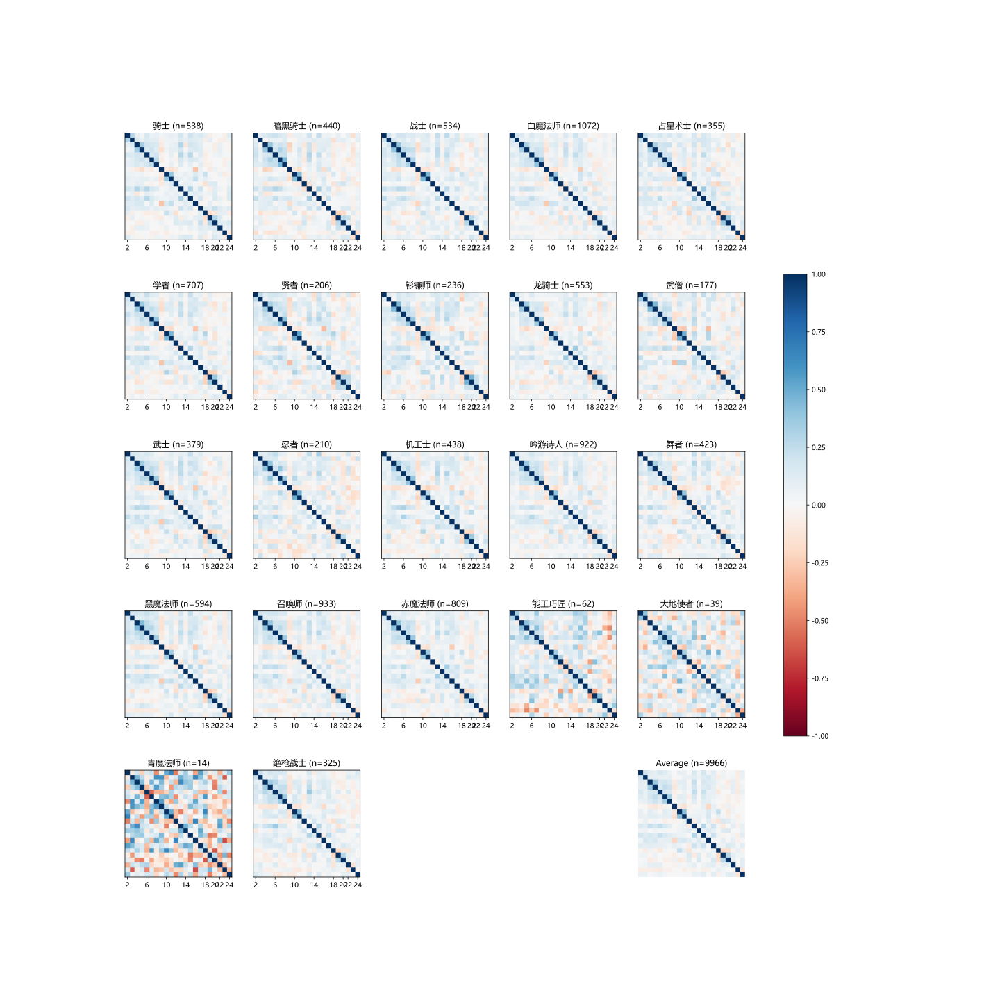

+++
title = "Predicting FFXIV Job Choices Based on Personality"
date = 2024-04-30
+++

## TL;DR

Click [here](/ffxiv_job_pred) to try out the bayes'-theorem-based FFXIV job recommender based on your personality!

## Introduction

Final Fantasy XIV (FFXIV) is a popular MMORPG with a diverse set of jobs (classes) that players can choose from. Each job has its own unique playstyle, abilities, and role in the game. With so many options available, it can be overwhelming for new players to decide which job to play.

A previous [questionnaire](https://www.wjx.cn/wjx/activitystat/verifyreportpassword.aspx?viewtype=1&activity=170647260&type=1) (password: ff14) was conducted to collect data on players' personality and job choices in FFXIV. The corresponding [result analysis video](https://www.bilibili.com/video/av982552290) did a preliminary analysis on the weighted sum of choice distribution for each job.

In this post, we will explore the relationship between questionnaire answers and job choices, and build a predictive model to recommend jobs based on a player's personality.

## Data Preprocessing

We obtained the raw response data from the [link](https://pan.baidu.com/s/1xgEtntmWhia5fjVUc-eIFA) (password: ff14) provided in video comment section. There were 10525 responses in total.

Upon inspection we found several issues with the data:

- There are some questions in the questionnaire that allows optional answer, which would be turned to `-2` in the raw data. We removed all responses that contains such choice.
- The first question, which asks for the player's job choice, contains an option for "I have no preferred job". We removed these responses as well.

This could be done with the following Python code:

```python
def read_data(filename: str) -> Tuple[np.ndarray, np.ndarray]:
    res = pd.read_excel(filename, sheet_name="Sheet1", skiprows=1)

    # Clean up any row that contains value < 0
    res = res[(res >= 0).all(axis=1)]

    # Remove rows with first column = 22
    res = res[res.iloc[:, 0] != 22]

    # Splitting the first column and the rest into two numpy arrays
    y = res.iloc[:, 0].to_numpy() - 1
    X = res.iloc[:, 1:].to_numpy() - 1
    y[y > 21] -= 1  # remove job id 21 and thus all job id >= 22 should -= 1
    return y, X
```

In code above, 22 is the job id for "I have no preferred job".

## Data Visualization

We used UMAP to reduce 22-dimension to 3-dimension. For even further simplification, we reduced job categories from 22 to 7 major ones.

## Attempted Approaches

We tried out several approaches, and got the following table:

|Model|Accuracy|Balanced Acc|F1|
|-|-|-|-|
|Random|6.42%|4.55%|6.42%|
|Most frequent|10.76%|4.55%|2.09%|
|Naive Bayesian|10.66%|**7.21%**|**8.95%**|
|Lace|10.09%|4.81%|4.09%|
|Neural|**10.85%**|5.30%|5.83%|
|Random Forest|10.38%|6.55%|8.41%|

We used StratifiedKFold with k = 5 to train and evaluate the performance.

When trained on full dataset, and asked to evaluate on the full dataset, bayesian shows a great improvement:

|Model|Accuracy|Balanced Acc|F1|
|-|-|-|-|
|Random|6.42%|4.55%|6.42%|
|Most frequent|10.76%|4.55%|2.09%|
|Naive Bayesian|**14.16%**|**11.57%**|**12.11%**|

We only tested bayesian and baseline methods against full dataset, as neural method and random forest would easily remember everything in the dataset and yield absurdly high accuracy.

We would only discuss naive bayesian and leave other approaches in the appendix.

## Bayes' Theorem

Bayes' theorem is a fundamental theorem in probability theory that describes the probability of an event based on prior knowledge of conditions that might be related to the event.

We chose to use Bayes' theorem to predict job choices, as we want to model the distribution of job preference, rather than predicting one specific job. Most machine learning models are not designed for this task, instead they were more likely to be designed to predict a single output (or classification).

Specifically, we used the following formula to calculate the probability of a job given a player's responses:

$$
\mathbf{P}(c\space|\space Q_1, Q_2, \dots) = \frac{\mathbf{P}(Q_1, Q_2, \dots \space|\space c) \mathbf{P}(c)}{\mathbf{P}(Q_1, Q_2, \dots) }
$$

Where $c$ is the job choice, $Q_1, Q_2, \dots$ are the question responses for question $1$, $2$, etc.

For simplicity, we approximate $\mathbf{P}(c\space|\space Q_1, Q_2, \dots)$ by assuming that questions are independent:

$$
\mathbf{P}(c\space|\space Q_1, Q_2, \dots) \approx \mathbf{P}(c)\prod_{i=1}^{n}\mathbf{P}(Q_i\space|\space c)
$$

where $n$ is the number of questions in the questionnaire.

### Covariance Matrix

Even we decided to assume independency, it's still worth taking a look at the covariance matrix of the data to have an idea how off we are.

<details>

<summary>Code</summary>

```python
import numpy as np
import matplotlib.pyplot as plt
from data import read_data

first_column, rest_columns = read_data("data.xlsx")
job_ids = np.unique(first_column)  # Get unique job IDs from first_column
job_names = [
    "骑士",
    "暗黑骑士",
    "战士",
    "白魔法师",
    "占星术士",
    "学者",
    "贤者",
    "钐镰师",
    "龙骑士",
    "武僧",
    "武士",
    "忍者",
    "机工士",
    "吟游诗人",
    "舞者",
    "黑魔法师",
    "召唤师",
    "赤魔法师",
    "能工巧匠",
    "大地使者",
    "青魔法师",
    "绝枪战士",
]

subset_corr_mats = []  # List to store subset arrays for each job ID
subset_len = []

for job_id in job_ids:
    subset_array = rest_columns[
        first_column == job_id
    ]  # Generate subset array for current job ID
    # calculate the correlation matrix for the subset array
    corr_matrix = np.corrcoef(subset_array, rowvar=False)
    subset_corr_mats.append(corr_matrix)
    subset_len.append(subset_array.shape[0])

# there should be 23 matrices, put them in 5x5 grid
fig, axes = plt.subplots(5, 5, figsize=(20, 20))
plt.rcParams['font.sans-serif'] = ['Microsoft YaHei']
plt.rcParams['axes.unicode_minus'] = False

# turn off y-axis ticks for all subplots, x-axis to have offset of 2, i.e. 0-th column shown as 2.
for ax in axes.flat:
    ax.set_yticks([])
    ax.set_xticks(np.arange(0, 18, 4).tolist() + [18, 19, 21])
    ax.set_xticklabels(np.arange(2, 20, 4).tolist() + [20, 22, 24])

for i, ax in enumerate(axes.flat):
    if i < len(subset_corr_mats):
        ax.imshow(subset_corr_mats[i], cmap="RdBu", vmin=-1, vmax=1)
        ax.set_title(job_names[i] + " (n=%d)" % subset_len[i])
    else:
        ax.axis("off")
avg_corr = np.mean(subset_corr_mats, axis=0)
# add colorbar
avg_ax = ax.imshow(avg_corr, cmap="RdBu", vmin=-1, vmax=1)
ax.set_title("Average (n=%d)" % sum(subset_len))
fig.colorbar(avg_ax, ax=axes, shrink=0.6)
plt.savefig("corr.svg")
```

</details>



Some questions shows relatively strong correlation. For example, for question 10 and 11,

> 第10题：先不算有没有表现出来，你的独占欲强烈吗？（对待朋友、恋人、物品、幻化捏脸等等）
>
> 第11题：那么你会表现出来的独占欲如何呢（哪怕是装出来的）？

Which translates to:

> Question 10: Not counting whether it shows or not, do you have a strong desire for exclusivity? (With friends, lovers, items, glamours, etc.)
>
> Question 11: So how exclusive would you show it (even if it's faked)?

shows strong correlation (0.40997773). While this is expected as the two questions are related, it's still worth noting that the assumption of independence is not entirely correct, and thus the prediction might be off for that reason.

## Prediction Engine

I tried to play around with WASM when building the front-end for this project. The goal is to build a static website, such that the prediction engine can be run entirely within the browser. The prediction engine is built using Rust and compiled to WebAssembly using `wasm-pack`.

There are several reasons for choosing Rust and compiling to WASM:

- Rust has many packages. I wanted to explore more probablistic models in the future to improve the prediction accuracy, and Rust is likely to be helpful in such case.
- It has good performance. Even though for current approach, where we simply compute posterior by performing element-wise multiplication, the performance gain is not that significant, due to the first reason we might still want to use something faster than vanilla js.

We first calculate likelihood and prior using `numpy`, and store them to binary files.

<details>
    <summary>Code</summary>

```python
import numpy as np
from data import read_data
from typing import List


y, X = read_data("data.xlsx")
prior = np.bincount(y) / len(y)


def estimate_likelihood(
    X: np.ndarray, y: np.ndarray, question_indices: List[int]
) -> np.ndarray:
    num_jobs = np.max(y) + 1

    likelihood = np.zeros((len(question_indices), num_jobs, X.max() + 1))

    for idx, question_index in enumerate(question_indices):
        for job in range(num_jobs):
            for response in range(X[:, question_index].max() + 1):
                job_filter = y == job
                response_count = np.sum(X[job_filter, question_index] == response)
                total_job_count = np.sum(job_filter)
                if total_job_count > 0:
                    likelihood[idx, job, response] = response_count / total_job_count
                else:
                    likelihood[idx, job, response] = 0

    return likelihood


if __name__ == "__main__":
    likelihood = estimate_likelihood(X, y, list(range(22)))
    prior.tofile("prior.bin")
    likelihood.tofile("likelihood.bin")
```

</details>

Then, given likelihood ($\mathbf{P}(Q_i\space|\space c)$) and prior ($\mathbf{P}(c)$), we can easily calulate the posterior ($\mathbf{P}(c\space|\space Q_1, Q_2, \dots)$) by multiplying them together. In python the code looks like this:

```python
def calculate_posterior(
    prior: np.ndarray, likelihood: np.ndarray, responses: List[int]
) -> np.ndarray:
    posterior = np.copy(prior)

    for question_index, response in enumerate(responses):
        posterior *= likelihood[question_index, :, response]

    posterior /= np.sum(posterior_distribution)

    return posterior
```

This could be turned into the following rust code:

```rust
use ndarray::{s, ArrayView3};
use wasm_bindgen::prelude::*;

#[wasm_bindgen]
pub fn calc_posterior(
    prior: &[f64],
    raw_likelihood: &[f64],
    answers: Vec<u8>,
    indexes: Vec<u8>,
) -> Box<[f64]> {
    let mut posterior = prior.iter().map(|v| v.to_owned()).collect::<Vec<_>>();
    let likelihood = ArrayView3::from_shape((22, 22, 7), raw_likelihood).unwrap();
    for (q_index, response) in indexes.iter().zip(answers.iter()) {
        for (i, v) in likelihood
            .slice(s![*q_index as usize, .., *response as usize])
            .iter()
            .enumerate()
        {
            posterior[i] *= v;
        }
    }
    let sum = posterior.iter().sum::<f64>();
    for v in posterior.iter_mut() {
        *v /= sum;
    }
    posterior.into_boxed_slice()
}
```

In rust version, we added `answers` and `indexes`, due to the fact that the questionnaire questions could be answered in any order, and thus we need to specify what questions have been answered, and what the answers are.

After compiling the rust code to wasm using command `wasm-pack build --target web`, we can use it in the front-end to calculate the posterior distribution given the responses.

## Front-end

I'm not familiar with front-end, thus I choose to stay away from frameworks like `React` and instead just go with vanilla js + tailwind css. However, for visualization, I used `plotly.js` to generate the bar chart and the transition animation.

### Question Generation

We can easily parse question statements and their choices from the original [questionnaire html](https://www.wjx.cn/report/170647260.aspx?quesId=-1) using `beautifulsoup4`, then convert these questions into json format.

<details>
    <summary>Code</summary>

```python
from bs4 import BeautifulSoup
from dataclasses import dataclass
from typing import List


@dataclass
class Question:
    statement: str
    choices: List[str]


def extract_questions(html_content: str) -> List[Question]:
    soup = BeautifulSoup(html_content, "html.parser")
    questions = []

    question_blocks = soup.find_all(class_="title-item")

    for block in question_blocks:
        statement = block.find(class_="title").get_text(strip=True)
        choices = [
            td.get_text(strip=True) for td in block.find_all("td", {"val": True})
        ]
        questions.append(Question(statement, choices))

    return questions


with open("test.html", "r", encoding="utf-8") as f:
    html_content = f.read()
questions = extract_questions(html_content)
print(questions)

res = []
for question in questions:
    res.append(
        {
            "statement": question.statement,
            "choices": question.choices,
        }
    )
with open("questions.json", "w", encoding="utf-8") as f:
    json.dump(res, f, ensure_ascii=False)
```

</details>

We could then load the json file in the front-end and generate the questions dynamically:

```html
<script>
    async function fetchQuestions() {
        try {
            const response = await fetch('questions.json');
            const questions = await response.json();

            generateQuestions(questions);
        } catch (error) {
            console.error('Failed to load questions:', error);
        }
    }

    function generateQuestions(questions) {
        const container = document.getElementById('questionContainer');
        questions.forEach((question, q_index) => {
            // ...
        });
    }

    fetchQuestions();
</script>
```

### Connecting radio changes to plotly updates

We could use a callback function that updates plotly data whenever a radio button is changed:

```javascript
var map = new Map();
window.updateSelection = function (value, index) {
    map.set(index, value);
    let indices = Uint8Array.from(map.keys());
    let choices = Uint8Array.from(map.values());
    genPlotlyData(choices, indices);
}
```

And when we generate the radio buttons, we could set the callback function to each of them:

```javascript
    function generateQuestions(questions) {
        const container = document.getElementById('questionContainer');
        questions.forEach((question, q_index) => {
            question.choices.forEach((choice, i) => {
                const radio = document.createElement('input');
                radio.onchange = () => updateSelection(i, q_index);
                // ...
            });
            // ...
        });
    }
```

### Implementing the plotly update function

Before we can call WASM function that computes posterior distribution, we need to load the wasm module, the likelihood and prior data.

```javascript
    import init, { calc_posterior } from "./pkg/client.js";
    await init();
    async function loadF64Array(name) {
        let response = await fetch(name);
        let buffer = await response.arrayBuffer();
        return new Float64Array(buffer);
    }
    const likelihood = await loadF64Array('likelihood.bin');
    const prior = await loadF64Array('prior.bin');
```

Then we can calculate posteriors based on the selected radio buttons:

```javascript
function genPlotlyData(choices, indices) {
    let posteriors = calc_posterior(
        prior,
        likelihood,
        choices,
        indices,
    );
}
```

### Animating plotly data

Given the posteriors, we can calculate difference between posterior and prior, and use it to color the bars in the plotly chart:

```javascript
    let diff = prior.map((pri, index) => posteriors[index] - pri);
    let colors = Array.from(diff).map(d => d > 0 ? 'rgba(75, 192, 192, 0.7)' : 'rgba(255, 99, 132, 0.7)');
```

Then animate this using the following code:

```javascript
    Plotly.animate('myDiv', {
        data: data,
        layout: layout
    }, {
        transition: {
            duration: duration,
            easing: 'cubic-in-out'
        },
        frame: {
            duration: duration
        }
    });
```

where `data` and `layout` are values that's built based on the posteriors, differences, and priors.

However it's worthnoting that when max y value is updated, and bars are also updated, then only the change of max y value would be animated. A simple workaround is to animate max y change first, then animate the bars.

## Deliverables

The final deliverable is a static website that allows users to answer questions and see the predicted job choices based on their personality. The website is hosted [here](/custom/ffxiv_job_pred/).

The website is built using vanilla JavaScript, HTML, and CSS, with the prediction engine implemented in Rust and compiled to WebAssembly. The prediction engine uses Bayes' theorem to calculate the posterior distribution of job choices based on the user's responses to the questionnaire.

## References

- https://github.com/rust-ndarray/ndarray/blob/master/README-quick-start.md
- https://docs.rs/ndarray/latest/ndarray/struct.ArrayBase.html#array-views
- https://rustwasm.github.io/docs/wasm-bindgen/reference/types/boxed-slices.html
- https://rustwasm.github.io/docs/wasm-pack/commands/build.html#target
- https://developer.mozilla.org/en-US/docs/Web/JavaScript/Reference/Global_Objects/Map#map.prototype.keys 
