+++
title = "The Blockheads Tools Dev Log - pt. 1"
date = 2020-03-02
+++

After I got access to VPN, the thought of downloading *some* game and play it again lingers around my head. It's subliminal and implicit, so that it took me a good while to recall the name of the game.

The blockheads.

It was such a good game that enlightened my junior high school time. It has surprisingly good quality and playable content amongst indie games on mobile, and was #1 on App Store. To this day, even after the creator has abandoned it for years, there's still many active users on forums.

Here's how the game looks like if you have never played it before:


As you could probably tell, this is a sandbox game. And unfortunately the creativity you could usually find in sandbox games are constraint by the fact that this is a mobile game, and the crafting mechanism, and the lack of creative mode:

- Mobile platform makes it extremely difficult to modify save files. Either you jailbreak or you root.
- To craft items, it takes times. This is important monetization for the creator other than ads. Unfortunately for mega-structures, the crafting time might take more than thousands of hours.
- No creative mode. Though we gotta admit that after customizable world rules becomes a thing, but still when it comes to removing mis-placed industrial blocks like steel or carbon fiber blocks, it's still a miserable experience. Plus you can't copy and paste atomic architecture elements, and you are limited to blocks that's available to you (think about unmined limestone/marble/ores - could be good building materials!).

While minecraft are getting updated and having thriving mod community, it's sad to see the game slowly dying because of constraints mentioned above, it's definitely sad to see for someone truely likes the game.

What if you can create your own world generator? Generating funny mazes? Customized island survival just like skyblock? Nope.

After looking around on github there doesn't seems to be anything that could satisfy these needs. Most of the repositories related to blockheads are merely chatbots for the server. We have to create these ourselves.

## Reading the Save File

After getting the save folder, there's only one folder inside of it, named `world_db`, in which there's only two files: `data.mdb`和`lock.mdb`.

Some online search reveals that this is likely `lmdb` files. Which is surprising given that before 1.7, all the save files are scattered across multiple sub-folders instead of just two files. This might be actually good because now the game gains the ACID properties of databases. This also eliminates item duplication by *copying inventory file, putting items in inventory in chests, pasting inventory file*.

Without any post processing, this is how the data looks like after you read them out from the database:

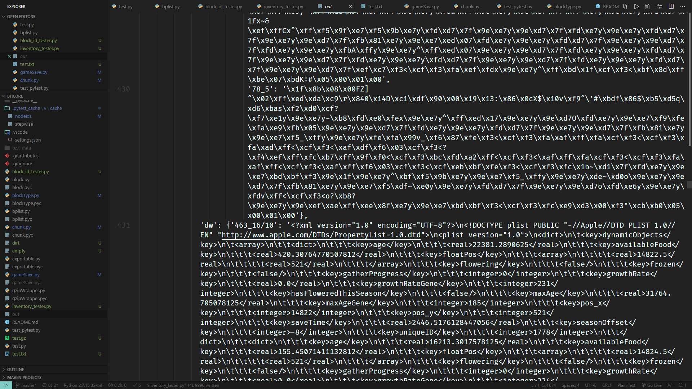

It's a hell of binaries and xml plist data that no one understands.

Good news is, the chunk data is gzip-compressed just like save files from older game versions. There's also binary plist and xml plist which could be easily parsed with some imports.

However, when writing the parsing function, I found that there would be situations where there was a plist or gzip or base64 inside an xml plist, which was really annoying. There was no other way, so I had to rely on recursion:

```python
def process(v):
    if isinstance(v, list):
        for i, _ in enumerate(v):
            v[i] = process(_)
        return v
    elif isinstance(v, dict):
        for a, b in v.items():
            v[a] = process(b)
        return v
    elif isinstance(v, bytes):
        f = io.BytesIO(v)
        result = None
        if v.startswith(b"bplist00"):
            result = ccl_bplist.load(f)
            result = process(result)
        elif v.startswith(b"\x1f\x8b"):
            with gzip.open(f, "rb") as f2:
                content = f2.read()
            result = process(content)
        else:
            result = v
        return result
    else:
        return v
```

Then write the file to any folder for easy inspection:

```python
env = lmdb.open(FOLDER + "world_db", readonly=True, max_dbs=114514)
with env.begin() as txn:
    cursor = txn.cursor()
    for k, v in cursor:
        sub_db = env.open_db(k, txn=txn, create=False)
        for k2, v2 in txn.cursor(sub_db):
            filename = FOLDER + OUT_FOLDER + "%s_%s" \
                       % (k.decode(), k2.decode().replace("/", "_"))
            result = process(v2)
            if isinstance(result, bytes):
                with open(filename, "wb") as f:
                    f.write(result)
            else:
                with open(filename, "w") as f:
                    f.write(pprint.pformat(result))
env.close()
```

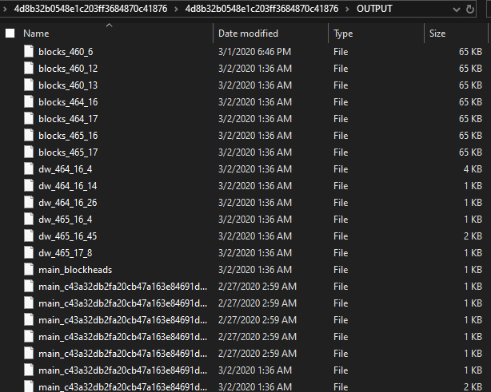

Pick a file and inspect it:


We can read it! The natural next step would be to figure out how to write it.

## Writing the Save File

Writing save files is honestly quite a hassle. I won't go into too much technical detail here.

In short, the `world_db` is divided into several sub-databases, each storing key-value pairs. The values are all binary data of various types.

Currently known data types include:

- bplist, Apple's binary property list
- plist, a standard property list stored in XML format
- base64
- gzip

The core goal is to distinguish and parse these contents while ensuring that they can be correctly repackaged into binary data. Thus, I created an abstract class called `Exportable`, which represents a class that can be exported as binary data. Such a class must provide a method called `export` for use during the export process.

That's basically it.

A good way to test whether `export` is working correctly is to pass the exported binary data into the class's constructor and see if the same data can be parsed. Once this test passes, there's a high probability that it won't fail with real data.

The implementation process was still a bit of a headache, after all, dealing with recursive structures. The debugging experience wasn't very user-friendly either. Even the slightest mistake would cause the game to reject the save file and not tell you what was wrong. But I guess you should not expect any decent debugging experience when reverse engineering someone else's game anyway.

Thankfully, it finally worked. To demonstrate its capabilities, I wrote a code snippet to randomly place time crystals:

```python
if __name__ == "__main__":
    from pprint import pprint
    from random import randint
    from blockType import BlockType
    FOLDER = "./test_data/saves/c8185b81198a1890dac4b621677a9229/"
    gs = GameSave(FOLDER)
    for name, chunk in gs.chunks.items():
        for _ in range(128):
            block = chunk.get_block(randint(0, 31), randint(0, 31))
            block.set_attr("first_layer_id", BlockType.TIME_CRYSTAL.value)
    print("saving...")
    gs.save("./test_data/saves/out/")
```

The general idea is to iterate through all chunks, independently randomly sample 128 block coordinates and then replace the block at the selected coordinate with time crystals.

The results are as follows:

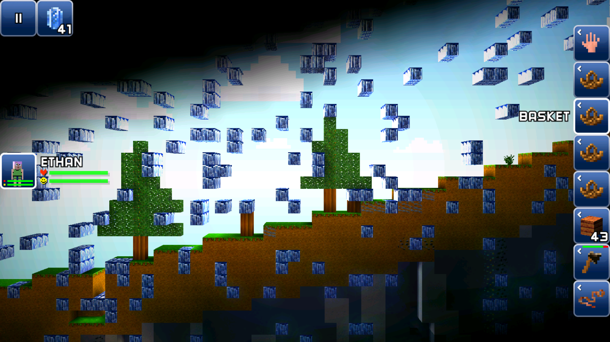

Let's test the IDs of all blocks in 1.7. Considering that there are unlikely to be more than 256 types, a 16*16 grid should be enough.

Code:

```python
FOLDER = "./test_data/saves/c8185b81198a1890dac4b621677a9229/"
gs = GameSave(FOLDER)
info = gs.get_info()
chunk_pos = [_ >> 5 for _ in info["start_portal_pos"]]
chunk_pos[1] += 1
chunk = gs.get_chunk(*chunk_pos)
for y in range(15, -1, -1):
    for x in range(16):
        b = chunk.get_block(x, y)
        b.set_attr("first_layer_id", ((15 - y) << 4 | x) % 128)
gs.save("./test_data/saves/out/")
```
Basically, we get the block above the spawn point and iterate from (0, 0) to (15, 15), i.e. from left to right and from top to bottom. Result:


There are quite a few blocks we don't really know what type it is. The amazing thing is that, for blocks 0 and 78 to 127, although they are transparent, they are all solid blocks:


Notice there's no ores, oil blocks, etc. I'm guessing there might be some additional value for blocks, like the stained glass and planks in minecraft. After all, a block takes 64 bytes, and we only know that the meaning of the very first byte is block type.

## Inventory

Once you've can change the world, it's time to do the same for inventory.

To figure out how the inventory is stored, we can simply control variables.

First, discard all your items. Then parse the inventory. You'll get the following result:

```py
[['\x01\x00\x00\x00\x00\x00\x00\x0c'], [], [], [], [], [], [], []]
```

The 8 bytes in the first list apparently represent the clothing slot, presumably a special item. The following seven lists are empty, as expected.

Next, place the dirt block into the first slot. Here's the result:

```py
[['\x01\x00\x00\x00\x00\x00\x00\x0c'], ['\x18\x04\x00\x00\x00\x00\x00\x0c'], [], [], 
[], [], [], []]
```

Based on the query strings for items on the [Global Market](http://blockmarket.theblockheads.net/), it's easy to see that the ID for [Dirt Block](http://blockmarket.theblockheads.net/graph/?item_id=1048) is 1048. Its hexadecimal value is `0x418`, which corresponds to `\x18\x04`. This proves that item IDs are stored in little-endian format.

Next, place one more dirt block in the first slot:

```py
[['\x01\x00\x00\x00\x00\x00\x00\x0c'], 
['\x18\x04\x00\x00\x00\x00\x00\x0c', '\x18\x04\x00\x00\x00\x00\x00\x00'], 
[], [], [], [], [], []]
```

It's quite surprising to know that it's not using some bits to represent the amount of dirt blocks. Also, the last byte goes from `\x0c` to `\x00`. What does this mean?

To further confirm how the amount of item is represented, we put one more dirt block into the same slot:

```py
[['\x01\x00\x00\x00\x00\x00\x00\x0c'], 
['\x18\x04\x00\x00\x00\x00\x00\x0c', '\x18\x04\x00\x00\x00\x00\x00\x00', 
'\x18\x04\x00\x00\x00\x00\x00\x00'], 
[], [], [], [], [], []]
```

It's still `\x00`. Does the first item always end with `\x0c`?

Add the quantity and try putting 13 dirt blocks:

```py
[['\x01\x00\x00\x00\x00\x00\x00\x0c'], ['\x18\x04\x00\x00\x00\x00\x00\x0c', 
'\x18\x04\x00\x00\x00\x00\x00\x00', '\x18\x04\x00\x00\x00\x00\x00\x00', 
'\x18\x04\x00\x00\x00\x00\x00\x00', '\x18\x04\x00\x00\x00\x00\x00\x00', 
'\x18\x04\x00\x00\x00\x00\x00\x00', '\x18\x04\x00\x00\x00\x00\x00\x00', 
'\x18\x04\x00\x00\x00\x00\x00\x00', '\x18\x04\x00\x00\x00\x00\x00\x00', 
'\x18\x04\x00\x00\x00\x00\x00\x00', '\x18\x04\x00\x00\x00\x00\x00\x00', 
'\x18\x04\x00\x00\x00\x00\x00\x00', '\x18\x04\x00\x00\x00\x00\x00\x00'], 
[], [], [], [], [], []]
```

This seems to confirm my hypothesis.

Since `\x01` is the ID for the clothing, why not try **turning all slots into clothing**?

It turns out it works:

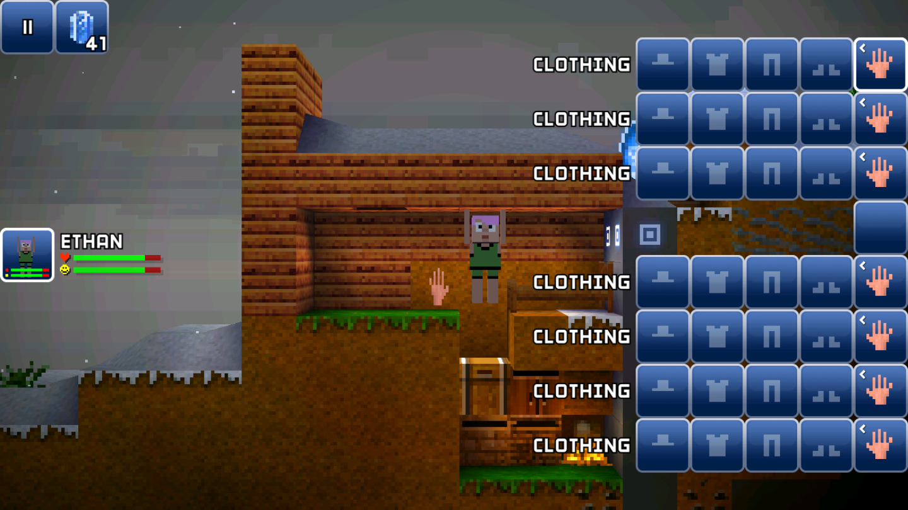

Walking around with a hand in my hand is kinda creepy, so I dropped it. Interestingly though I couldn't pick it up any more...

Now we can change item type, what happens if we make all the items empty? I tested it and found that the first item is always set to the clothing.

Since we've confirmed that it's little-endian encoding, let's try to figure out what the first few item IDs correspond to. The code is simple:

```python
FOLDER = "./test_data/saves/c8185b81198a1890dac4b621677a9229/"
gs = GameSave(FOLDER)
inv = gs["world_db"]["main"]["blockhead_321_inventory"]
for i in range(1, 8):
    inv[i] = [biplist.Data(struct.pack("<i", i + 1) + "\0\0\0\x0c")]
print(gs["world_db"]["main"]["blockhead_321_inventory"])
gs.save("./test_data/saves/out/")
```

This yields items with id from 2 to 8:

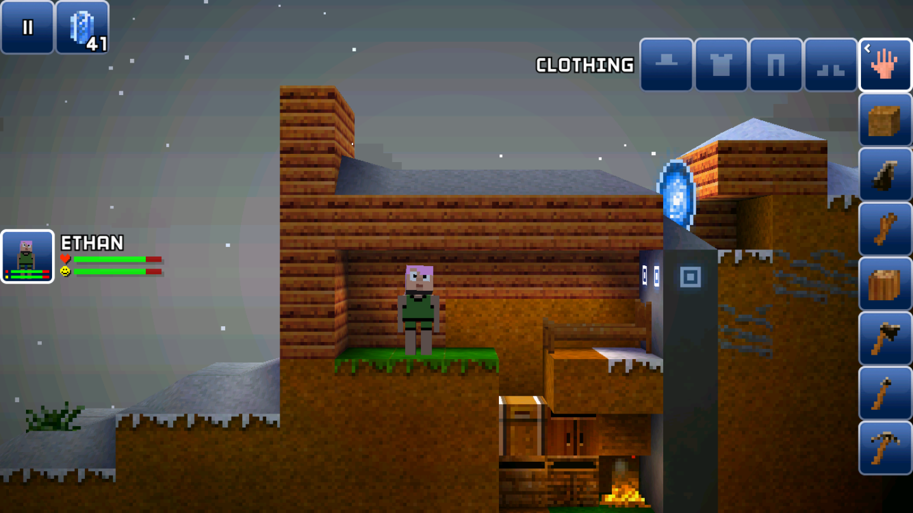

Which looks somewhat similar to the early screenshots of the game from Dave's [postmortem](https://www.gamedeveloper.com/business/postmortem-the-blockheads).

Putting baskets back and cleaning up all other items, we get:

```py
[['\x01\x00\x00\x00\x00\x00\x00\x0c'], ['\x0c\x00\x00\x00\x00\x00\x03\x0c'], 
['\x0c\x00\x00\x00\x00\x00\x03\x0c'], ['\x0c\x00\x00\x00\x00\x00\x03\x0c'], 
['\x0c\x00\x00\x00\x00\x00\x00\x0c'], ['\x0c\x00\x00\x00\x00\x00\x00\x0c'], 
['\x0c\x00\x00\x00\x00\x00\x00\x0c'], ['\x0c\x00\x00\x00\x00\x00\x00\x0c']]
```

It looks like the basket's ID is 12. Then, what the heck is this `\x03`?

Let's put this weird byte aside for now and put one dirt block into the first basket. Something interesting happened...

```py
[['\x01\x00\x00\x00\x00\x00\x00\x0c'], 
['\x0c\x00\x00\x00\x00\x00\x03\x0c\x1f\x8b\x08\x00\x00\x00\x00\x00\x00\x07
\x85\x8e\xcd\x0e\x820\x10\x84\xcf\xf2\x14\xb5wX\xbd\x19S0(hL\x88b\x84\x83
\xc7\x866J\xe4\xa7i\x1b\xd1\xb7\xb7\x051\xf1d/\xfd\xba3\x9d\x1d\xb2z\xd6
\x15zp\xa9\xca\xb6\xf1\xf1\xdc\x9ba\xc4\x9b\xa2ees\xf5q\x9em\xdd\x05^\x05
\x0e\x99F\xc7MvIc$\xaaRi\x94\xe6\xebd\xbfA\xd8\x05\x08\x85\xa88@\x94E(M
\xf6\xe7\x0c\x99\x0c\x80\xf8\x80\x11\xbei-\x96\x00]\xd7y\xd4\xba\xbc\xa2
\xad\xadQA*[\xc1\xa5~%&\xcc5\x1f<\xa6\x196k\x86\xf4\x9f:f\xca\xcaB\x07
\xce\x84\xdc\xf9+P\x04\xece^TJj\xe1C\xf0\x0f-M\x08\xa3\x9a\xf6\xb4\x0bO
\xe1p:\xbfW`\x94\x08\x8c\xfe/\x19\xb1\xef@\xa0o\x188o\x0b\xd3m\x148\x01
\x00\x00'], 
['\x0c\x00\x00\x00\x00\x00\x03\x0c'], ['\x0c\x00\x00\x00\x00\x00\x03\x0c'], 
['\x0c\x00\x00\x00\x00\x00\x03\x0c'], ['\x0c\x00\x00\x00\x00\x00\x00\x0c'], 
['\x0c\x00\x00\x00\x00\x00\x00\x0c'], ['\x0c\x00\x00\x00\x00\x00\x00\x0c']]
```

Why one dirt block could lead to this many new bytes??😳😳😳

Well if you look closely, you will notice `\x1f\x8b`, which is the header of gzip.

Decompression yields:

```xml
<?xml version="1.0" encoding="UTF-8"?>
<!DOCTYPE plist PUBLIC "-//Apple//DTD PLIST 1.0//EN" "http://www.apple.com/DTDs/PropertyList-1.0.dtd">
<plist version="1.0">
<dict>
        <key>s</key>
        <array>
                <array/>
                <array/>
                <array/>
                <array>
                        <data>
                        GAQAAAAAAAw=
                        </data>
                </array>
        </array>
</dict>
</plist>
```

Decoding `GAQAAAAAAAw=` with base64, you get `18 04 00 00 00 00 00 0c` - a dirt block!

Then wouldn't it be possible to add `<array/>` yourself? And what on earth is this `<key>s</key>`?

Regardless of all the unsolved mysterious bytes, we now understands the format of an item. For an item with a length of only 8 bytes, it's a single item. For an item with a length greater than 8 bytes, it's a container. To extract data from such container, just decompress everything from the 8th byte onwards and recursively parse it.

After some coding we get this beautiful parsing result:


Now, remember the 13 dirt blocks above? Since we are not using bits to represent the amount, we will try to put more than 99 items in one slot:

```py
gs = GameSave("./test_data/saves/c8185b81198a1890dac4b621677a9229/")
bh = gs.get_blockheads()
inv = gs.get_inventory(bh[0])
inv[1].set_id(1049)
inv[1].set_count(1919)
gs.save("./test_data/saves/out/")
```

Got this result:

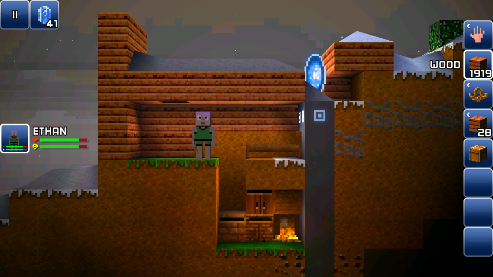

## Item durability (or wear level)

When I was working on code, I once assumed that item id takes 4 bytes. This resulted items with id 229553894. Clearly we mis-interpreted bytes that means something else. Item ID thus must be 2 bytes.

Interestingly, after fixing the exploding item id, all once problematic ids turns into tool ids. Naturally, it might be item durability that caused this. Some code helps checking the hypothesis:


Which after visualization looks like:

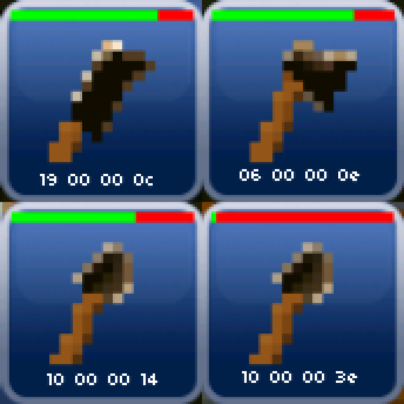

The last byte seems to indicate the wear level of the tool. The less durability left, the larger the value becomes.

Since everything is stored little-endian, the wear level should only use the 4-th byte.

Is it possible the value could be larger than `3f`? What about bronze, steel and better level tools?

Well we can simply change the value to `7f`. And we got this:


While this might look like photoshoped, this is indeed a screenshot.

What about wear level of better tools? Is `3f` still the maximum value?

Titanium pickaxe is the most durable pickaxe in the game and would be a great reference. Result:


So yes, `3f` is the maximum. In decimal it's 63. But we know titanium can be used much more than 64 times. Or maybe wear level takes 2 bytes, i.e. `00 3e` is the real value?

After hitting a few rocks, we check the item bytes:

```
C:\Game\BH\BHCore (master -> origin) 
λ c:/python27/python inventory_tester.py
'\x1d\x01!>\x00\x00\x00\x0c'
```

The 2-byte hypothesis is correct. The maximum loss is `ff 3f`. This means that each item has 16384 wear level / durability. The lower the item's level, the greater the loss of durability each time it's used. I used a titanium pickaxe to mine 11 blocks of stone, and the loss went from 00 to 21 3e . This increase of 33 points means that the titanium pickaxe loses 3 durability per use, meaning the titanium pickaxe can be used to mine 16384 / 3 = 5461.33 stones.

Similarly, we can test the durability of each kind of pickaxe. Since different pickaxe may have different bonuses for mining stone, the test method is to use the pickaxe to dig a block of sand, observe the wear and tear, and divide it by the number of times it takes to hit the block of sand by hand. This calculates the wear / durability loss caused by each pickaxe usage (gather 1 time). For convenience, this will be referred to as **base wear**.

Result:


Based on the previous observation, we can get the maximum number of usage by dividing 16384 by the base wear of the corresponding tool. The result is as follows:

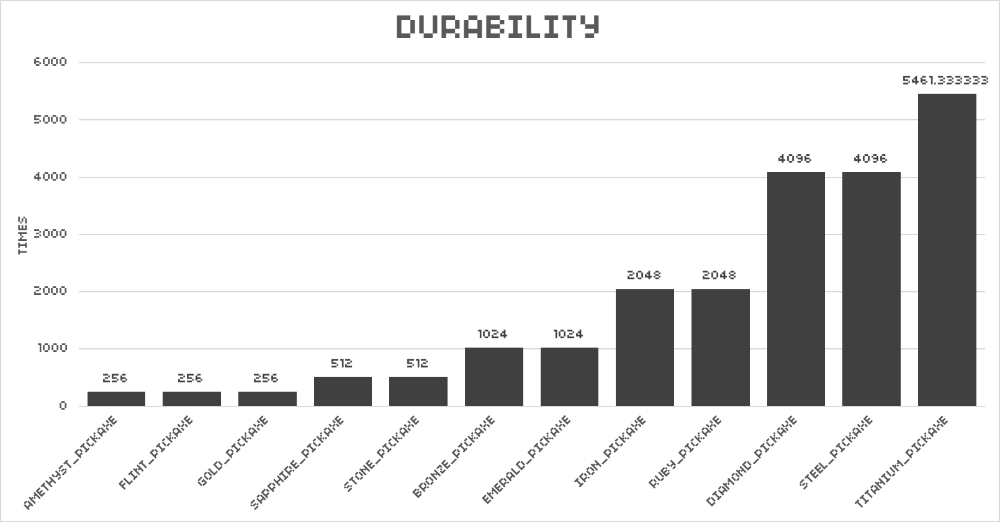

But don't forget that blocks also have "health" (sounds weird, but I can't think of a better word). Some pickaxes deal more damage to blocks, while others do less. This can lead to pickaxes with essentially the same wear and tear, mining the same block, but one will run out of durability first.

For this reason, it's obviously necessary to test the health of the block. I used a shovel for a fair comparison. The result...

Well, no matter how I adjust the block's hardness, there's always only one byte change... So I tried enumerating the changed byte from 0 to 255:


It seems the damage value is indeed stored in just one byte... but the hardness of industrial blocks clearly exceeds 256? So where exactly is the actual block hardness stored?

Just when I was at my wit's end, two blocks I'd previously tested actually recovered! This suggests the damage value and damage time must be stored somewhere other than the blocks. So I opened DW and pulled out all the files for the corresponding block. A DW file named `466_17/26` struck me as suspicious:

```json
{'dynamicObjects': [{'floatPos': [14918.5, 544.0],
                     'lastKnownGatherValue': 201,
                     'pos_x': 14918,
                     'pos_y': 544,
                     'timer': 7.865746974945068,
                     'uniqueID': 5815},
                    {'floatPos': [14914.5, 544.0],
                     'lastKnownGatherValue': 2,
                     'pos_x': 14914,
                     'pos_y': 544,
                     'timer': 0.43180203437805176,
                     'uniqueID': 6437}]}
```

Since I tested at blocks `2, 0` and `6, 0` of block `466, 17`, which converts to 14914 and 14918 respectively. Their heights are exactly 544. Furthermore, I mined `6, 0` first, then `2, 0`, so the timer data is correct.

So I guess it's `lastKnownGatherValue` that's controlling the damage (or maybe we should use `gather` as suggested by the game itself). However, after a few tests (by hitting the steel block with my hand), I found that the value hasn't changed at all... If the game uses floating point numbers for storage, then it's likely that the block's health is being forcibly converted to an unsigned short when it's stored.

Re-examining the measured damage data and dividing it by the base wear, we can get the number of hits each pickaxe takes to hit each block. End result:


The y-axis means the number of usage needed to mine one block. Everything looks good until steel block. Steel block is resilient to bronze pickaxe only, and titanium block is weak to steel, diamond, and titanium pickaxe??

I guess this leaves more question for me than what we learned here.

## Item ID mapping

Around 2015, there was a craze for collecting *unknown* items. The so-called *unknown* items were items without names. For some reason, these items of unknown origin suddenly began to circulate throughout the servers, and the myth that "the more you collect, the more powerful you become" took hold.

At the time, I didn't know how to modify item IDs, but I did know how to change the IDs of items dropped on the ground. This is because items on the ground are stored in a datastore (dw), which is just a regular binary plist before 1.7 update. So, with this rudimentary but effective technique, I successfully made a batch of home-made unknown items.

Knowing this works, I have considered mapping the ID back then. However, this method only allows me to test the ID of one item at a time. Such repetitive actions were hard to avoid getting bored with.

Thankfully, with code, it's much easier to finish what used to be a dream.

There are 7 baskets, each with 4 slots, meaning 28 items can be tested at a time. That's a 28x efficiency boost! The code is very simple:

```python
inv = gs.get_inventory(bh[0])
offset = 28 * 0
for i in range(1, 8):
    for j in range(3, -1, -1):
        item = inv[i][0]['s'][j]
        item.set_id(((i - 1) << 2 | (3 - j)) + offset)
        item.set_count(1)
```

The following are all items with ID 0 to 27:


It only took about a dozen times to finish. Here's some interesting findings:

- Placing a diamond portal obtained by changing the ID, only to find it turned into a normal portal.
- Paint obtained by changing the ID has no effect when applied to blocks.
- All workbenches obtained by changing the ID will function, but they are all at the lowest level.
- Some unmined blocks can be obtained by setting the ID:

  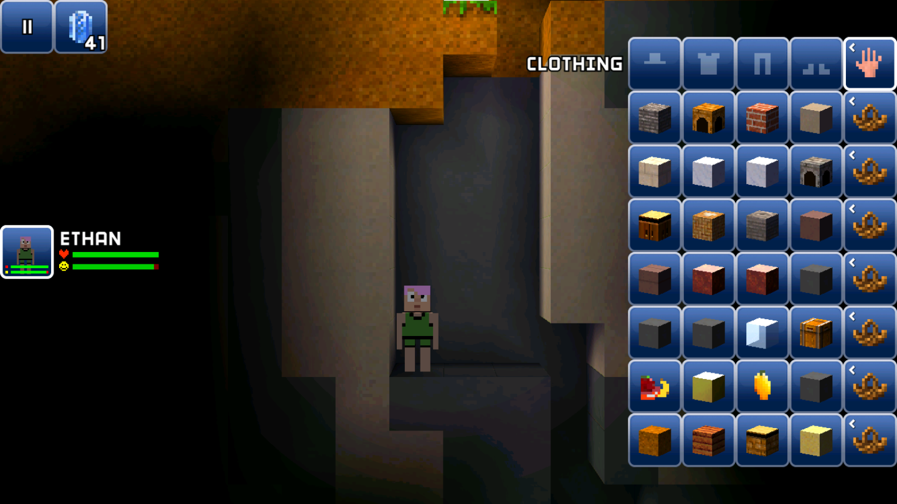

  We get unmined limestone, marble, red marble, and stone. However, they can't be placed - the game stops you from doing that.

I suspect the remaining `00 00 00 0c` in the item data contain the bytes describing the workbench level and paint color.

## Workbench

The byte that describes workbench level can be easily found by actually upgrading a workbench and see what changed.

However the upgraded workbench yields frustrating output:


A workbench item contains a lot of additional information, rather than just a bit representing the level as previously thought. There's just so much information that I suspect Dave has simply thrown out all the class members.

> Note from 2025: after checking decompiled code of the blockheads server, this is indeed simply a serialized workbench instance.

Try changing `['d']['level']` to 3, we successfully get a workbench of the highest level:

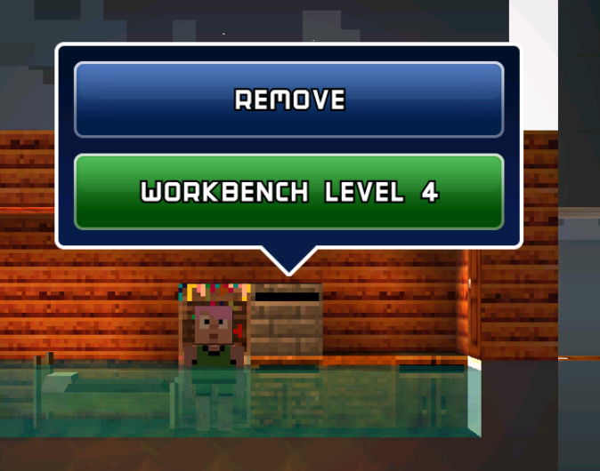

## Paints

Maybe paint color is stored in these bytes! First, just craft a bunch of paints:


Which could be visualized as:


Now for the mixing part. To start simple, we will do white + black and white + white + black. Result:

```
C:\Game\BH\BHCore (master -> origin)
λ c:/python27/python workbench_paint_tester.py
'g\x00\x00\x00\x00\x12\x00\x0c'
'g\x00\x00\x00\x20\x11\x00\x0c'
```

So the second dye will be placed in the lower 4 bits of the 5th byte, and the third dye will be placed in the upper 4 bits of the 4th byte? Will the lower 4 bits of the 4th byte be effective?

Anyway we can write the function to support this:

```py
    def set_color(self, *colors):
        assert 1 <= len(colors) <= 4
        val = 0
        for i in range(4):
            val <<= 4
            if i < len(colors):
                val |= colors[i]
        self._data = self._data[:4] + struct.pack("<H", val) + self._data[6:]
```

The logic is simple. If we convert the previous `\x20\x11` to an unsigned short, we get `11 20`. It's easy to see the relationship between the order of the dyes and the number of bits. Therefore, we can construct paints with only left shift.

Unfortunately though `set_color(1, 1, 2, 3)` doesn't yield the color I was expecting to see. So the game probably only read 3 4-bits.

What about cloth and bed? They should work the same. We can just try it:

```py
item = inv[2].get(2)
item.set_color(3, 4, 7)

item = inv[4].get(3)
item.set_color(5, 6, 8)
```

Result:


Their previous colors were `(1, 1, 2)` and `(0, 0, 0)`, meaning that the change was successful!

## More on block data format

We have only covered the 0th and 2nd byte of blocks, meaning foreground and background block type respectively.

But there's so much more: ore, color, discovered, brightness, temperature, water and snow height, and many more. We need more tests.

### Ore

There is a piece of clay next to the spawn point:


It's at `6, 27` in the chunk. We can compare the bytes with the dirt block below it:

```python
dirt_clay = chunk.get_block(6, 27)
dirt_normal = chunk.get_block(6, 26)
binary = ''.join([struct.pack('b', dirt_clay[i]) for i in range(64)])
binary_normal = ''.join([struct.pack('b', dirt_normal[i]) for i in range(64)])
print(repr(binary))
print(repr(binary_normal))
```

Got:

```python
'\x06\x06\x02\x02\xff\x00\xff\xbe\x00...'
'\x06\x06\x02\x00\xff\x00\xff\x8f\x00...'
```

Although there is a `0xbe` at the end, which is different from `0x8f`, the mineral type should obviously be placed at the front, and the number should not be so large. Considering that soil only has two minerals, `flint` and `clay`, it is very likely that `flint` is `\x01`.

After some coding, we now supports setting the ore type:

```py
dirt_clay.set("sub_type", 1)
```

And the result is good:


Now that this works, we must try something everyone wants to see:


Similarly for other blocks we just need to how many possible sub-types there are, right? Like maybe coal is 1, iron is 2?

I tried to find ore types for stone:


It's quite surprising that ores are separated very far apart. Turns out that if you take look at the middle layer...


Yep, there's even trees.

This means, the sub types of different blocks are mixed together - it's not like minecraft, where you get multiple variants for a block, like birch and bamboo plank or black and red stained glass.

Changing block id to air confirms the understanding above:

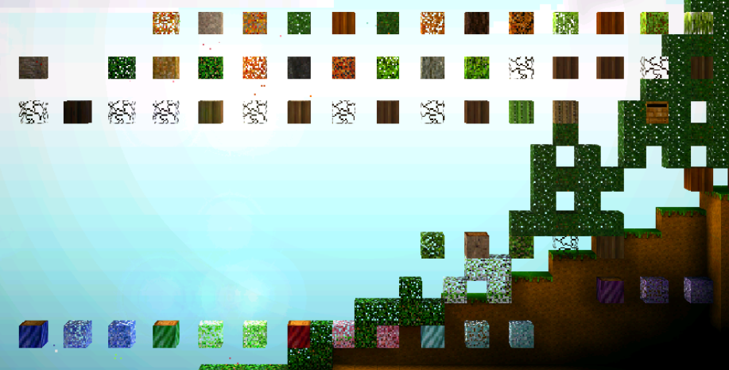

Guess it will take another eternity for me to find all the sub-type mapping.

Before that, let's just try something everyone wants to see again:


### Height of water and snow

First, put some water in our home sweet home:


Then pull out the block data corresponding to these 7 water blocks:

```py
for i in range(24, 31):
    print(chunk.get_block(i, 29).to_hex())
```


You can see that the 4-th byte of the last four blocks is `2e`, so the subtype value for the tool bench is 46. We can roughly guess that the 5-th digit represents the height of the water and snow.

Let's check snow:


Corresponds to bytes:

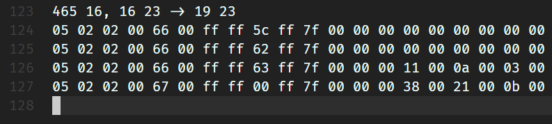

We can confirm that the 5-th byte represents the height of the water and snow. Looking at the following bytes, you can see that the top two blocks both have a value of 0. The only difference in the image seems to be lighting. Lighting itself requires three colors, which explains the presence of the three bytes: `11 0a 03`.

We'll leave lighting for later. Now, for some fun, we can generate an entire chunk of water and snow:

```py
chunk = gs.get_chunk(*chunk_pos)
for y in range(15, -1, -1):
    for x in range(16):
        b = chunk.get_block(x, y)
        b.set("first_layer_id", choice([BlockType.SNOW, BlockType.WATER]))
        b.set("height", 0xff)
```

And we get:

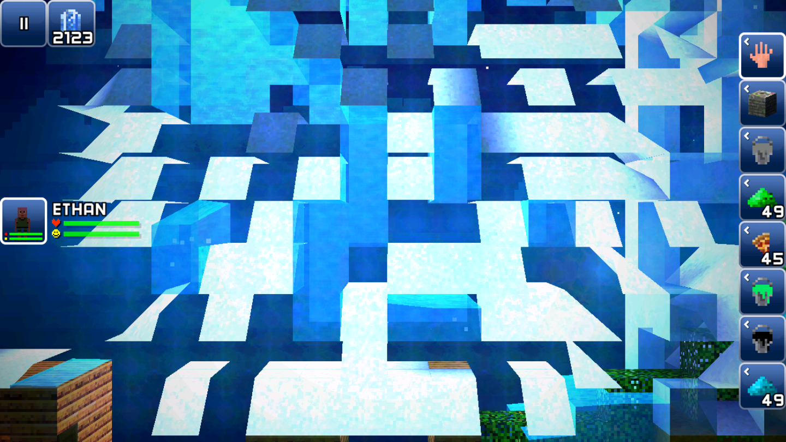

That's the messiness I always wanted to see!

### Visibility

Places that's not discovered are hidden behind fog. A good way to find which byte stores this info is to print out a column of blocks, here we chose the 17-th column of chunk `465, 17` and `465, 16` and printed out block bytes:

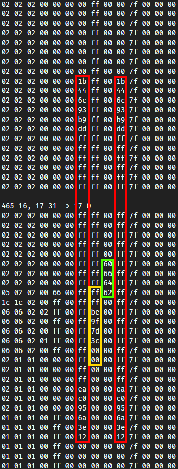

- The red part likely indicates whether it has been explored. `ff` means fully explored, and `00` means complete dark. However, I have no idea why this is represented by two identical bytes.
- I suspect the yellow part is caused by the darkness of solid blocks. After all, the further inside, the less light is received, and the closer it is to `00`. Blocks like air don't have this issue, so they're all `ff`.
- The green part shows strange data that remains unknown to me.

Let's test what happens if the values of the two red bytes are different:

```py
for y in range(15, -1, -1):
    for x in range(16):
        b = chunk.get_block(x, y)
        b.set("first_layer_id", BlockType.AIR)
        b.set("visibility", ((15 ^ y) << 4 | x) & 255, randint(0, 255))
```


So the second byte means... nothing?

After swapping the value, we get:


Guess I can't figure out why there's two identical bytes but only one of them actually works.

### Brightness

Based on previous observations, we infer that brightness is at 8-th byte. Therefore, the result after making all blocks other than air unlit is as follows:


This shows that the blockheads uses their foot to perceive brightness.


Changing the brightness and visibility of all blocks, we can visualize all generated chunks:


---

To keep the length of this article down, I'll stop here for this part. See you in the next one!

> 2025 update: click [here](/the-blockheads-save-file-tool-dev-log-2/) to read the second part!

## Reference

- http://deepdish.io/2015/04/28/creating-lmdb-in-python/
- https://blog.separateconcerns.com/2016-04-03-lmdb-format.html
- https://lmdb.readthedocs.io/en/release/


