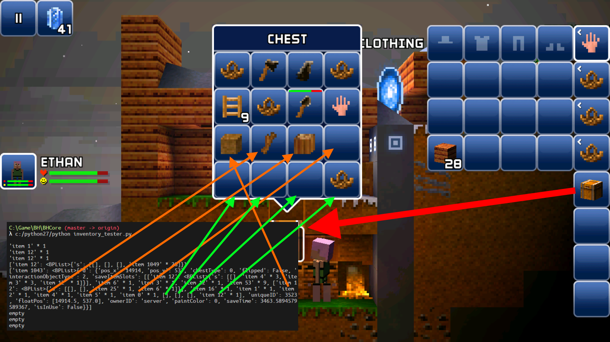
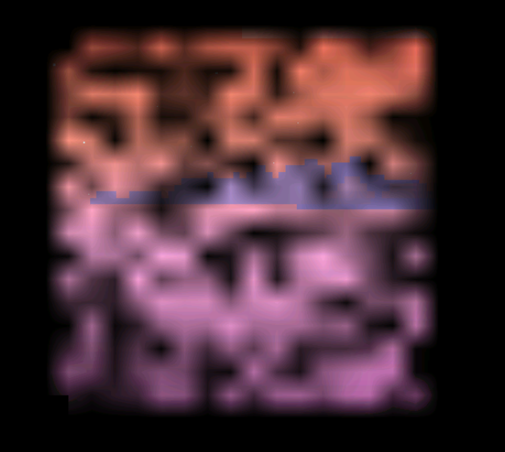

自从小学期有幸获得同学的申必VPN后，就总觉得，既然能连上Google Play Store了，就应该把*那个游戏*下下来，体验一下正版之类的。这样的想法总是若隐若现，而*那个游戏*的名字我又早已淡忘。于是就这么一直拖着，直到拖到了最近才想起来。

它的名字叫The Blockheads。我想大部分人应该都没听说过。

这是一个我从初中就开始玩的游戏。作为移动平台的独立游戏，其综合素质不可谓不高。当年曾经拿下过App Store免费榜的榜首。即便是原作者已经几乎是弃坑了几年之后，其论坛依然有不少活跃用户。

先贴几张截图，直观的感受一下到底是个怎样的游戏:


> Nick的[红砖建筑](https://tieba.baidu.com/p/2280732422)


> 苏_悠少的[中式木建筑](https://tieba.baidu.com/p/4243244196)


> kaga的[涂鸦](https://tieba.baidu.com/p/2844121646)

然而很不幸的是，作为一个沙盒游戏，其创造力却被移动平台，合成时间机制以及纯生存所禁锢:

- 移动平台使得更改其存档极其困难。要么root要么越狱，除此之外没有别的办法。
- 合成时间机制。由于合成物品需要时间，引入用来加速合成的道具自然也就能带来除了广告之外的另一笔收入。但是对于巨型建筑工程来说，所需要的合成时间通常会高达上万小时。要么修改水晶，要么开启服务器号召大家一起建造。在玩家群体如此式微的现在，想要召集高质量的建筑师大概不怎么可行。这样看来的话，要解决合成时间的问题可能只剩下root然后改水晶数量了吧。
- 纯生存。虽然在引入了自定义机制之后，已经相比以前要方便许多了，但还是没办法轻松地拆掉钢块钛块之类的。而且就算交易门免费，也需要有存储的箱子之类的。而且也不能复制粘贴批量修改（为什么会有这种功能啊喂！），也不能放置不合法的方块。看看隔壁的小木斧和MCEdit，总之多少有些羡慕。

在minecraft因为mod和本体不断更新而风生水起的时候，看着另外一个同样很优秀的游戏因为这种限制而不断凋零，对于喜欢这游戏的玩家来说显然不是什么好事。

在建造巨型建筑的时候，想要复制一个非常复杂的结构，并粘贴到某个位置，显然不可能。看腻了BH自带的地形，想要自己写个地形生成器，发现没有API。将一些不可分割的元素拆分后也许能做出相当棒的效果，然而因为不可拆分所以同样做不到。利用程序生成迷宫，自定义空岛生存，这些都是很棒的点子，但就是做不到。

多可惜啊。

上github转了一圈，反正没看到有谁写过类似的东西，大多不过是聊天机器人。这样的话，就只能自己动手了。

## 读存档

上手一看，存档文件夹里就躺着个world_db，里面就俩文件，`data.mdb`和`lock.mdb`。照理说`.mdb`应该是Access的格式，然而很可惜并打不开。

无奈，上网查了一下`.mdb`还可能是什么存储格式，但还是无功而返。针对文件内容的分析也同样失败了。

心态有点小崩，返回存档又看了几眼，发现不仅是world_db，lightBlocks和server_db同样也都只有`data.mdb`和`lock.mdb`。由于db的全称是database，不免让人想到这一数据库的特点就是同时存储`data.mdb`和`lock.mdb`来作为整个数据库。因此把这两个名字一起搜一下，果然...


??? 为什么会跳出来caffe的结果啊?

不过也总比什么证据都得不到要好，毕竟提到了个叫lmdb的东西。我想可能就是它了。遂搜索，然而一个GUI工具都没找着，只找到一个python的模块和一个[文档](https://lmdb.readthedocs.io/en/release/)。嗬，感情我还得学完这API才能确定自己猜的对不对呗?

想着似乎也就这么一个可能的可行路径了，就还是试了下去。好在最后的确成功读出了数据。

---

总的来说，1.7的存档格式相比之前有些改动。现在的1.7采用的是lmdb，将数据全部存放在几个数据库里。而以前各个文件都分散地存储在不同的文件夹里。新的存储方式提供了完整性保证，杜绝了通过*复制物品栏文件后，把物品栏的物品放进箱子里，再把物品栏复制回来*的方法刷物品。另外，由于lmdb提供ACID的事务，因此不用再担心存档在读写过程中出现问题而导致存档损坏的情况了。~~要是再出问题那就可以实锤dave的代码有bug了。~~

只是单纯的读出来而不做任何处理的话，会得到这种申必数据:


就是二进制和xml plist组成的地狱绘图。

好在，其中的区块数据和以前一样，还是gzip压缩。而二进制的bplist也同样有库可以解决。xml plist则更不用说，python自带了plistlib可以用于解决这一问题。

然而，在写解析函数的时候，我发现还会出现那种xml plist里面套plist或者gzip或者base64的情况，属实膈应人。没办法，还是只能依赖递归了:

```python
def process(v):
    if isinstance(v, list):
        for i, _ in enumerate(v):
            v[i] = process(_)
        return v
    elif isinstance(v, dict):
        for a, b in v.items():
            v[a] = process(b)
        return v
    elif isinstance(v, bytes):
        f = io.BytesIO(v)
        result = None
        if v.startswith(b"bplist00"):
            result = ccl_bplist.load(f)
            result = process(result)
        elif v.startswith(b"\x1f\x8b"):
            with gzip.open(f, "rb") as f2:
                content = f2.read()
            result = process(content)
        else:
            result = v
        return result
    else:
        return v
```

然后把文件写到随便哪个文件夹下，方便查询:

```python
env = lmdb.open(FOLDER + "world_db", readonly=True, max_dbs=114514)
with env.begin() as txn:
    cursor = txn.cursor()
    for k, v in cursor:
        sub_db = env.open_db(k, txn=txn, create=False)
        for k2, v2 in txn.cursor(sub_db):
            filename = FOLDER + OUT_FOLDER + "%s_%s" \
                       % (k.decode(), k2.decode().replace("/", "_"))
            result = process(v2)
            if isinstance(result, bytes):
                with open(filename, "wb") as f:
                    f.write(result)
            else:
                with open(filename, "w") as f:
                    f.write(pprint.pformat(result))
env.close()
```

就能得到一大堆乱七八糟的文件:


随便打开一个看看:


能读了！！

不过只是能读那有个🔨用，改不了还不是个鸡肋?

## 写存档

写存档说实话还挺麻烦的。在这里就不透露过多技术细节了。

简而言之，world_db下会分有几个子数据库，子数据库内存储的都是键值对。值全部都是二进制数据，而且类型各不相同。而有些类型又是容器，容器内又有不同的格式，总之相当混乱。

目前已知的有下面这些:

- bplist，苹果的binary property list
- plist，普通的property list，以xml的形式存储
- base64
- gzip

那么核心目标就是，在分辨并解析这些内容的同时，确保有办法能够让它们被重新正确地打包成二进制数据。为此，我设置了一个抽象类，名为`Exportable`，表示这是可以导出成二进制数据的类。这样的类必须提供一个名为`export`的方法，用于在导出时使用。

大致上就是如此。

一个很好的检测`export`是否在正确工作的方法就是把export出来的二进制数据丢进该类的构造方法里，看看能不能解析出同样的数据来。我想，能够通过这样的测试的话，大概率也就不会在真实数据上翻车了。

实现过程总之还是有点头疼的，毕竟总是要处理递归的结构。debug体验也不是很友好。稍微写错一点，游戏就不认这个存档，也不告诉你错哪了。不过逆向分析别人的东西，本来就不会有什么debug体验就是了。

好在最后成功地跑起来了。为了展示其能力，特地写了一段用来随机放置时间水晶的代码:

```python
if __name__ == "__main__":
    from pprint import pprint
    from random import randint
    from blockType import BlockType
    FOLDER = "./test_data/saves/c8185b81198a1890dac4b621677a9229/"
    gs = GameSave(FOLDER)
    for name, chunk in gs.chunks.items():
        for _ in range(128):
            block = chunk.get_block(randint(0, 31), randint(0, 31))
            block.set_attr("first_layer_id", BlockType.TIME_CRYSTAL.value)
    print("saving...")
    gs.save("./test_data/saves/out/")
```

大致思路就是遍历所有chunk，跑128次随机，每次随机俩数字，把这俩数字对应的方块改成时间水晶就完事了。

成果如下:


*本来觉得用这样的例子不太好，毕竟dave大还是要靠看广告送水晶的方法来恰饭的。但是转念一想，要想改存档，起码得root或者越狱。既然都root/越狱了，改个水晶还不简单?*

再测一下1.7所有方块的id。考虑到不可能超过256种，所以用16 * 16的格子应该就能满足要求了。

代码如下:

```python
FOLDER = "./test_data/saves/c8185b81198a1890dac4b621677a9229/"
gs = GameSave(FOLDER)
info = gs.get_info()
chunk_pos = [_ >> 5 for _ in info["start_portal_pos"]]
chunk_pos[1] += 1
chunk = gs.get_chunk(*chunk_pos)
for y in range(15, -1, -1):
    for x in range(16):
        b = chunk.get_block(x, y)
        b.set_attr("first_layer_id", ((15 - y) << 4 | x) % 128)
gs.save("./test_data/saves/out/")
```

大致上就是获取出生点上方的区块，把它从(0, 0)到(15, 15)的部分按照从左到右，从上到下的方法枚举出来。结果如下:


可以看到有不少不能确定的方块。神奇的是，对于0号和78~127号方块来说，尽管它们是透明的，但它们却都是实打实的实体方块:


矿物并没有出现。我猜可能是存在类似mc染色玻璃和木板那样的方块附加值。毕竟一个方块花了64个字节描述，而现在只知道其中两个字节的意思。

## Inventory迷思

在能基本改造世界后，就该考虑物品栏了。

要测Inventory的存储方式，自然只能依靠控制变量法了。

首先先丢掉身上所有物品。然后把Inventory解出来，可以得到下面的数据:

```
[['\x01\x00\x00\x00\x00\x00\x00\x0c'], [], [], [], [], [], [], []]
```

显然第一个list中的8个byte表示服装栏，大概是一个特殊的物品吧。后面七个list都是空的，符合预期。

接下来把土块放进第一个格子，所得数据如下:

```
[['\x01\x00\x00\x00\x00\x00\x00\x0c'], ['\x18\x04\x00\x00\x00\x00\x00\x0c'], [], [], 
[], [], [], []]
```

根据[全球市场](http://blockmarket.theblockheads.net/)上各物品的query string，不难看出[土块](http://blockmarket.theblockheads.net/graph/?item_id=1048)的id是1048。它的16进制值为`0x418`，正好对应着`\x18\x04`。这证明了物品id的存储方式是little-endian。

接下来是在第一个格子里放俩土块:

```
[['\x01\x00\x00\x00\x00\x00\x00\x0c'], 
['\x18\x04\x00\x00\x00\x00\x00\x0c', '\x18\x04\x00\x00\x00\x00\x00\x00'], 
[], [], [], [], [], []]
```

卧槽，居然不是改动某一位来表示数量?? 而且最后一位也从`\x0c`变成了`\x00`，这又是什么意思呢?

保险起见，再放一个土块进去:

```
[['\x01\x00\x00\x00\x00\x00\x00\x0c'], 
['\x18\x04\x00\x00\x00\x00\x00\x0c', '\x18\x04\x00\x00\x00\x00\x00\x00', 
'\x18\x04\x00\x00\x00\x00\x00\x00'], 
[], [], [], [], [], []]
```

依然是`\x00`。难道第一个物品都是以`\x0c`结尾的吗?

把数量加上去，放13个土块试试:

```
[['\x01\x00\x00\x00\x00\x00\x00\x0c'], ['\x18\x04\x00\x00\x00\x00\x00\x0c', 
'\x18\x04\x00\x00\x00\x00\x00\x00', '\x18\x04\x00\x00\x00\x00\x00\x00', 
'\x18\x04\x00\x00\x00\x00\x00\x00', '\x18\x04\x00\x00\x00\x00\x00\x00', 
'\x18\x04\x00\x00\x00\x00\x00\x00', '\x18\x04\x00\x00\x00\x00\x00\x00', 
'\x18\x04\x00\x00\x00\x00\x00\x00', '\x18\x04\x00\x00\x00\x00\x00\x00', 
'\x18\x04\x00\x00\x00\x00\x00\x00', '\x18\x04\x00\x00\x00\x00\x00\x00', 
'\x18\x04\x00\x00\x00\x00\x00\x00', '\x18\x04\x00\x00\x00\x00\x00\x00'], 
[], [], [], [], [], []]
```

看来证实了这一猜想。

既然`\x01`是衣服那一栏的编号，为什么不试试**把所有物品都变成衣服栏**呢?

事实证明可行:


手里拿着个手走来走去实属渗人，赶紧撇了。结果丢地上之后发现还真就捡不起来了。。

既然可以改，那把所有的物品都改成空的会怎样? 测了一下发现第一个物品无论如何都会被强制设置为衣物栏...还是放弃吧。

既然已经确定了是little-endian编码，不妨试试前几个物品id分别对应什么。代码写起来很简单:

```python
FOLDER = "./test_data/saves/c8185b81198a1890dac4b621677a9229/"
gs = GameSave(FOLDER)
inv = gs["world_db"]["main"]["blockhead_321_inventory"]
for i in range(1, 8):
    inv[i] = [biplist.Data(struct.pack("<i", i + 1) + "\0\0\0\x0c")]
print(gs["world_db"]["main"]["blockhead_321_inventory"])
gs.save("./test_data/saves/out/")
```

就可以得到id 1 ~ 8的物品:


如果有读过kaga翻译的dave大的[一周年开发回顾](https://tieba.baidu.com/p/2838156463)的话，会发现这个泥土和原木...实在是太有年代感了。

接下来把剩下7个篮子装回去，然后把所有物品掏空。所得结果如下:

```
[['\x01\x00\x00\x00\x00\x00\x00\x0c'], ['\x0c\x00\x00\x00\x00\x00\x03\x0c'], 
['\x0c\x00\x00\x00\x00\x00\x03\x0c'], ['\x0c\x00\x00\x00\x00\x00\x03\x0c'], 
['\x0c\x00\x00\x00\x00\x00\x00\x0c'], ['\x0c\x00\x00\x00\x00\x00\x00\x0c'], 
['\x0c\x00\x00\x00\x00\x00\x00\x0c'], ['\x0c\x00\x00\x00\x00\x00\x00\x0c']]
```

看来篮子的id是12。那这个`\x03`是什么鬼啊??

还是先不考虑这个奇葩字节，丢个土块进第一个篮子里。结果出现了不得了的东西...

```
[['\x01\x00\x00\x00\x00\x00\x00\x0c'], 
['\x0c\x00\x00\x00\x00\x00\x03\x0c\x1f\x8b\x08\x00\x00\x00\x00\x00\x00\x07
\x85\x8e\xcd\x0e\x820\x10\x84\xcf\xf2\x14\xb5wX\xbd\x19S0(hL\x88b\x84\x83
\xc7\x866J\xe4\xa7i\x1b\xd1\xb7\xb7\x051\xf1d/\xfd\xba3\x9d\x1d\xb2z\xd6
\x15zp\xa9\xca\xb6\xf1\xf1\xdc\x9ba\xc4\x9b\xa2ees\xf5q\x9em\xdd\x05^\x05
\x0e\x99F\xc7MvIc$\xaaRi\x94\xe6\xebd\xbfA\xd8\x05\x08\x85\xa88@\x94E(M
\xf6\xe7\x0c\x99\x0c\x80\xf8\x80\x11\xbei-\x96\x00]\xd7y\xd4\xba\xbc\xa2
\xad\xadQA*[\xc1\xa5~%&\xcc5\x1f<\xa6\x196k\x86\xf4\x9f:f\xca\xcaB\x07
\xce\x84\xdc\xf9+P\x04\xece^TJj\xe1C\xf0\x0f-M\x08\xa3\x9a\xf6\xb4\x0bO
\xe1p:\xbfW`\x94\x08\x8c\xfe/\x19\xb1\xef@\xa0o\x188o\x0b\xd3m\x148\x01
\x00\x00'], 
['\x0c\x00\x00\x00\x00\x00\x03\x0c'], ['\x0c\x00\x00\x00\x00\x00\x03\x0c'], 
['\x0c\x00\x00\x00\x00\x00\x03\x0c'], ['\x0c\x00\x00\x00\x00\x00\x00\x0c'], 
['\x0c\x00\x00\x00\x00\x00\x00\x0c'], ['\x0c\x00\x00\x00\x00\x00\x00\x0c']]
```

不是，加个土块，至于这么激动吗?? 这一个土块咋能干出这么多字节来呢??😳😳😳

然后仔细一看，看到`\x1f\x8b`我就知道事情不对...这不是gzip文件头吗...

gzip解压之后如下:

```xml
<?xml version="1.0" encoding="UTF-8"?>
<!DOCTYPE plist PUBLIC "-//Apple//DTD PLIST 1.0//EN" "http://www.apple.com/DTDs/PropertyList-1.0.dtd">
<plist version="1.0">
<dict>
        <key>s</key>
        <array>
                <array/>
                <array/>
                <array/>
                <array>
                        <data>
                        GAQAAAAAAAw=
                        </data>
                </array>
        </array>
</dict>
</plist>


```

高，实在是高。`GAQAAAAAAAw=`解码后正是`18 04 00 00 00 00 00 0c`。

这样的话，岂不是可以自己乱加`<array/>`?? 这个`<key>s</key>`又是什么鬼?

不过也算是大致确定了一个物品的格式。对于长度只有8字节的，就是单个物品。对于长度大于8字节的，就是一个容器。对于长度大于8字节的，把第8字节开始到后面所有的部分都拿去解压并递归解析即可。

依然是省略又臭又长又煞风景的代码段，直接来看结果:



上图中，由于实现了repr，所以物品栏中每个物品的内容都可以被详尽的打印出来，包括在chest里的basket里的物品也都能显示。上面的箭头对应着解析结果与实际物品的对应关系。

另外，有了之前13个土块的经验，这次来试试超过99个物品堆叠限制的测试:

```python
gs = GameSave("./test_data/saves/c8185b81198a1890dac4b621677a9229/")
bh = gs.get_blockheads()
inv = gs.get_inventory(bh[0])
inv[1].set_id(1049)
inv[1].set_count(1919)
gs.save("./test_data/saves/out/")
```

跑完之后，结果如下:


## 损耗

之前实现时，假定物品id占用4字节。结果实现了repr之后发现居然出现了item 229553894这种表示...显然占用了用来表示其他内容的字节，因此id只能是2字节了。

而很显然的是，对于little-endian而言的高位出现了变动，导致了item id出现了离谱的数字。而它们对应的物品id在恢复正常后，指向的都是工具。难免让人怀疑后面的位数是耐久。

于是写一点简单代码跑一下:


总的来说就是获取inventory，然后读取指定位置的内容并打印出来。为了方便观察，我把输出的值和图标对应了起来。规律自然也是很明显了:


考虑到这个数值随着损耗程度越大而越大，还是不要叫它耐久，而是叫它损耗比较好。

因为是little-endian，那么按照目前的数据，损耗就应该只占用第四位。

不过仍然需要注意的是，这是同一等级的物品的损耗。因此，数值是否可能比`3f`更大，需要对其他等级的工具进行测试。

在那之前，为了满足自己的恶趣味，来试试把flint spade的损耗改到7f:


看起来就跟p的一样，不过游戏画面的确就是这样😂😂有被笑到hhhh

大概dave大认为控制损耗的代码不会出错，就没有在读取物品的时候添加对应的检测。~~也算是人之常情吧，我也经常偷这种懒来着...~~

接下来测试一下同样是`3e`的损耗，其他物品的表现如何呢? 这次直接请出游戏中最耐用的工具之一: 钛镐。

简单地在之前的代码中加上`item.set_id(285)`，就能把flint spade变成titanium pickaxe。测试结果如下:


*黑人问号.jpg* 如果损耗只有一位的话，那要怎么确定钛镐能够挖多少次啊? 毕竟上限只有`3e`... 还是说，其实`00 3e`才是真正的损耗值?

感觉后一个猜想可行，随便敲几个石头试试，然后看看损耗值。结果如下:

```
C:\Game\BH\BHCore (master -> origin) 
λ c:/python27/python inventory_tester.py
'\x1d\x01!>\x00\x00\x00\x0c'
```

看来第二个猜想是正确的，所以最大的损耗是`ff 3f`。可以理解为，每个物品都有16384的耐久。等级越低的物品，每使用一次耐久减少得越多。我用钛镐挖了11块石头，损耗从`\x00>`变成了`!>`，也就是`21 3e`。损耗增加了33点，说明钛镐挖一次石头会损失3耐久。显然不难计算出钛镐的使用次数为`16384 / 3 = 5461.33`次。

那同样我们也可以测试出每种镐子的耐久。由于不同的稿子挖石头可能会有不同的加成，因此测试方法是用镐子挖一块沙子，观察损耗值，并除以手敲一块沙子所需次数，即可计算出每次镐击带来的损耗。为了方便起见，下文就把这简称为**基本损耗**。

结果如下:


再根据之前的结论，只要用16384除以对应工具的基本损耗就可以得到它的敲击次数限制了。结果如下:


但不要忘了，方块也是有*生命值*的（听起来很怪但是没想到更好的词儿）。有的镐子给方块的伤害比较高，有的比较低。这就会导致基本损耗相同的镐子，挖同种方块，最后却是其中一把先爆。

为此，显然有必要测试方块的生命值。镐子有加成，所以用铲子测试。结果...

呃，不论我怎么调整方块的硬度，永远都只有一个字节有改动...所以试了一下把这个改动的字节从0 ~ 255枚举一遍:


看来损伤值确实是只有一个字节来存储...可是工业方块的硬度显然已经超过了256的范围啊? 那到底是把真实的方块硬度放在哪里了呢...

一筹莫展的时候，两个之前被我拿来测试的方块居然复原了！这说明一定是在blocks以外的地方存储了损伤值以及损伤时间。于是打开dw，把对应区块所有文件扒拉出来。里面一个叫`466_17/26`的dw让我觉得很可疑:

```json
{'dynamicObjects': [{'floatPos': [14918.5, 544.0],
                     'lastKnownGatherValue': 201,
                     'pos_x': 14918,
                     'pos_y': 544,
                     'timer': 7.865746974945068,
                     'uniqueID': 5815},
                    {'floatPos': [14914.5, 544.0],
                     'lastKnownGatherValue': 2,
                     'pos_x': 14914,
                     'pos_y': 544,
                     'timer': 0.43180203437805176,
                     'uniqueID': 6437}]}
```

由于我做测试的点分别是区块`466, 17`的第`2, 0`和`6, 0`方块，简单换算一下就是`14914`和`14918`。而它们的高度又正好是`544`。此外，我是先挖的`6, 0`，再挖的`2, 0`，所以`timer`的数据也没有错。

所以想必是`lastKnownGatherValue`在控制损伤了。但是，做了几次测试之后（用手敲了几下钢块），发现这个值完全没有变... 如果游戏内是用浮点数存储的话，那大概率就是方块的生命值在存储时会被强制转换成unsigned short了吧。

无奈之下重新审视测得的损耗数据，和基本损耗相除后就可以得到每种镐子敲每种方块的敲击次数。绘制成图像后如下:


并找不到什么规律...钢块对铜镐之类的竟然还有抗性...真的摸不透。

所以，最后得出的结论如下:

- 每种工具每次敲击消耗的耐久是固定的。
- 不同的工具对不同的方块的攻击力不同。
- 所有方块的生命值都只有256。

说实话没什么建设性的发现...

## 物品测序

~~这标题整得跟基因测序似的，不懂的人还以为很高大上，往下一看就发现就测个id而已，失望至极，转而怒骂作者，拉黑离去。~~

数年前，曾经有过一场unknown收集热。所谓unknown，就是没有名字的物品。不知道为什么，似乎一时间，服务器中就开始流传这些来历不明的物品，并且刮起了*收集得越多就越是大佬*这种神奇的风气。

那时的我虽然不清楚怎么修改物品的id，但是却知道怎么更改掉在地上的物品的id。这是因为地上的物品是被存放在dw里的，而dw就是普普通通的bplist。于是，凭借着这样低级却有效的技术，我也成功自制了一批unknown。

尝到了甜头的我在那时就有过要测序的念头。但利用这种方法，每次只能测一个物品的id。如此高重复的动作，很难不让人厌倦。

好在如今有了代码的支持，想要测序就变得异常简单了。

7个basket，每个basket4个slot，一次能测28个物品。代码很简单:

```python
inv = gs.get_inventory(bh[0])
offset = 28 * 0
for i in range(1, 8):
    for j in range(3, -1, -1):
        item = inv[i][0]['s'][j]
        item.set_id(((i - 1) << 2 | (3 - j)) + offset)
        item.set_count(1)
```

以下是id 0 ~ 27的所有物品:


前前后后测了大概十几次，总归也测完了。由于实在太多，就不在这里贴出了。

记录一些神奇的事情:

- 在测序过程中把改id获得的diamond portal放下来，却发现它变成了普通portal。

- 通过改id获得的paint， 涂在方块上不会有任何效果。

- 通过改id获得的所有工具台都可以工作，但都是最低等级。

- 可以通过设定id获得一些原始方块:

    
    
    上图中就获得了未被挖掘的`limestone`，`marble`，`red marble`以及`rock`。但是，任何试图放置它们的尝试都会被游戏阻止而失败。

我猜，物品数据中剩下的`00 00 00 0c`中，应该就包含了描述工作台等级和paint颜色的字节。这样的话，准备几个石头让小人升级一下最基础的workbench，再看看物品的数据大概就可以了。

## 物品格式

于是根据上面所设想的测试步骤，升级了一个workbench，然后得到了看着就很麻烦的输出:


就是说，一个workbench item里，会带有很多很多附加信息，而不是之前设想的那样用某个位表示等级。这信息实在是太多了，我怀疑dave是直接把所有类成员都丢了出来。

试着把`['d']['level']`改成了3，成功获得了一枚最高等级的workbench:


也算是发现了后面的部分应该称为附加数据，于是添加了构造和删除附加数据的方法。~~然而还是不怎么好用就是了。~~

然后试着造了一桶白油漆，并把数据读了出来:


这一次确实没有附加数据了，我猜想的位置也出现了改变。不过，具体每一位代表什么还有着许多不确定。

于是我先把最基本的8种颜色做了出来，获得了它们的数据:


然后把它们一一对应到油漆上:


简单观察一下就能发现，数字大小和它们在mixing bench中的出现顺序一致。

不过光有一个颜料肯定是不够的，接下来试试白+黑以及白+白+黑。命令行的输出结果分别是:

```
C:\Game\BH\BHCore (master -> origin)
λ c:/python27/python workbench_paint_tester.py
'g\x00\x00\x00\x00\x12\x00\x0c'
'g\x00\x00\x00\x20\x11\x00\x0c'
```

所以第二个染料会被放在第5字节的低4位，第三个染料会被放在第4字节的高4位? 第4字节的低4位会起效吗?

总归，先加上对应的支持函数`set_color(*args)`。为了能满足测试第4字节的低4位的恶趣味，就把函数写成比较通用的形式吧:

```python
    def set_color(self, *colors):
        assert 1 <= len(colors) <= 4
        val = 0
        for i in range(4):
            val <<= 4
            if i < len(colors):
                val |= colors[i]
        self._data = self._data[:4] + struct.pack("<H", val) + self._data[6:]
```

逻辑很简单。如果把先前的`\x20\x11`转换成一个unsigned short来看待的话，就是`11 20`。 不难看出染料顺序与位数高低的关系。因此，只需要暴力左移即可。

之后测了一下`set_color(1, 1, 2, 3)`。如果成功的话，得到的油漆应该带有一点暗红色。可惜的是并没有识别出来...所以就不贴截图了。

那么衣服之类的呢? 我想应该不会有太大出入，所以直接上手试一下:

```python
item = inv[2].get(2)
item.set_color(3, 4, 7)

item = inv[4].get(3)
item.set_color(5, 6, 8)
```

把修改后的存档丢回去，打开看看:


它们之前的颜色分别是`(1, 1, 2)`和`(0, 0, 0)`，说明修改成功了！

这样的话，想要生成所有油漆，似乎也不是什么难事啊。

## 方块数据格式

一直以来，我都只关注过方块的第0和第2位，分别代表着前景方块和背景方块的ID。

但是这怎么可能够呢? 矿物，染色，探索与否，是否人为放置，亮度，温度，水的高度以及雪的高度目前都还不确定。所以，还需要进一步的测试。

### 矿物

首先是矿物。注意到出生点旁边有这么一块clay:


就从这里下手吧！

先把区块打印出来:


简单数一下就能确定它的位置是`6, 27`。为了做对比，我们顺便把它下面的普通土块拉出来，然后打印它们俩的数据:

```python
dirt_clay = chunk.get_block(6, 27)
dirt_normal = chunk.get_block(6, 26)
binary = ''.join([struct.pack('b', dirt_clay[i]) for i in range(64)])
binary_normal = ''.join([struct.pack('b', dirt_normal[i]) for i in range(64)])
print(repr(binary))
print(repr(binary_normal))
```

看一眼输出:

```python
'\x06\x06\x02\x02\xff\x00\xff\xbe\x00...'
'\x06\x06\x02\x00\xff\x00\xff\x8f\x00...'
```

虽然后面也有个`0xbe`和`0x8f`不一样，但是显然矿物种类应该会放在更靠前的位置，而且也不会出现那么大的数字。考虑到泥土只有`flint`和`clay`两种矿物，那么`flint`是`\x01`的可能性就很大了。

所以，在block类里面新加一个部分`sub_type`，然后调用一下试试:

```python
dirt_clay.set("sub_type", 1)
```

保存，导入，打开游戏，一气呵成，~~是BH中的豪杰。~~

结果如下:


既然成功了那肯定得整活啊！所以就有了如下恶趣味的画面:


那么其他块应该也只需要看一下有多少种可能的子类就行了吧?

于是我试了一下石头:


??? 这为啥能隔的这么开??

感觉很奇怪，于是我往下翻了一下...


这第二层不太对吧！！

如果是这样的话，dave岂不是把所有方块的子类都丢一块了...

为了验证猜想，于是我把block_id换成了air之后又试了一次:


得，看来是实锤了。为了把所有种类都套出来我估计又得花不少时间...

不管怎样，先试试看把所有矿都堆一起吧！


显然根据目前的结果，已经不能叫它矿物了。但是，如果不叫矿物的话，又该怎么称呼它呢?

### 雪和水的高度

首先先在温馨的小家里放点水:


然后把这7格水对应的方块数据把拉出来:

```python
for i in range(24, 31):
    print(chunk.get_block(i, 29).to_hex())
```

于是就能看到下面这种申必数据:


可以看到后4个方块的第4位都是`2e`，所以工具台对应的sub type值是46。

大致可以猜测第5位是水和雪的高度。更靠后的部分的那些申必数据我暂且还蒙在鼓里。

再来看看雪的情况:


图中圈出的红色部分的对应数据如下:


我想基本可以证实第5位是水和雪的高度了。再看看后面那几位，可以看到最上面那两个方块的值都是`0`，在图中有区别的似乎也只有光照了。而光照本身需要三种颜色，也就能解释为什么会出现`11 0a 03`三个值了。

不过之前水的数据中出现了`f7 02`这种光照值，让人有点搞不懂。为什么会用两个字节表示某种颜色的光照呢?

光照就留到后面继续测试吧。现在试一下恶趣味，生成一整个区块的水和雪试试:

```python
chunk = gs.get_chunk(*chunk_pos)
for y in range(15, -1, -1):
    for x in range(16):
        b = chunk.get_block(x, y)
        b.set("first_layer_id", choice([BlockType.SNOW, BlockType.WATER]))
        b.set("height", 0xff)
```

进游戏看一眼:


虽然看着很混乱，不过确实成功了！

### 迷雾

游戏中没有探索过的地方是隐藏在迷雾中的。

显然，为了探索迷雾，最好的方法就是往上看。

将`465, 17`和`465, 16`的第17列所有方块的数据按高度降序打印了出来，结果如下:


红色的部分大概率就是是否有被探索过。`ff`表示完全探索，`00`表示完全处于黑暗迷雾中。但是为什么要用两个字节来表示，我暂且蒙在鼓里。

黄色的部分我猜想是实心方块导致的黑暗。毕竟越处于内部，获得的外部光照就越少，越接近`00`。而对于空气这种方块，就没有这种问题，所以全部都是`ff`。

绿色部分出现了奇怪的数据。然而这数据究竟代表什么，暂时还是未知。

来测试一下两个红色字节的值如果不同会产生怎样的效果:

```python
for y in range(15, -1, -1):
    for x in range(16):
        b = chunk.get_block(x, y)
        b.set("first_layer_id", BlockType.AIR)
        b.set("visibility", ((15 ^ y) << 4 | x) & 255, randint(0, 255))
```


所以说，第二位这不是一点用都没有吗??

把它们调换一下顺序，会得到这种鬼畜结果:



反正我不是很懂为什么要搞两个一模一样的位出来...

### 亮度

根据之前的观察，推测亮度是第8位。于是，把所有空气之外的方块变成没有光照后的结果如下:


也间接证明了~~小人是用脚感知周围亮度的~~:


修改所有方块的亮度和之前的可见度，就可以把所有已生成的区块都扒出来:


再来一张近照:


---

为了控制文章的长度，这一部分就到这里为止。下一部分见！

## Reference

- http://deepdish.io/2015/04/28/creating-lmdb-in-python/
- https://blog.separateconcerns.com/2016-04-03-lmdb-format.html
- https://lmdb.readthedocs.io/en/release/

