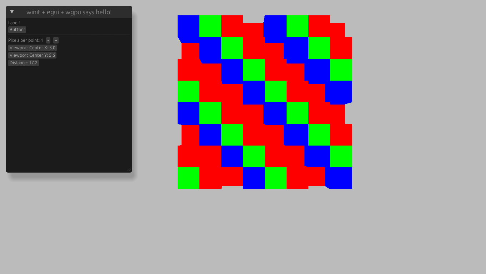

+++
title = "The Blockheads Tools Dev Log - pt. 2"
date = 2025-06-29
+++

## Quick Recap

In the [previous part of the dev log](/the-blockheads-save-file-tool-dev-log-1/), we:

- looked into the overall save file structure
- understood the meaning of some bytes of blocks
- found how to modify items and containers.

It's been 5 years since the last part of the dev log. I was not able to work on this project since I can't run the game any more:

- Android game simulators are too new these days, while the blockheads needs Android version <= 10.
- Even if there's simulators with old enough system, they usually doesn't support root access (e.g. accessing `/data/data`, where the  blockheads saves are stored).

Though fortunately users of this project have shared me how to run the blockheads server on linux, and how bluestack 4 could still be used to run the blockheads.

Miraculously, it turns out the blockheads server could run on WSL, **and** at the same time, communicate with bluestack 4 simulator.

This means I can modify the world save file, and see the result much faster by simply re-joining the local server again, instead of closing the game, replace file, and restart it again.

Of course there're some issues within this approach: most of the region are covered in dark on the client side.

Thanks to info shared by them, I'm able to continue working on this, and we will start from exactly where I left.

## GUI

5 years ago, I decided that GUI is very important for future development:

- Being able to interactively inspect data would hugely boost the reverse engineering progress
- No more frustration of mapping raw coordinate numbers to their locations - you can see it!

The question is, there's so many options out there, which one to choose? Well, it turns out another factor will help us narrow down selections.

### Better Typing

Whenever I have to maintain the codebase, mostly for fixing bugs, I found there's no typing and it's very hard to maintain.

Everything is stored in a mega dictionary, to access `worldV2` you have to use `game_save._data["world_db"][b"main"][b"worldv2"]`, and each of the `__getitem__` could go wrong.

It's clearly the wrong way to do things - the game itself must stores these data in structs, and only exported everything as dictionary when being saved.

To make things worse, there's basically no test at all.

This leads to a total rewrite, with proper type system - Rust.

Now knowing we will write everything in Rust, it's time to explore options that allows us to build UI that also supports 3D rendering.

### Picking crate

It took me a good while to figure out what would be the best solution here. I tried:

- `egui` + `macroquad`

  The [portal explorer](https://github.com/optozorax/portal) is written in this combination.

  I'm not very happy with the fact that we implicitly have an static member that takes most care for you. Plus it seems to be [unsound](https://www.reddit.com/r/rust_gamedev/comments/vvcd2v/comment/ifkei84/).

  But it's indeed very easy to use! I was able to get this chunk render within 30 minutes of coding:

  

- `eframe` + `egui-wgpu`

  This seems to be the official way to add wgpu content into egui. There's too much limitations: the render pass is defined implicitly and you have no control over that unless you build your own pass and render it into texture, creating overhead. Plus callbacks creates a lot of unnecessary boilerplate code. The depth texture is created implicitly as well with two obscure parameter `depth_buffer: u8` and `stencil_buffer: u8`. Probably the worst crate UX I have ever had.

- `egui` + `egui-wgpu`

  It turns out that there's a [good template](https://github.com/kaphula/winit-egui-wgpu-template) for this combination, which has much less implicitly defined things - you can just modify the code according to your need. Rendering egui is just another pass that you can take full control of. The raw input is exposed to you before passing into egui, thus you can take full control over how the application should work.

And thanks to the fact that everything other than `lmdb-sys` is written in Rust, if we rewrite that single dependency in pure Rust, we will be able to make the GUI a completely static single page application!

Now with the crates chosen, we should move to generating 3d objects from world block information that gpu could understand and render on the screen, also known as mesh.

### Mesh Generation

I planned to do implement mesh generation, using a progressive approach:

1. Spam a ton of cubes.
2. Face culling: remove faces that is not exposed to air, thus will never be seen by the player.
3. Optimized face culling: combine faces into single larger one, thus less vertices and indices for the GPU to draw.

We have already spammed a ton of cubes in `egui` + `macroquad` test. Before working on face culling, I decided to work on texturing. It turns out that it's much deeper than I expected, thus we have to detour for a while.

### Texture Mapping

It's possible to manually find corresponding uv coords in `TileMap.png` for any given tile type (I call it block type). But it's tedious and not fun.

Looking inside apk, I found glsl shaders. For example, here's `Block.fsh` (fragment shader):

```glsl
uniform sampler2D texture;
uniform sampler2D light_texture;
uniform sampler2D destruct_texture;
uniform lowp vec4 daylight;

varying lowp vec3 outTexCoord;
varying lowp vec2 outLightTexCoord;
varying highp vec3 outLightNormal;
varying lowp vec4 outPaintColor;
varying highp vec2 outTexIndex;

void main()
{
    highp vec2 texCoord = outTexCoord.xy;
    texCoord.x = ((((texCoord.x / 255.0) * 0.984375) + 0.0078125) + outTexIndex.x) / 32.0;
    texCoord.y = ((((texCoord.y / 255.0) * 0.984375) + 0.0078125) + outTexIndex.y) / 32.0;
    
    highp vec4 tex = texture2D(texture, texCoord);
    highp vec4 lightTex = texture2D(light_texture, outLightTexCoord);
    highp vec4 destruct = texture2D(destruct_texture, texCoord);
    
    highp float outTexCoordZ = outTexCoord.z;
```

This is interesting since there's also a thing called `TileDestruct.png` right next to `TileMap.png`. This must have been loaded somewhere in the main app. There's a simple way to find where it's loaded.

```
> rg "Block.vsh" --binary
libApplication.so: binary file matches (found "\0" byte around offset 7)
```

This means the core logic is within `libApplication.so`. Since this is essentially a library we can extract symbols inside, here's some interesting ones:

```
> nm -D libApplication.so
004d6820 W _Z22texCoordsForImageIndexi
00a13e6c T _Z25imageIndexForTileContentsP4TileP5World7intpair
00a171f4 T _Z23drawBlockAtWorldPostioniiP9MacroTileP5World
005f0450 W _Z24tileTexCoordsForItemType8ItemTypea
00a17a70 T _Z26randomBonusItemTypeForTileP4Tile7intpairPiP5World
```

`_Z24tileTexCoordsForItemType8ItemTypea` essentially hints this is a function for converting ItemType to tex coords. With some help from [Ghidra](https://github.com/NationalSecurityAgency/ghidra), a disassembler and decompiler developed by NSA, we get these two C function:

```c
/* tileTexCoordsForItemType(ItemType, signed char) */

void tileTexCoordsForItemType(float *param_1,undefined4 param_2,char param_3)

{
  undefined4 uVar1;
  int iVar2;
  int iVar3;
  
  uVar1 = imageTypeForItemType(param_2,(int)param_3);
  iVar2 = __modsi3(uVar1);
  iVar3 = __aeabi_idiv(uVar1,0x20);
  *param_1 = (float)((double)(longlong)iVar2 * 0.03125 + 0.00048828125);
  param_1[2] = 0.030273438;
  param_1[1] = (float)((double)(longlong)iVar3 * 0.03125 + 0.00048828125);
  param_1[3] = 0.030273438;
  return;
}

/* imageTypeForItemType(ItemType, signed char) */

undefined4 imageTypeForItemType(int param_1,char param_2)

{
  if (param_1 < 0xa8) {
    if (param_1 == 0x3a) {
      return 0x6d;
    }
  }
  else if (param_1 < 0x400) {
    if (param_1 == 0xa8) {
      if (param_2 != '\0') {
        return 0x131;
      }
      return 0x130;
    }
    if (param_1 == 0xae) {
      return 0x76;
    }
  }
  else {
    switch(param_1) {
    case 0x400:
      return 0x21;
    case 0x402:
      return 0x22;
    case 0x403:
      return 0x42;
    // ...
    case 0x413:
      if (param_2 != '\0') {
        return 0x157;
      }
      return 0x156;
    case 0x415:
      return 0x55;
    // ...
    case 0x451:
      return 0x2ea;
    }
  }
  return 0x20;
}
```

Unfortunately though, there's no such a convenient function named something like `texCoordsForTileType`. After some clueless search, it turns out almost all references of `transparencyLevelForTile` comes from one function, and decompiling that function gives us an abomination of 6448 lines of code.

It turns out that this function might be related to generating chunk png for the minimap.

```c
int UndefinedFunction_00a2d730
    (undefined4 param_1,undefined4 param_2,int *param_3,World *param_4,int param_5,
    int param_6,undefined4 param_7,undefined4 param_8)

{
  // ...
  switch(*pTStack_1c8) {
  case (Tile)0x1:
    iStack_540 = 0x20;
    iStack_544 = 0x20;
    TVar2 = pTStack_1c8[3];
    if ((byte)TVar2 < 0x6a) {
      if ((byte)TVar2 < 0x4d) {
        switch(TVar2) {
        case (Tile)0x3d:
          iStack_540 = 1;
          iStack_544 = 1;
          break;
        case (Tile)0x3e:
          iStack_540 = 3;
          iStack_544 = 3;
          break;
        case (Tile)0x3f:
          iStack_540 = 2;
          iStack_544 = 2;
          break;
        default:
code_r0x00a31e60:
          break;
        case (Tile)0x41:
          iStack_540 = 0x53;
          iStack_544 = 0x53;
        }
      }
      else {
        if (TVar2 != (Tile)0x4d) goto code_r0x00a31e60;
        iStack_540 = 0x54;
        iStack_544 = 0x54;
      }
    }
    else if (TVar2 == (Tile)0x6a) {
      iStack_540 = 0x9d;
      iStack_544 = 0x9d;
    }
    else {
      if (TVar2 != (Tile)0x6b) goto code_r0x00a31e60;
      iStack_540 = 0xdb;
      iStack_544 = 0xdb;
    }
    uStack_560 = 2;
    uStack_558 = uStack_560;
    if (pTStack_1c8[5] == (Tile)0x0) {
      uStack_560 = 0;
      uStack_558 = uStack_560;
    }
    break;
    // ...
  }
  //...
}
```

`case (Tile)0x1` means this tile is stone, and `TVar2 = pTStack_1c8[3];` means we are looking at block's subtype.

Now take a look at values we are comparing against. As for comparison, here's a list of sub type ids we know so far:

```py
class SubType(Enum):
    WORKBENCH = 46
    PORTAL_GATE = 47
    COPPER_ORE = 61
    TIN_ORE = 62
    IRON_ORE = 63
    OIL = 64
    COAL = 65
    GOLD_NUGGETS = 77
    PLATIUM_ORE = 106
    TITANIUM_ORE = 107
```

We are comparing:

- no sub type, position `0x20` = 32
- `0x3d` = 61 = `COPPER_ORE`, position 1
- `0x3e` = 62 = `TIN_ORE`, position 3
- `0x3f` = 63 = `IRON_ORE`, position 2

Double checking `tileMap.png`, it seems it's actually mapping.


Checking more comparison:

- `0x41` = 65 = `COAL`, position `0x53` = 83 = `(2, 19)`
- `0x4d` = 77 = `GOLD_NUGGETS`, position `0x54` = 84 = `(2, 20)`
- `0x6a` = 106 = `PLATIUM_ORE`, position `0x9d` = 157 = `(4, 29)`
- `0x6b` = 107 = `TITANIUM_ORE`, position `0xdb` = 219 = `(6, 27)`


While it's not clear the difference between `iStack_540` and `iStack_544`, I think it's safe to confirm that this function contains exactly what we are looking for, i.e. mapping tile type into tile map index.

Now knowing how blocks and items are mapped into uv index, it's time to go back on mesh generation & rendering.

### Mesh Generation, continued

This is a voxel game, meaning everything is just blocks, just like minecraft, which also happens to be a voxel game. Therefore you can do a lot of optimizations with that property. 7 years ago when I was working on [minecraft clone](/zh/minecraft-clone-dev-log-2/), I only implemented the most trivial optimization algorithm, which is simply just removing faces that's deeply inside of chunks. But that doesn't help FPS much - the performance is still terrible.

It turns out there's a thing called greedy meshing algorithm. There's a [fantastic talk](https://www.youtube.com/watch?v=4xs66m1Of4A) about how to make it much, much faster by using bitwise operations to 32x the calculation speed of greedy meshing. But most importantly, the idea of sending GPUs the voxel type information and directly render on GPU is truly mindblowing to me.

Then one comment suggests that with voxel type on GPU, **ray-marching** will be even faster, and you won't need any mesh at all. This eliminates the need of looping over all chunks in viewport each frame and add them into gpu operation queue, which is very slow.

A normal sized world has 32 * 32 * 3 * 512 * 32 blocks. The `tileMap.png` has 1024 textures, thus each block texture needs `u16` to store, which is 2 bytes. In total, storing whole world on GPU would need 96MB VRAM, which is totally acceptable on modern hardwares.

### Ray Marching

Ray marching is simply shooting rays from camera into the world, and calculate result color if it hit voxels. It's kind of similar to the buzz word ray-tracing you hear from all sorts of 3A games, but here we are not doing reflection or refraction - no bounce of light ray.

I basically vibe-coded this by breaking down the task into smaller tasks of which the output could be manually inspected.

- Display blocks

  To render a block on screen, that basically means the rays are calculated correctly and is able to hit things.

  

  I used 4 dummy types as voxel types, for type 0, it's air; for type 1, 2, 3, they have color R, G, B.

  This is the result of 100 marching steps. It doesn't calculate the accurate hit point, thus the voxels doesn't look very cubic.

  I asked Gemini to vibe-code digital differential analysis into shader for me, and we get a much cleaner output:

  

- Face normal

  Take grass block as an example. If you hit on top face, you get all grass. If you hit on side, only top pixels have grass and the rest are dirt. If you hit on bottom, it's dirt.

  Thus, which face do we hit is crucial information.

  Again after some vibe-coding and vibe-debugging we get this beautiful output:

  

- UV

  On top of hitting some voxel face, it's also important to know the exact location on that specific face in order to properly texture it.

  By asking AI to modify shader and use the uv coordinate within the face as color output, we can easily verify if it's correct:

  

Combining these information, the texture lookup simply becomes a function of three inputs:

1. voxel type
2. face id
3. face uv coordinate

The voxel type id could point us to `[uv_offset; 6]`, that is, the uv offset for each face. The texture is 32x32, thus `uv_offset` could be just a `u16`, which could be easily translated to upper-left corner pixel coordinate.

In conclusion:

- On Rust side, simply prepare a uv mapping buffer `&[[u16; 6]]` with data coming from the decompiled function above, and send it to GPU.

  ```rust
  impl VoxelType {
      // [PX, NX, PY, NY, PZ, NZ]
      pub(crate) const UV_AT_FACE: &[[u32; 6]] = &[
          [0; 6],                         // None
          [32; 6],                        // Stone
          // ...
          [85; 6],                        // GoldBlock
          [160, 160, 161, 64, 160, 160],  // GrassDirt
          [162, 162, 163, 64, 162, 162],  // SnowDirt
          // ...
          [97; 6],                        // Compost
          [98, 98, 294, 97, 98, 98],      // GrassCompost
          [130, 130, 163, 97, 130, 130],  // SnowCompost
          // ...
          [291, 291, 161, 64, 291, 291],  // GrassDirt + Clay
          [289, 289, 161, 64, 289, 289],  // GrassDirt + Flint
          // ...
          [237; 6],                       // PineTreeLeaf
          [192, 192, 193, 193, 192, 192], // PineTreeTrunk,
          [236; 6],                       // PineTreeTrunkWithLeaf
          // ...
      ];
  }

  // renderer.rs
  impl VoxelRenderer {
      pub fn new(
          // ...
      ) {
          let uv_at_face_buf = device.create_buffer_init(&wgpu::util::BufferInitDescriptor {
              label: Some("Texture UV Atlas Buffer"),
              contents: bytemuck::cast_slice(VoxelType::UV_AT_FACE),
              usage: wgpu::BufferUsages::STORAGE | wgpu::BufferUsages::COPY_DST,
          });
      }
  }
  ```

- On wgpu side, use voxel type and face id to get uv offset, then add the offset with face uv coordinate to get the final sample uv coordinate:

  ```wgsl
  fn sample_texture(voxel_type: u32, hit_face_id: u32, uv_on_face: vec2<f32>) -> vec4<f32> {
      let atlas_index_lookup = voxel_type * 6u + hit_face_id;
      let tile_index = texture_uv_atlas_indices[atlas_index_lookup];

      let tile_x = f32(tile_index % TILES_PER_ROW);
      let tile_y = f32(tile_index / TILES_PER_ROW);

      let uv_min_tile = vec2<f32>(tile_x * TILE_SIZE_UV, tile_y * TILE_SIZE_UV);

      let final_atlas_uv = uv_min_tile + uv_on_face * TILE_SIZE_UV;

      return textureSample(texture_atlas, texture_sampler, final_atlas_uv);
  }
  ```

The result is very beautiful.


And, it's very fast.


With some basic lighting, we have the shading looks like the game before 1.6.


It would be amazing if we can have a save file that has all chunks generated to stress test the renderer as well as the lib. This would also be ideal for various kinds of statistics and could be used to test python bindings of the library.

Only if such save file exists... right?

Well it turns out, you can create them.

### Reverse Engineering Server/Client Protocol

The same handy `nm -D` command shows that the server also contains a lot of symbols:

```
> nm -D blockheads_server171 > symbols.txt
> hx symbols.txt
...
0000000000965230 V .objc_sel_nameaddElectricityParticleWithPath:size:
0000000000920f90 V .objc_sel_nameaddElevatorMotorAtPos:ofType:saveDict:placedByClient:
...
00000000004e1970 T enet_address_set_host
00000000004da4c0 T enet_crc32
...
```

Which means it's likely that we can inspect its runtime stacktrace. A simple way to do this is to simply use some profiler. Here, I'm using [`samply`](https://github.com/mstange/samply). After running server for a while and controlling the blockhead to go right side for several chunks on client, it gives us this beautiful flamegraph:


This shows us a lot of information, but most importantly, it seems that `-[WorldTileLoader loadPhysicalBlock:atXPos:yPos:createIfNotCreated:]` is likely to be the place where the generation happens due to the existence of perlin noise in downstream calls.

Notice on the left side `-[BHServer match:didReceiveData:fromPlayer:]` also calls `createIfNotCreated`, though the downstream calls are simply just lookups.

When searching functions with name `createIfNotCreated`, I found another interesting function that shows how the macro index is calculated from macro coordinates:

```objc
/* WARNING: Variable defined which should be unmapped: macroPos_local */
/* WARNING: Struct "NPC": ignoring overlapping field "damage" */
/* DWARF original name: -[ClientTileLoader requestBlockFromServerAtPos:createIfNotCreated:]
   DWARF original prototype: void
   -[ClientTileLoader_requestBlockFromServerAtPos:createIfNotCreated:](ClientTileLoader * self, SEL
   _cmd, intpair macroPos, BOOL createIfNotCreated) */

void __thiscall
-[ClientTileLoader_requestBlockFromServerAtPos:createIfNotCreated:]
          (void *this,SEL _cmd,intpair macroPos,BOOL createIfNotCreated)

{
  // some definitions omitted
  ClientMacroBlockRequest request_1;
  ClientMacroBlockRequest request;
  int iStack_30;
  int32_t local_28;
  BOOL alreadyRequested;
  uint32_t macroIndex;
  BOOL createIfNotCreated_local;
  SEL _cmd_local;
  ClientTileLoader *this_local;
  intpair macroPos_local;
  
  this_local._4_4_ = macroPos.y;
  iVar6 = this_local._4_4_;
  uVar9 = *(undefined8 *)((long)this + 8);
  alreadyRequested = createIfNotCreated;
  _macroIndex = _cmd;
  _cmd_local = (SEL)this;
  this_local = (ClientTileLoader *)macroPos;
  pcVar7 = (code *)objc_msg_lookup(uVar9,0xce2aa0);
  iVar5 = (*pcVar7)(uVar9,0xce2aa0);
  iStack_30 = iVar6 * iVar5 + (int)this_local;
  local_28 = iStack_30;
  sVar8 = std::map<>::count((map<> *)(_cmd_local + 0x110),&stack0xffffffffffffffd0);
  i._3_1_ = sVar8 != 0;
  if ((bool)i._3_1_) {
    // ...
  }
  poVar4 = _cmd_local;
  pcVar7 = (code *)objc_msg_lookup(_cmd_local,0xce2ad0);
  iVar6 = (*pcVar7)(poVar4,0xce2ad0);
  if (iVar6 < 0x11) {
    // ...
  }
  else {
    bVar2 = false;
    request.createIfNotCreated = '\0';
    request.padding[0] = '\0';
    request.padding[1] = '\0';
    request.padding[2] = '\0';
    for (; sVar12 = std::vector<>::size((vector<> *)(_cmd_local + 0xf8)),
        (ulong)(long)(int)request._4_4_ < sVar12; request._4_4_ = request._4_4_ + 1) {
      pvVar13 = std::vector<>::at((vector<> *)(_cmd_local + 0xf8),(long)(int)request._4_4_);
      if (pvVar13->macroIndex == local_28) {
        bVar2 = true;
        break;
      }
    }
    if (!bVar2) {
      request_1.macroIndex = local_28;
      request_1.createIfNotCreated = alreadyRequested != '\0';
      std::vector<>::push_back((vector<> *)(_cmd_local + 0xf8),&request_1);
    }
  }
  return;
}
```

Notice `request_1.macroIndex = local_28;`, which comes from `local_28 = iStack_30;`. Thus, `iStack_30 = iVar6 * iVar5 + (int)this_local;` seems to be `macroPos.y * worldWidthMacro + macroPos.x`.

I was also doing some packet capturing at the same time and trying to figure out the private protocol between server and client. After running `tcpdump` on a gaming session where I commanded the blockhead to go continuously go right, we get some beautiful `.pcap` file that wireshark is able to read. It shows that all packets are UDP.


But UDP is not the full story. Remember the `enet_xxx` functions in `nm -D` command output above? That turns out to be the application-level protocol that the server is using to talk to client.

There is a [wireshark dissector for enet](https://github.com/cgutman/wireshark-enet-dissector) but I can't get it to work. Thankfully, `enet.lua` in the dissector repository contains all information you need to parse enet packages. I asked Gemini to rewrite the lua into Rust, and viola. We are now able to understand the enet part of these packets:


One particularly interesting packet shows:

```
--- Found UDP Packet #22: 62567 -> 15151 ---
Packet {
    header: Header {
        peer_id: 0,
        compressed: false,
        has_sent_time: true,
        session_id: 0,
        sent_time: Some(
            46462,
        ),
    },
    commands: [
        SendReliable(
            CommandHeader {
                command: 6,
                channel_id: 0,
                reliable_sequence_number: 2,
            },
            SendReliableCommand {
                data_length: 9,
                data: 
                03 4f 21 00 00 00 00 00 00                      | .O!......       ,
            },
        ),
    ],
}
```

Remember the relationship between macro index and macro coordinates we discovered above? It turns out `4f 21` is exactly the macro index of spawn portal chunk:

```py
>>> def to_macro_index(x: int, y: int) -> int:
...   return y * 512 + x
...
>>> 10740 >> 5, 520 >> 5
(335, 16)
>>> hex(to_macro_index(335, 16))
'0x214f'
```

While walking to the right side (positive x direction), we received some interesting data from server:

```
--- Found UDP Packet #428: 15151 -> 62567 ---
Packet {
    header: Header {
        peer_id: 0,
        compressed: false,
        has_sent_time: true,
        session_id: 0,
        sent_time: Some(
            61922,
        ),
    },
    commands: [
        SendReliable(
            CommandHeader {
                command: 6,
                channel_id: 0,
                reliable_sequence_number: 256,
            },
            SendReliableCommand {
                data_length: 208,
                data: 
                28 52 21 00 00 1f 8b 08 00 00 00 00 00 00 03 fb | (R!.............
                ff 1f 07 f8 75 77 df 9c 8a 60 1d 5c d2 40 70 77 | ....uw...`.\.@pw
                e7 e4 1c 17 3c f2 bf 2e af 6e 8a c0 23 ff ff d5 | ....<....n..#...
                81 a9 59 f8 e4 ff 5c 5c 5a 81 4f fe ff dd 0d 4d | ..Y...\\Z.O....M
                78 e5 9f 6e ef c0 2b ff 7c 67 37 45 f2 84 cc 27 | x..n..+.|g7E...'
                e0 3e 42 fe 23 10 3e 84 c2 17 7f fc e0 8f df 3f | .>B.#.>........?
                af 2e ef 9c 53 13 65 2e 84 21 fe 1c 08 9e de bd | ....S.e..!......
                78 60 f5 e4 8a 28 2b 49 86 e7 c8 00 24 be 13 08 | x`...(+I....$...
                b6 6f 58 3a b5 29 27 d8 5c 92 81 61 27 32 00 89 | .oX:.)'.\..a'2..
                77 03 41 47 53 45 56 84 8b 8e 10 03 03 43 37 32 | w.AGSEV......C72
                00 89 c7 00 41 54 a8 b7 9d 9e 34 0b 50 9a 21 06 | ....AT....4.P.!.
                19 80 c5 81 40 47 5d 4e 88 99 01 0c f4 90 01 92 | ....@G]N........
                f8 28 20 0e 28 01 31 00 f0 6f 3c 89 04 04 00 00 | .( .(.1..o<.....,
            },
        ),
        SendReliable(
            CommandHeader {
                command: 6,
                channel_id: 0,
                reliable_sequence_number: 257,
            },
            SendReliableCommand {
                data_length: 144,
                data: 
                28 52 1f 00 00 1f 8b 08 00 00 00 00 00 00 03 63 | (R.............c
                60 18 05 a3 60 14 50 08 98 85 e4 d4 75 f4 60 40 | `...`.P.....u.`@
                47 5d 4e 88 19 22 01 13 b2 f3 0e 8d 8a 81 81 a8 | G]N.."..........
                50 6f 3b 3d 69 16 90 3c 4c 28 ab a2 a9 a3 1b 06 | Po;=i..<L(......
                3a 9a 2a b2 22 5c 74 84 80 f2 30 a1 a9 4b 37 6c | :.*."\t...0..K7l
                df 09 03 db 37 2c 9d da 94 13 6c 2e c9 c0 00 13 | ....7,....l.....
                3a 70 f1 ee d3 e7 30 f0 f4 ee c5 03 ab 27 57 44 | :p....0......'WD
                59 49 32 c0 84 5e fd f9 8f 0c fe bc ba bc 73 4e | YI2..^........sN
                4d 94 b9 90 02 d0 0e 00 5d 64 04 37 04 04 00 00 | M.......]d.7....,
            },
        ),
    ],
}

original data length: 208
prefix: 
28 52 21 00 00                                  | (R!..           
decompressed: 
ff ff ff ff ff ff ff ff ff ff ff ff ff ff ff ff | ................
ff ff ff ff ff ff ff ff ff fa dd be 9c 78 53 2c | .............xS,
ff ff ff ff ff ff ff ff ff ff ff ff ff ff ff ff | ................
ff ff ff ff ff ff ff ff ff ff ff dd b9 93 6c 44 | ..............lD
ff ff ff ff ff ff ff ff ff ff ff ff ff ff ff ff | ................
ff ff ff ff ff ff ff ff ff ff ff fa d3 ab 82 58 | ...............X
ff ff ff ff ff ff ff ff ff ff ff ff ff ff ff ff | ................
ff ff ff ff ff ff ff ff ff ff ff ff ea c0 95 6a | ...............j
ff ff ff ff ff ff ff ff ff ff ff ff ff ff ff ff | ................
ff ff ff ff ff ff ff ff ff ff ff ff fc d1 a5 78 | ...............x
ff ff ff ff ff ff ff ff ff ff ff ff ff ff ff ff | ................
ff ff ff ff ff ff ff ff ff ff ff ff ff dd b0 82 | ................
ff ff ff ff ff ff ff ff ff ff ff ff ff ff ff ff | ................
ff ff ff ff ff ff ff ff ff ff ff ff ff e5 b7 88 | ................
ff ff ff ff ff ff ff ff ff ff ff ff ff ff ff ff | ................
ff ff ff ff ff ff ff ff ff ff ff ff ff e7 b9 8b | ................
ff ff ff ff ff ff ff ff ff ff ff ff ff ff ff ff | ................
ff ff ff ff ff ff ff ff ff ff ff ff ff e7 b9 8b | ................
ff ff ff ff ff ff ff ff ff ff ff ff ff ff ff ff | ................
ff ff ff ff ff ff ff ff ff ff ff ff ff e5 b7 88 | ................
ff ff ff ff ff ff ff ff ff ff ff ff ff ff ff ff | ................
ff ff ff ff ff ff ff ff ff ff ff ff ff dd b0 82 | ................
ff ff ff ff ff ff ff ff ff ff ff ff ff ff ff ff | ................
ff ff ff ff ff ff ff ff ff ff ff ff fc d1 a5 78 | ...............x
ff ff ff ff ff ff ff ff ff ff ff ff ff ff ff ff | ................
ff ff ff ff ff ff ff ff ff ff ff ff ea c0 95 6a | ...............j
ff ff ff ff ff ff ff ff ff ff ff ff ff ff ff ff | ................
ff ff ff ff ff ff ff ff ff ff ff fa d3 ab 82 58 | ...............X
ff ff ff ff ff ff ff ff ff ff ff ff ff ff ff ff | ................
ff ff ff ff ff ff ff ff ff ff ff dd b9 93 6c 44 | ..............lD
ff ff ff ff ff ff ff ff ff ff ff ff ff ff ff ff | ................
ff ff ff ff ff ff ff ff ff fa dd be 9c 78 53 2c | .............xS,
ff ff ff ff ff ff ff ff ff ff ff ff ff ff ff ff | ................
ff ff ff ff ff ff ff fc ea d3 b9 9c 7c 5a 37 12 | ............|Z7.
ff ff ff ff ff ff ff ff ff ff ff ff ff ff ff fc | ................
ea e7 e7 e7 e7 e5 dd d1 c0 ab 93 78 5a 3a 19 00 | ...........xZ:..
e7 e7 e7 e7 e7 e7 e7 e7 e7 e7 e7 e7 e7 e5 dd d1 | ................
c0 b9 b9 b9 b9 b7 b0 a5 95 82 6c 53 37 19 00 00 | ..........lS7...
b9 b9 b9 b9 b9 b9 b9 b9 b9 b9 b9 b9 b9 b7 b0 a5 | ................
95 8b 8b 8b 8b 88 82 78 6a 58 44 2c 12 00 00 00 | .......xjXD,....
8b 8b 8b 8b 8b 8b 8b 8b 8b 8b 8b 8b 8b 88 82 78 | ...............x
6a 5c 5c 5c 5c 5a 55 4b 3e 2e 1b 04 00 00 00 00 | j\\\\ZUK>.......
5c 5c 5c 5c 5c 5c 5c 5c 5c 5c 5c 5c 5c 5a 55 4b | \\\\\\\\\\\\\ZUK
3e 2e 2e 2e 2e 2c 27 1e 12 03 00 00 00 00 00 00 | >....,'.........
2e 2e 2e 2e 2e 2e 2e 2e 2e 2e 2e 2e 2e 2c 27 1e | .............,'.
12 03 00 00 00 00 00 00 00 00 00 00 00 00 00 00 | ................
00 00 00 00 00 00 00 00 00 00 00 00 00 00 00 00 | ................
00 00 00 00 00 00 00 00 00 00 00 00 00 00 00 00 | ................
00 00 00 00 00 00 00 00 00 00 00 00 00 00 00 00 | ................
00 00 00 00 00 00 00 00 00 00 00 00 00 00 00 00 | ................
00 00 00 00 00 00 00 00 00 00 00 00 00 00 00 00 | ................
00 00 00 00 00 00 00 00 00 00 00 00 00 00 00 00 | ................
00 00 00 00 00 00 00 00 00 00 00 00 00 00 00 00 | ................
00 00 00 00 00 00 00 00 00 00 00 00 00 00 00 00 | ................
00 00 00 00 00 00 00 00 00 00 00 00 00 00 00 00 | ................
00 00 00 00 00 00 00 00 00 00 00 00 00 00 00 00 | ................
00 00 00 00 00 00 00 00 00 00 00 00 00 00 00 00 | ................
00 00 00 00 00 00 00 00 00 00 00 00 00 00 00 00 | ................
00 00 00 00 00 00 00 00 00 00 00 00 00 00 00 00 | ................
00 00 00 00 00 00 00 00 00 00 00 00 00 00 00 00 | ................
00 00 00 00 00 00 00 00 00 00 00 00 00 00 00 00 | ................
00 00 00 00 00 00 00 00 00 00 00 00 00 00 00 00 | ................
00 00 00 00 00 00 00 00 00 00 00 00 00 00 00 00 | ................
00 00 00 00 00 00 00 00 00 00 00 00 00 00 00 00 | ................
22 00 00 00                                     | "...            
```

It's very clear that this is the visibility layer, i.e. the black fog hiding unexplored area. Though profiling result above suggests that the server called this `lightBlock`. Notice that `52 21` in prefix `28 52 21 00 00` translates to:

```py
>>> def from_macro_index(i: int) -> tuple[int, int]:
...   return (i % 512, i // 512)
...
>>> from_macro_index(0x2152)
(338, 16)
```

Which is exactly 3 chunks away from `(335, 16)`, the spawn portal chunk, and matches the direction (positive x).

Further investigation suggests `03` might be the type id for requesting chunks (macro tiles):

```
--- Found UDP Packet #36: 62567 -> 15151 ---
Packet {
    header: Header {
        peer_id: 0,
        compressed: false,
        has_sent_time: true,
        session_id: 0,
        sent_time: Some(
            46770,
        ),
    },
    commands: [
        SendReliable(
            CommandHeader {
                command: 6,
                channel_id: 0,
                reliable_sequence_number: 4,
            },
            SendReliableCommand {
                data_length: 9,
                data: 
                03 51 21 00 00 01 29 05 ad                      | .Q!...)..       ,
            },
        ),
    ],
}

--- Found UDP Packet #38: 15151 -> 62567 ---
Packet {
    header: Header {
        peer_id: 0,
        compressed: false,
        has_sent_time: false,
        session_id: 0,
        sent_time: None,
    },
    commands: [
        Acknowledge(
            CommandHeader {
                command: 1,
                channel_id: 0,
                reliable_sequence_number: 12,
            },
            AcknowledgeCommand {
                received_reliable_sequence_number: 4,
                received_sent_time: 46770,
            },
        ),
    ],
}

--- Found UDP Packet #41: 15151 -> 62567 ---
Packet {
    header: Header {
        peer_id: 0,
        compressed: false,
        has_sent_time: true,
        session_id: 0,
        sent_time: Some(
            46922,
        ),
    },
    commands: [
        SendFragment(
            CommandHeader {
                command: 8,
                channel_id: 0,
                reliable_sequence_number: 14,
            },
            SendFragmentCommand {
                start_sequence_number: 14,
                data_length: 1372,
                fragment_count: 2,
                fragment_number: 0,
                total_length: 2476,
                fragment_offset: 0,
                data: 
                04 51 21 00 00 3c 3f 78 6d 6c 20 76 65 72 73 69 | .Q!..<?xml versi
                6f 6e 3d 22 31 2e 30 22 20 65 6e 63 6f 64 69 6e | on="1.0" encodin
                67 3d 22 55 54 46 2d 38 22 3f 3e 0a 3c 21 44 4f | g="UTF-8"?>.<!DO
                43 54 59 50 45 20 70 6c 69 73 74 20 50 55 42 4c | CTYPE plist PUBL
                49 43 20 22 2d 2f 2f 41 70 70 6c 65 2f 2f 44 54 | IC "-//Apple//DT
                44 20 50 4c 49 53 54 20 31 2e 30 2f 2f 45 4e 22 | D PLIST 1.0//EN"
                20 22 68 74 74 70 3a 2f 2f 77 77 77 2e 61 70 70 |  "http://www.app
                6c 65 2e 63 6f 6d 2f 44 54 44 73 2f 50 72 6f 70 | le.com/DTDs/Prop
                65 72 74 79 4c 69 73 74 2d 31 2e 30 2e 64 74 64 | ertyList-1.0.dtd
                22 3e 0a 3c 70 6c 69 73 74 20 76 65 72 73 69 6f | ">.<plist versio
                6e 3d 22 31 2e 30 22 3e 0a 3c 64 69 63 74 3e 0a | n="1.0">.<dict>.
                20 20 20 20 3c 6b 65 79 3e 72 3c 2f 6b 65 79 3e |     <key>r</key>
                0a 20 20 20 20 3c 64 61 74 61 3e 0a 48 34 73 49 | .    <data>.H4sI
                41 41 41 41 41 41 41 41 41 2f 76 2f 48 78 50 38 | AAAAAAAAA/v/HxP8
                65 58 56 35 35 35 79 61 4b 48 4d 68 42 67 59 47 | eXV555yaKHMhBgYG
                4c 4e 4a 41 38 4f 76 75 76 6a 6b 56 77 54 6f 73 | LNJA8OvuvjkVwTos
                75 4f 54 2f 2f 37 2b 37 63 33 4b 4f 69 7a 52 75 | uOT//7+7c3KOizRu
                ...
                2b 76 73 32 6d 54 2f 34 4a 4b 75 2f             | +vs2mT/4JKu/    ,
            },
        ),
    ],
}
```

See how this goes?

- In packet 36, client sends `03 51 21` to server. Server replys packet 38 for ack.
- In packet 41, server sends `04 51 21` to client.

To confirm this, it's time for some more Ghidra decompliation sessions. Knowing from profiler that right below the enet layer (`-[BHNetServerMatch pollNetEvents]`) we go into `-[BHServer_match:didReceiveData:fromPlayer:]`, we will start from this function.

For now, we will focus on how the request is passed down in the server. For request started with `03`:

```objc
void __thiscall
-[BHServer_match:didReceiveData:fromPlayer:]
          (void *this,SEL _cmd,BHMatch *match_,NSData *data,NSString *peer)

{
  ClientMacroBlockRequest request;
  // ... var declarations omitted

  pcVar11 = (code *)objc_msg_lookup(this,0xbe8058); // this.updatePlayers
  (*pcVar11)(this,0xbe8058);
  pcVar11 = (code *)objc_msg_lookup(data,0xbe7d28); // data.bytes
  puVar12 = (uint8_t *)(*pcVar11)(data,0xbe7d28);
  request.padding[2] = *puVar12; // request.padding[2] = data.bytes[0];

  // !!!!!! Request started with 03! !!!!!!
  if (request.padding[2] == '\x03') {

    playerInfo = *(NSDictionary **)(puVar12 + 1);
    uVar14 = *(undefined8 *)((long)this + 0x38); // world (World*)
    local_60 = playerInfo;
    pcVar11 = (code *)objc_msg_lookup(uVar14,0xbe8168); // requestForBlock:fromClient:
    (*pcVar11)(uVar14,0xbe8168,playerInfo,peer); // this.world.requestForBlock(ClientMacroBlockRequest request,NSString *clientID)
    return;
  }
```

Thus according to `this.world.requestForBlock` we go into `World::requestForBlock`:

```objc
__thiscall
-[World_requestForBlock:fromClient:]
          (void *this,SEL _cmd,ClientMacroBlockRequest request,NSString *clientID)

{
  char cVar1;
  code *pcVar2;
  undefined8 uVar3;
  NSString *clientID_local;
  SEL _cmd_local;
  World *this_local;
  ClientMacroBlockRequest request_local;
  
  uVar3 = *(undefined8 *)((long)this + 0x4d0); // this.serverClients (NSMutableDictionary*)
  pcVar2 = (code *)objc_msg_lookup(uVar3,0xbe2ef0); // NSMutableDictionary_objectForKey:
  uVar3 = (*pcVar2)(uVar3,0xbe2ef0,clientID);
  pcVar2 = (code *)objc_msg_lookup(uVar3,0xbe20b0); // ServerClient::connected()
  cVar1 = (*pcVar2)(uVar3,0xbe20b0);
  if (cVar1 != '\0') {
    uVar3 = *(undefined8 *)((long)this + 0x4d0);
    pcVar2 = (code *)objc_msg_lookup(uVar3,0xbe2ef0);
    uVar3 = (*pcVar2)(uVar3,0xbe2ef0,clientID); // uVar3 = ServerClient again
    pcVar2 = (code *)objc_msg_lookup(uVar3,0xbe2160); // ServerClient_requestForBlock:
    (*pcVar2)(uVar3,0xbe2160,request); // ServerClient::requestForBlock(request)
  }
  return;
}
```

And we goes into `ServerClient::requestForBlock`:

```objc
void __thiscall
-[ServerClient_requestForBlock:](void *this,SEL _cmd,ClientMacroBlockRequest request)

{
  // ... omitted definitions
  ServerClient *this_local;
  ClientMacroBlockRequest request_local;
  
  this_local._0_4_ = request.macroIndex;
  local_24 = (key_type.conflict1)this_local;
  local_20 = _cmd;
  _cmd_local = (SEL)this;
  this_local = (ServerClient *)request;
  pmVar2 = std::map<>::operator[]((map<> *)((long)this + 0x20),&local_24); // this + 0x20 -> this.requestedBlockRequestTypes[request.macroIndex] (map<unsigned_int, unsigned_char>)
  if (*pmVar2 == '\0') {
    uVar1 = *(undefined8 *)(_cmd_local + 0x18); // this.requestedBlockIndices (NSMutableIndexSet *)
    lVar4 = (long)(int)(key_type.conflict1)this_local;
    pcVar3 = (code *)objc_msg_lookup(uVar1,0xce5108); // NSMutableIndexSet::addIndex
    (*pcVar3)(uVar1,0xce5108,lVar4); // this.requestedBlockIndices.addIndex(request.macroIndex)
    mVar5 = '\x02';
    if (this_local._4_1_ != '\0') {
      mVar5 = '\x01';
    }
    local_28 = (key_type.conflict1)this_local;
    pmVar2 = std::map<>::operator[]((map<> *)(_cmd_local + 0x20),&local_28);
    *pmVar2 = mVar5;
    uVar1 = *(undefined8 *)(_cmd_local + 0x50); // this.wiredBlocks (NSMutableIndexSet *)
    lVar4 = (long)(int)(key_type.conflict1)this_local;
    pcVar3 = (code *)objc_msg_lookup(uVar1,0xce5108); // NSMutableIndexSet::addIndex
    (*pcVar3)(uVar1,0xce5108,lVar4); // this.wiredBlocks.addIndex(request.macroIndex)
  }
  return;
}
```

It seems that the actual generation is delayed by using a task queue - in this case, the queue is simply `this.requestedBlockIndices`, which is likely equivalent to `HashSet`.

Once the generation is done and the chunk is ready, the server will send the bytes back to chunk.

And surprise surprise, Ghidra is able to parse the internal structure of `ClientMacroBlockRequest`:


Which means for the packet `UDP Packet #36: 62567 -> 15151` we seen above, it's payload `03 51 21 00 00 01 29 05 ad` could be dissected into these components:

- `03` means this is client macro block request.
- `51 21 00 00` is `macroIndex`, i.e. 8529 or `(337, 16)`.
- `01` means `createIfNotCreated`, i.e. `true`.
- `29 05 ad` should be padding. While the decompiled server code suggested that they could mean something else, as for our use case, it's not that important.

Now having confirmation from server code, it should now be possible to write a small client that spams requests to enforce server to generate all chunks. The source code is now part of the crates, named [chunk_gen](https://github.com/med1844/TheBlockheadsTools/tree/rust/crates/chunk_gen), and I have put some of the implementation details in the crate `README.md`.

After running this for 13m42s continuously bombing the server with request, here we have it, the amazing view of all chunks visible at once and interactive @ 60fps:


This is much better than my previous attempt 5 years ago, which ended up using the older version of the tool to clean up every other column of chunks so that with manual flying I can force the game to generate all the rest chunks:


The image above took me 6 hours to finish travelling around the globe and is very boring. Now, I only have to start the program and do something else while waiting for the result. Love this.

### Editing

You can't call it save editor if you can't edit at all! Some quick code leads to this:


It's primitive but for now it's good enough for reverse-engineering purpose.

Now with the editing super power, it's time to get the id of all content blocks. I was able to get most content block types by simply looking at unknown blocks in the world and do some manual texture mapping using the decompiled function.

For example, for normal trees, just look around the world, inspect it's block type id, check the texture coordinate and name it.

However for dead trees blocks, which is also content blocks, it's not that straight forward. There's a good amount kinds of them and it's kind of tricky to tell them apart. Remember the block type -> texture index function we decompiled before? Take a look at the section where it decides the texture of dead trees:

```objc
  switch(pTStack_1c8[3]) {
    case (Tile)0x1b:
    case (Tile)0x1e:
    case (Tile)0x20:
    case (Tile)0x22:
    case (Tile)0x23:
    case (Tile)0x25:
    case (Tile)0x27:
    case (Tile)0x29:
    case (Tile)0x5c:
      iStack_54c = 0x1c1;
      iStack_548 = 0x1c1;
      uStack_55c = 2;
      break;
    case (Tile)0x1c:
    case (Tile)0x1d:
    case (Tile)0x1f:
    case (Tile)0x21:
    case (Tile)0x24:
    case (Tile)0x26:
    case (Tile)0x28:
    case (Tile)0x2a:
    case (Tile)0x5d:
      uStack_55c = 2;
      iStack_548 = 0xc2;
      iStack_54c = 0xc3;
      if (pTStack_1c8[5] == (Tile)0x0) {
        uStack_55c = 0;
      }
      break;
  }
```

All these tile types maps to two block textures, `0x1c1` maps to dead leaf, and `0xc2`, `0xc3` maps to dead tree trunk.

It's very likely that for each tree type, there's a corresponding dead tree trunk and leaf type for it. Chopping trees near the portal gives me some good start:

```rust
#[derive(Debug, PartialEq, Eq, Hash)]
#[repr(u8)]
pub enum BlockContent {
    DeadPineTreeTrunk = 29,
    DeadPineTreeLeaf = 34,
    DeadOrangeTreeLeaf = 37,
    DeadOrangeTreeTrunk = 38,
    DeadCherryTreeLeaf = 39,
    DeadCherryTreeTrunk = 40,
}
```

But this is not enough as it's very apparent that the ids doesn't have clear pattern, for pine tree at least.

To find out the exact id for each of them, I manually planted two trees hoping to get some data:


But turns out the game doesn't like them:


When you dig out the dirt under a tree, the whole tree should be converted into their dead counterparts. But our manually planted trees, well, doesn't need dirt at root to survive.

It turns out trees are also stored as dynamic objects. And thus, it's time to finally visit them.

### Dynamic Objects

`world_db.dw` contains dynamic objects. It's a dictionary.

- `x_y/14` seems to be about items dropped on the ground:

  ```xml
  <?xml version="1.0" encoding="UTF-8"?>
  <!DOCTYPE plist PUBLIC "-//Apple//DTD PLIST 1.0//EN" "http://www.apple.com/DTDs/PropertyList-1.0.dtd">
  <plist version="1.0">
  <dict>
      <key>dynamicObjects</key>
      <array>
          <dict>
              <key>floatPos</key>
              <array>
                  <real>10739.42</real>
                  <real>520.25</real>
              </array>
              <key>itemType</key>
              <integer>16</integer>
              <key>uniqueID</key>
              <integer>3005</integer>
          </dict>
          <dict>
              <key>floatPos</key>
              <array>
                  <real>10737.35</real>
                  <real>520.25</real>
              </array>
              <key>itemType</key>
              <integer>12</integer>
              <key>subItems</key>
              <array>
                  <array>
                  </array>
                  <array>
                  </array>
                  <array>
                  </array>
                  <array>
                  </array>
              </array>
              <key>uniqueID</key>
              <integer>3012</integer>
          </dict>
  ```

  Here, we have a flint spade (id = 16), and a basket (id = 12) with the inner slots to be empty.

  It's interesting to see how it also exposes how things are named internally. I previously call these extra data, but it turns out the official name is sub items.

  The items seems to match what I actually dropped on the ground:

  

- `x_y/57` is gem tree type.

  ```xml
  <?xml version="1.0" encoding="UTF-8"?>
  <!DOCTYPE plist PUBLIC "-//Apple//DTD PLIST 1.0//EN" "http://www.apple.com/DTDs/PropertyList-1.0.dtd">
  <plist version="1.0">
  <dict>
      <key>dynamicObjects</key>
      <array>
          <dict>
              <key>age</key>
              <real>400.3962</real>
              <key>dead</key>
              <false/>
              <key>floatPos</key>
              <array>
                  <real>2576.5</real>
                  <real>638</real>
              </array>
              <key>fruitYear</key>
              <integer>5</integer>
              <key>gemTreeType</key>
              <integer>15</integer>
              <key>height</key>
              <integer>7</integer>
              <key>pos_x</key>
              <integer>2576</integer>
              <key>pos_y</key>
              <integer>638</integer>
              <key>removeCheckCount</key>
              <real>0</real>
              <key>saveTime</key>
              <real>5454.200029030442</real>
              <key>timeDied</key>
              <real>0</real>
              <key>treeFruit</key>
              <array>
                  <dict>
                      <key>hasCreatedFreeBlockThisSeason</key>
                      <false/>
                      <key>pos.x</key>
                      <integer>2576</integer>
                      <key>pos.y</key>
                      <integer>644</integer>
                  </dict>
                  <dict>
                      <key>hasCreatedFreeBlockThisSeason</key>
                      <false/>
                      <key>pos.x</key>
                      <integer>2577</integer>
                      <key>pos.y</key>
                      <integer>641</integer>
                  </dict>
              </array>
              <key>treeSeasonOffset</key>
              <integer>15</integer>
              <key>uniqueID</key>
              <integer>124208</integer>
          </dict>
      </array>
  </dict>
  </plist>
  ```

Did you notice that for gem tree, there's a thing called `gemTreeType` and it has value 15?

Look it up in our trustworthy Ghidra and boom, there we have it.


Well if these enum could survive after compilation, why not lookup other enums?

And so, our quest of getting the complete list of content type id and dynamic world id ends much earlier than expected:


To further ruin the fun, this handy function connects the dynamic object type id to their actual classes:

```objc
Class classForDynamicObjectType(int type)

{
  undefined8 uVar1;
  code *pcVar2;
  Class poStack_10;
  int type_local;
  
  switch(type) {
  case 0:
  case 0x41:
  default:
    poStack_10 = (Class)0x0;
    break;
  case 1:
    uVar1 = objc_lookup_class("AppleTree");
    pcVar2 = (code *)objc_msg_lookup(uVar1,.objc_selector_list);
    poStack_10 = (Class)(*pcVar2)(uVar1,.objc_selector_list);
    break;
  case 2:
    uVar1 = objc_lookup_class("MapleTree");
    pcVar2 = (code *)objc_msg_lookup(uVar1,.objc_selector_list);
    poStack_10 = (Class)(*pcVar2)(uVar1,.objc_selector_list);
    break;
  case 3:
    uVar1 = objc_lookup_class("MangoTree");
    pcVar2 = (code *)objc_msg_lookup(uVar1,.objc_selector_list);
    poStack_10 = (Class)(*pcVar2)(uVar1,.objc_selector_list);
    break;
  // ...
  case 0x10:
    uVar1 = objc_lookup_class("FireObject");
    pcVar2 = (code *)objc_msg_lookup(uVar1,.objc_selector_list);
    poStack_10 = (Class)(*pcVar2)(uVar1,.objc_selector_list);
    break;
  case 0x11:
    uVar1 = objc_lookup_class("Torch");
    pcVar2 = (code *)objc_msg_lookup(uVar1,.objc_selector_list);
    poStack_10 = (Class)(*pcVar2)(uVar1,.objc_selector_list);
    break;
  // ...
}
```

Which maps to real classes:


Notice `renderImageType` in the methods? Turns out there's an enum class for this too:


This exactly maps to the tile texture. So, the mapping should actually be much more readable!

Anyway, it seems better to treat such objects as blocks as well - same code.

After some heavy refactoring, we get this beautiful rendered tomato plant:


And after making depth buffer correctly rendered in voxel renderer, the plant could be properly occluded now. Though it doesn't work very well with transparent voxels:


The reason is simply because we are drawing voxels first, so that we have the depth information and color info. Then, we draw these dynamic objects that are based on actual meshes.

We would need to render solid pixels first, in this case voxels and dynamic objects, then use a separate pass to render transparent objects. This needs a lot more rework on the GPU side.

---

It's been really fun journey, I especially love the achievement that we're now able to generate the whole map. I'm feeling burnt out so I will stop here for now. Here's a list of things to work on in the future:

- Python bindings - needed before we can replace the main branch with the new rust branch.
- Get all dynamic object's serde fields. This requires manually reading decompiled code and thus is very labor-intense, at the same time repetitive and not funny at all. Maybe some plugin for Ghidra or better decompiler would make this easier.
- Figure out how to support dynamic object editing. It would be great if we can generate egui code for it using macro, but since they are defined in lib, and egui should only exist in gui crate, which makes it hard to derive.
- Actually make the 3d widget resizable and works as a normal component. Currently it doesn't respect egui sizing (pixels are rendered under menu bar).

All these are big changes that might result in full rewrite! I'm starting to feel that python bindings are more useful than a full GUI at this point. I might also switch to dioxus if I could get lmdb r/w done in pure Rust.

To be honest, I'm overwhelmed by all possible ways to design a good user interface. However as we proceed further with decompilation, the conclusion that "GUI is important for future development" no longer holds true. The GUI development will get deprioritized. Instead, easy to use and fast python bindings will be more important.

See you in the next post!
