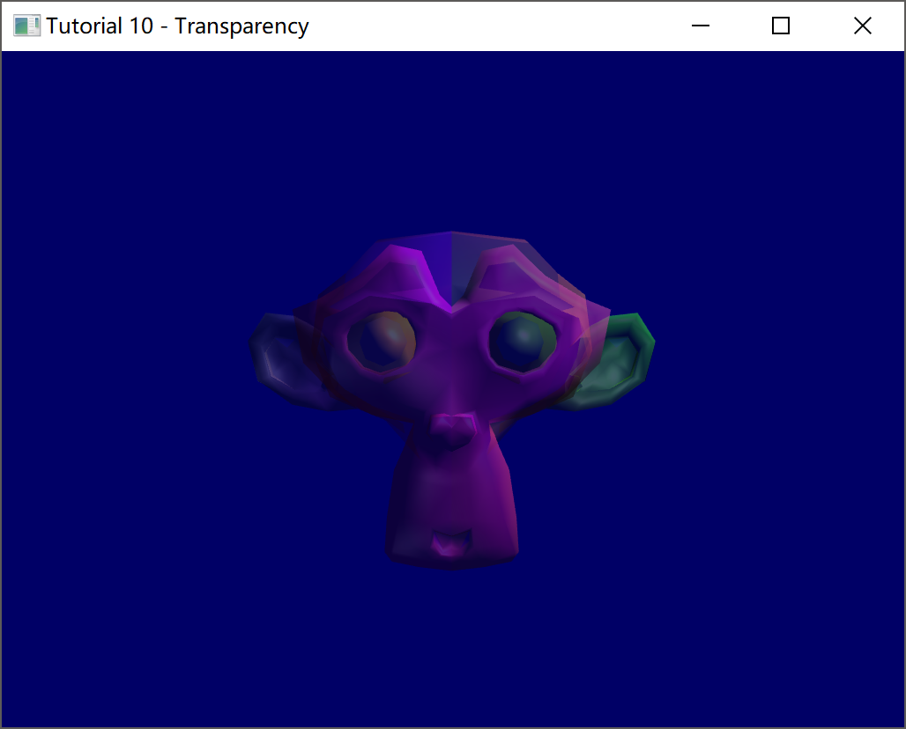
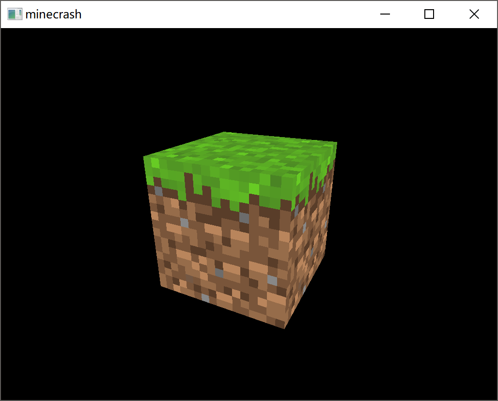

## 2019/06/24

小学期第一天。

在得知选题已经被限死的情况下，我和队友仍然决定写minecraft。理由如下:

- 学OpenGL和LWJGL，不管最后能不能作为大作业，都不亏。
- 通过前三周爆肝所得到的半成品，也许有机会求情。
- ~~这是程序员的浪漫！！~~

于是，在简单地研究之后，我们得出了如下学习路线:

1. 快速入门OpenGL，熟悉API。
2. 入门LWJGL。
3. 做到能够渲染一个草方块的程度。

这是最初步的计划，大约在一两天内完成。

在第一天的晚上，成功生成了来自[这个教程](https://www.opengl-tutorial.org/)所提供的工程文件，并且在查看编译结果后，对写出光影有了迷之自信:

- tutorial05说明了贴图的可行性。

    

- tutorial06说明了移动的可行性。

- tutorial10说明了玻璃和水的可行性。

    

- tutorial11说明了F3的可行性。

- **tutorial13说明了法线贴图的可行性。**

    

- **tutorial16说明了阴影的可行性。**

    

但是，MC本身还是没有自带光影，这是为什么呢?

## 2019/06/25

凌晨爆肝OpenGL入门教程。

本来想着也许睡觉前能够依葫芦画瓢，整个草方块出来，不过现在看看估计是没可能了。

要学的确实非常多，比方说怎么将一个物体投影到屏幕上来。

这主要被分为四个步骤:

- 模型坐标系
- 世界坐标系
- 相机坐标系
- 视野投影

每两个坐标系之间，都需要一个*矩阵*来对坐标进行变换。最后一步虽然也是通过矩阵，但其实并不是仅仅靠矩阵就能够完成的。

在相机坐标系部分，教程里有一句话真的非常震撼:

> The engines don’t move the ship at all. The ship stays where it is and the engines move the universe around it.

简直就像是缸中之脑一样，真的可以颠覆世界观。

这说的是，从世界坐标系转换到摄像机坐标系时发生的事情: 当你转头时，你并没有动，动的是*整个世界*。

所以，可以简单地把摄像机坐标系当作:

- 摄像机的坐标是原点
- 当摄像机移动视角时，我们可以对所有Vertex的坐标重新进行计算来达到等价的效果。也就是说，*the camera stays where it is, and the MATRIX move the objects around it.*

*这里的MATRIX可作双关，配合上文的缸中之脑效果更佳。;)*

---

之后在中午醒来之后上完课，补票千与千寻之后（其他都无所谓，这个真的必须补啊），花了不少时间去完成课内的问题。为了调整作息，也就是提早睡觉时间，所以今天几乎可以认为是完全没有进度了。

## 2019/06/26

花了一个小时在动态上色上，感觉还挺好玩的?


---

之后花了三个小时去搞明白贴图，但是说实话[这个教程](https://www.opengl-tutorial.org/)在这方面感觉讲的真的不怎么样: uv coordinates是通过blender制作的，这就需要我明白blender的使用方式，但是，**minecraft显然没有用blender来设定uv coordinates啊！**

不过为了满足前天所说的:

>  3. 做到能够渲染一个草方块的程度。
>
> 这是最初步的计划，大约在一两天内完成。

于是还是选择花了不少时间，最后成功的搞出了这么个奇怪的东西:


*~~steam名著"Mountain"全新dlc上线！~~*

带来的满足感还是很大的233，感觉充满了动力。

---

之后是日常无聊上课，华为云的题目...一看就是没有OJ经验的人写出来的...

扯远了。上课时做完了题目后，摸鱼写完了Minecraft风格的视角控制方式:

```c++
	// Move forward
	if (glfwGetKey( window, GLFW_KEY_E ) == GLFW_PRESS){
		position += horizontal_direction * deltaTime * speed;
	}
	// Move backward
	if (glfwGetKey( window, GLFW_KEY_D) == GLFW_PRESS){
		position -= horizontal_direction * deltaTime * speed;
	}
	// Strafe right
	if (glfwGetKey( window, GLFW_KEY_F ) == GLFW_PRESS){
		position += right * deltaTime * speed;
	}
	// Strafe left
	if (glfwGetKey( window, GLFW_KEY_S ) == GLFW_PRESS){
		position -= right * deltaTime * speed;
	}
	if (glfwGetKey(window, GLFW_KEY_SPACE) == GLFW_PRESS) {
		position += up * deltaTime * speed;
	}
	if (glfwGetKey(window, GLFW_KEY_LEFT_SHIFT) == GLFW_PRESS) {
		position -= up * deltaTime * speed;
	}
```

基本上是将前后左右上下分离为三个不同的向量来进行修改，最后根据这些来生成视角矩阵。

顺便完成了限定角度在$\pm90^\text{o}$的代码:

```c++
	if (verticalAngle < -PI / 2) verticalAngle = -PI / 2 + 0.000001;
	if (verticalAngle >  PI / 2) verticalAngle =  PI / 2 - 0.000001;
	if (horizontalAngle < 0) horizontalAngle += 2 * PI;
	if (horizontalAngle > 2 * PI) horizontalAngle -= 2 * PI;
```

吃饭时，稍微探讨了一下接下来的方向:

1. 在Github上建立项目，并且练习一下git的使用方式。
2. 开始入门LWJGL，原因如下:
    - 最终是使用LWJGL来进行开发。
    - OpenGL已经有了一点微小的基础，所以之后的部分，可以在使用LWJGL的过程中进行学习。

于是，费了不少尽建立了项目并且学会了基本的git使用方法后，就开始进行LWJGL的学习了。

## 2019/06/27

花了大量时间在选择IDE上...到底是IntelliJ IDEA呢还是Eclipse呢...

最后还是向Eclipse妥协了。 

虽然OpenGL之前已经学到了能够整一个草方块的程度，但是毕竟课程是Java，所以LWJGL还是必须要学的。

最后终于可以渲染一个Mesh了:


但是目前还是完全不明白要怎么把光影做到SEUS之类的程度...哪怕是一点点线索都没有。

## 2019/06/28

跟着教程写出了着色器:


感觉如果能做成随着时间而缓慢变化的话就可以拿来当作屏保用了。

同时发现了特别棒的着色器教程（链接已经贴在reference里），打算暂时从LWJGL中断开，先学习一下着色器的用法。

不过就算是学会了那么多着色器的使用方法，其实对贴图依然没有什么帮助...

之后学会了怎么对顶点进行染色。看起来距离Texturing还是遥遥无期啊...


## 2019/06/29

学会了怎么把材质绑定到顶点上，为此也学会了怎么创建uniform变量，在学了一点joml的接口之后已经能够做到在Vertex Shader中进行矩阵运算了。


有了这样的知识之后，我认为已经可以开始思考Chunk类的实现了:

- 首先会有一个$16 \times 16 \times 256$的三维数组，用于存放方块ID。

- 其次应该有一个用于渲染的mesh，存储那些需要渲染的面。关于存储有两种方案:

    - 仅在生成区块和改造区块时对mesh进行修改。平常与Chunk类一同存储在外存上。
    - 在将区块读入内存时，通过一个方法来生成mesh。平常不会将mesh数据存储在外存上。

    显然第二种方法对于地形生成器来说比较友好。缺点是加载时会比较慢。考虑到对地形生成器的友好，所以决定采用第二种方法。~~（偷懒是第一生产力）~~

- 一对值$x, y$，表示当前区块的区块坐标。

- 一个$16 \times 16$的数组，用于存放生态群系值。当然，这个可能会等到之后再来实现。

- 一个用来生成mesh的方法。可以简单考虑一下它的逻辑:

    我们需要生成以下数据来构建一个mesh:

    - 顶点坐标
    - index
    - 材质坐标
    - 材质id 

    为了计算顶点坐标，我想很显然我们需要先定义一下对于一个方块而言，它的中心在哪。

    打开mc，打开f3，通过将视角的水平角度和垂直角度分别调节到0和90度，我们可以确认准心所指向的位置就是当前x, z坐标所对应的位置。

    
    
    那么可以看到准心对准的位置是425.988, 78.028，而准心距离方块的角可以说非常近了，所以不妨认为准心对准了426, 78。
    
    
    
    这里可以认为准心对准的是425, 78。
    
    显然我们可以得出结论: 整数坐标是存放在方块的角上的。
    
    因而我们可以定义每个方块的原点如下:
    
    
    
    这样就可以计算出那些需要被显示的面对应4个点的坐标了。
    
    index可以通过一个哈希表记录当前点是否已经被加入到顶点数组中。如果有就直接使用已有的index，否则分配一个新的index并且记录进哈希表内即可。
    
    材质坐标，我想这也许应该由一个TextureManager的类来管理，具体的方法大概是:
    
    ```java
    Vector2f[] textureIndex = TextureManager.getTextureIndex(BLOCK_ID, DIRECTION);
    ```

在考虑完这些必要的东西后就可以开始写了。

## 2019/06/30

建了新的Repository，之后就正式开工了。

凌晨3:30把Texture Supplement正式~~抄~~改好了。早上起床开始写TextureManager和Chunk类。

可能会先学一下java的off-heap内存分配。

来一张近照:



~~*我可能真的很喜欢MC的草方块诶233*~~

接下来一整个白天被各种事情切碎了，不得不说手机这东西真的非常糟糕...当然注意力不集中自己也有原因。

熄灯之后肝了一个小时左右把Input类写好了，目前算是一个比较稳定的版本?


当然作为初期版本，穿模是必不可少的:


不过帧率还是不怎么样，感觉有必要做一下优化。

之后的路线大致想好了:

- TextureManager
- Chunk
- Generator
- 光照

## References

- 关于窗口: https://www.glfw.org/docs/latest/window_guide.html#window_object
- 关于什么是IBO: https://vulkan-tutorial.com/Vertex_buffers/Index_buffer
- 着色器教程: https://thebookofshaders.com/00/?lan=ch
- LWJGL教程: https://ahbejarano.gitbook.io/lwjglgamedev/

