## 2019/07/01

感觉一步登天直接写类似于`Chunk.generateMesh()`这种东西果然还是太不靠谱了。原因如下:

- 很难debug

- 做出成果之前要花不少时间

所以还是决定先用最简单的优化策略来渲染方块: 只渲染那些周围6个方块中，有至少一个与它方块类型不同的方块。在引入玻璃和水前，我想这可以简单地被概括为，只渲染那些与空气直接接触的方块。

花了两个小时，经过无数次简化实现之后，终于跑出了这么个玩意:

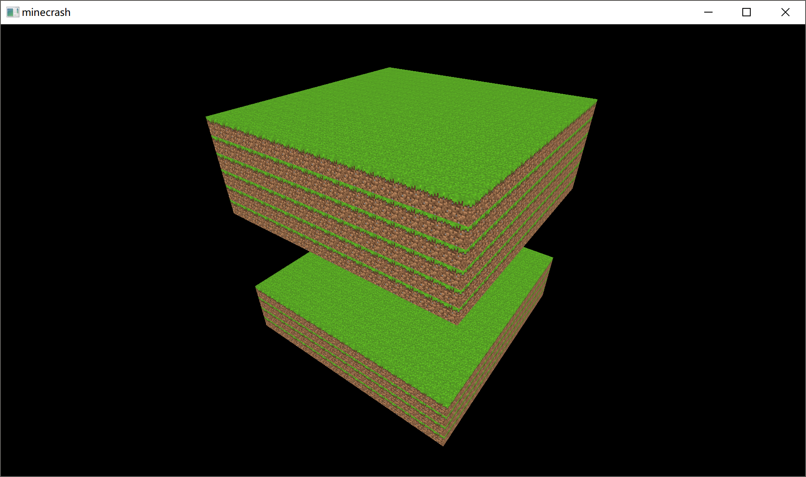

实现了最基本的优化，也就是只有与空气接触才会渲染这个方块。所以从内部看是这样的:

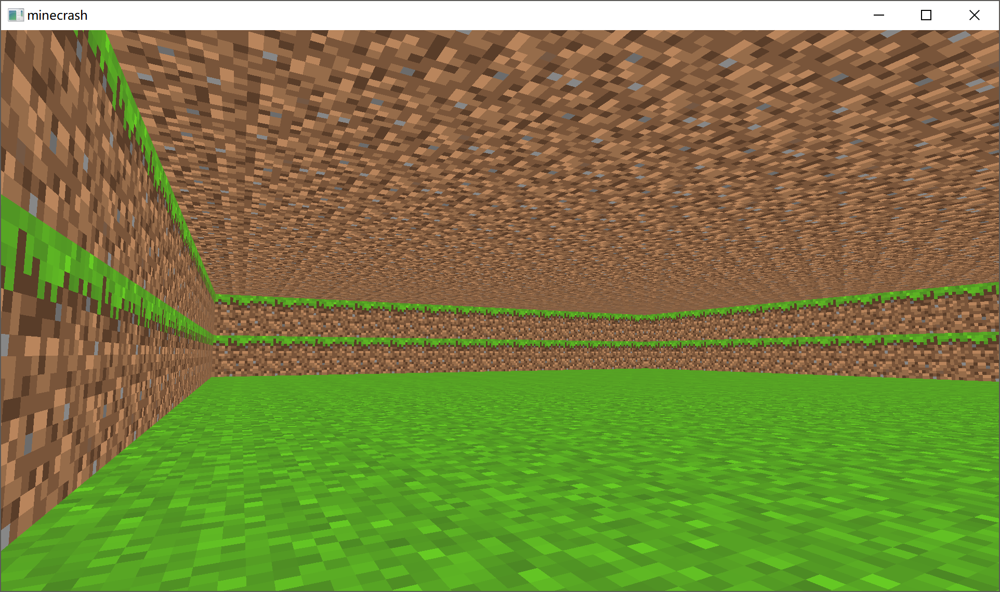

结果写到最后还是变成怎样写比较方便怎么来了...可能之前还是太理想主义了?

虽然看起来挺不错的，但是实际上还是有非常多没有必要的面被渲染了...生成mesh这件事可能要尽早解决。现在想想也许可以通过类似于`chunk.addFace(x, y, z, UP, textureID)`之类的方法来实现?

同时还有材质包的问题，本来打算在这一次更新里就把石头放进去，但是对着`float[] indices = new float[6 * 6];`还是退缩了。对于每个方块都手写这么多坐标我可能真的会疯...

现在的想法是这样的:

读取材质包的时候，对于每种方块都生成一个对应的mesh，在Chunk内开一个Block类的数组存储所有方块。对于每个Block实例，里面存储一下方块ID和对应的mesh引用，这样在Renderer渲染的时候能够方便一些。

---

过了无聊的白天之后，又到了有大块的开发时间的夜晚了。自从上大学以来就越发觉得整块的时间真的非常重要。在这段时间里不受打扰地专注工作真的可以让效率提升很多。

在晚上把`TextureManager`类写好了。其实最后发现，它所做的事情很简单，就是输入每个面的贴图位置，然后生成对应方块的`textureCoord`数组。这个东西用Python写还是很简单的:

```python
SIZE = 16
FULL_SIZE = 256


class Face(object):

    def __init__(self, texture_index, coord):
        print(', '.join(["new Vector3d%s" % str(_) for _ in coord]))
        self.coord = coord
        x1 = ((texture_index // (FULL_SIZE // SIZE)) * SIZE) / FULL_SIZE
        y1 = ((texture_index % (FULL_SIZE // SIZE)) * SIZE) / FULL_SIZE
        x2 = x1 + SIZE / FULL_SIZE
        y2 = y1 + SIZE / FULL_SIZE
        self.textureCoord = [(y, x) for x in [x1, x2] for y in [y1, y2]]

    def get(self):
        a, b, c, d = self.coord
        e, f, g, h = self.textureCoord
        return a + c + d + a + b + d, e + g + h + e + f + h


class Texture(object):

    def __init__(self):
        self.faces = []

    def get(self, up, down, left, right, front, back):
        self.faces.append(Face(up, [
            (x, .5, y) for x in [-.5, .5] for y in [-.5, .5]
        ]))
        self.faces.append(Face(down, [
            (x, -.5, y) for x in [-.5, .5] for y in [-.5, .5]
        ]))
        self.faces.append(Face(left, [
            (x, y, -.5) for y in [.5, -.5] for x in [.5, -.5]
        ]))
        self.faces.append(Face(right, [
            (x, y, .5) for y in [.5, -.5] for x in [.5, -.5]
        ]))
        self.faces.append(Face(front, [
            (.5, x, y) for x in [.5, -.5] for y in [.5, -.5]
        ]))
        self.faces.append(Face(back, [
            (-.5, x, y) for x in [.5, -.5] for y in [.5, -.5]
        ]))
        position, texture_coord = [], []
        for f in self.faces:
            assert isinstance(f, Face)
            pos, tex = f.get()
            position.extend(pos)
            texture_coord.extend(tex)
        return position, texture_coord


def pprint(position, texture_coord):
    return
    pos_render, tex_render = [], []
    for i in range(len(position) // 3):
        pos_render.append(', '.join([str(position[i * 3 + d]) + 'f' for d in range(3) if i + d < len(position)]))
    for i in range(len(texture_coord) // 2):
        tex_render.append(', '.join([str(texture_coord[i * 2 + d]) + 'f' for d in range(2) if i + d < len(texture_coord)]))
    print(', \n'.join(pos_render))
    print(', \n'.join(tex_render))
    # assert len(pos_render) == len(tex_render)
    # for i in range(len(pos_render)):
    #     print("%s: %s" % (pos_render[i], tex_render[i]))


l = [Texture() for _ in range(10)]
pprint(*l[1].get(0, 0, 0, 0, 0, 0))  # stone
"""
pprint(*l[2].get(1, 3, 2, 2, 2, 2))  # grass
pprint(*l[4].get(4, 4, 4, 4, 4, 4))  # cobblestone
"""
```

不过对于java来说，因为经验还是太少了，于是用最蠢的办法实现了同样的逻辑:

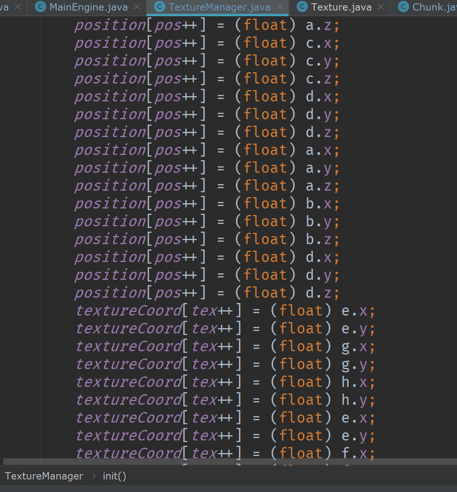

个人还是不太喜欢这种需要复制粘贴很多次才能实现的东西，本能地有畏难心理，可能也只是我的实现方法太蠢了。

然后稍微对Chunk类之类的改一改就可以看到结果啦！

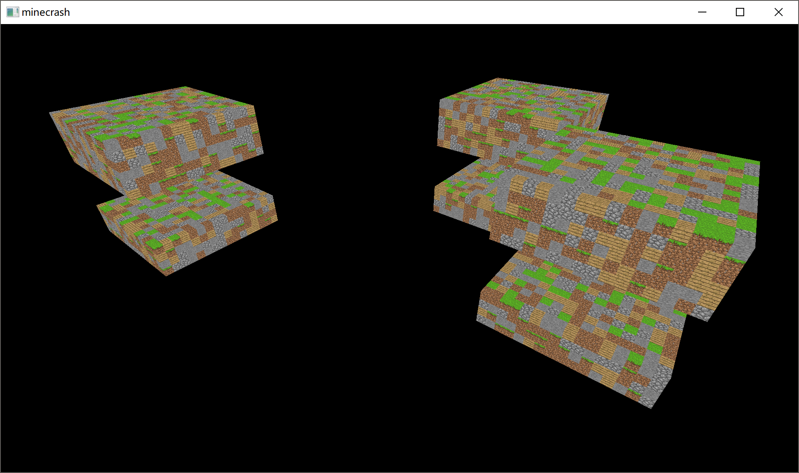

来一张近照:

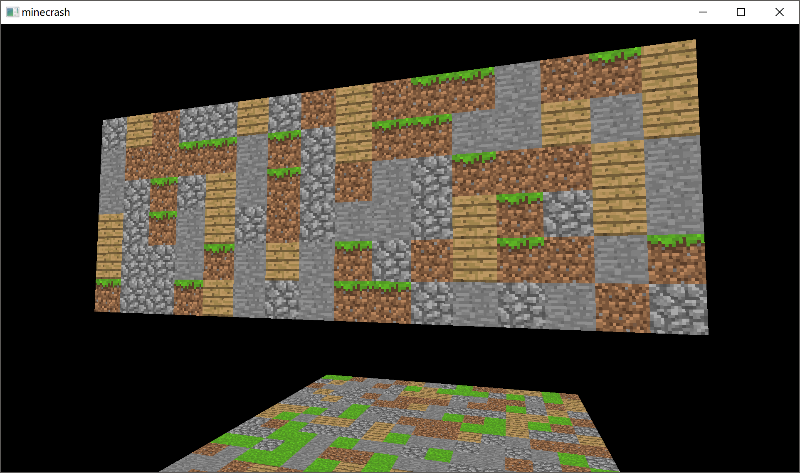

下一步本来应该是研究地形生成，但是可能应该先往光照，阴影，skybox方面走一走。至少卖相还是要好看点的嘛233

## 2019/07/02

看到这个日期突然想起来在中小学的时候已经是放假的第二天了。

其实只要我愿意的话，我也可以把小学期过得像真正的暑假一样。网课和华为云的题目，两个小时内就能全部解决。java也只需要稍微学一学就能很快上手，毕竟c++和python的底子虽说浅薄，但还是有的。

如果我没有选择做minecrash，而是选择从老师给定的20个题目里选择的话，我想以我和队友的能力，两天写完都是绰绰有余。

于是剩下的大把时间可以拿来尽情的放纵。星露谷联机、Minecraft服务器、补那些值得补的电影、去百货商城现充、躺在四下黑暗无光的草地上凝视星空，看群星慢慢划出一道道星轨、或者是真正单纯的赖床，也不看手机，不想任何事情，只是看着透过玻璃的阳光一点点移动，直到夏夜的虫鸣响起，整个宿舍陷入黑沉与寂静、或是将自己完全投入音乐的世界里，感受每个和弦进行里蕴含的所有细微的情感，每个乐器产生的独特的声音，它们合奏时产生的魄力，直面纯粹且震撼人心的，来自音乐的美丽、或是其他一切把大把大把的时间浪费在使人感到安心、安逸、幸福的任何看起来很平淡的事情上。

最贵的就是闲啊。可能从此以后再也没有这种纯粹的时光了。

而我最后做的选择是放弃这些，踏出舒适区，在每一次编译时祈祷，在每一次做出成果后欢喜，在每一次编译失败后失落。每一天除了吃饭，睡觉与上课，便是学习新知识和敲代码。

可能未来回望时，是不是会觉得连现在这种别无旁顾全身心投入一个项目的时光，也是一种奢侈呢?

扯远了。多么可悲啊，最后竟然要用"扯远了"来结束这段遐想。

---

我们可以实现很多种光源，比方说点光源，或者平行光源。稍微思考一下就会发现在原版MC里只有平行光源。

不过为了能够实现光影，这两种光源我们应该都会实现。但是现在的话，我想可能还是平行光源优先。

这是因为在加入物品系统之前，我想我们暂时还用不到动态光源。而这些动态光源，比方说拿在手上的火把，萤石，一桶岩浆，南瓜灯，或者是被放置并且被活塞推动的红石灯，都是点光源。

显然昼夜交替会先于物品系统被制作出来，所以我想，平行光的实现应当是比点光源更加优先的。

---

结果debug了一整天都没有找出怎么解决问题来。

现在虽然平行光实现了，但是通篇全是bug:

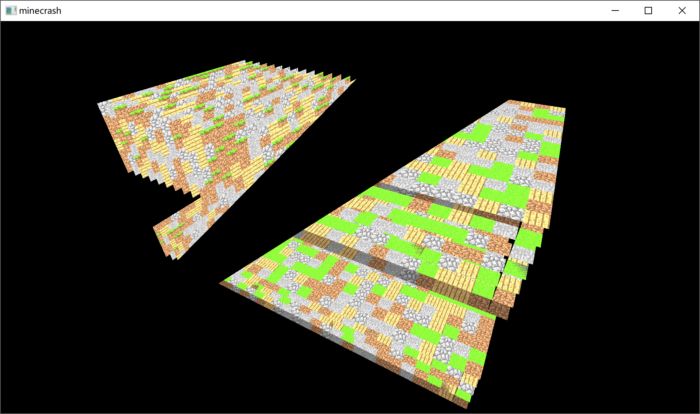

对`fragment.fsh`稍微做了点手脚，来测试到底是哪出了问题:

```c++
void main() {
    setupColours(material, outTextureCoord);

    vec4 diffuseSpecular = calcDirectionalLight(directionalLight, vertexPos, vertexNormal);

    fragColor = ambientC * vec4(ambientLight, 1) + diffuseSpecular;
    fragColor = vec4(ambientLight, 1);
}
```

其中`ambientLight`是一个`uniform vec3`变量。按照`fragColor = vec4(ambientLight, 1)`，应该所有方块都会被渲染成`ambientLight`的颜色，但是结果却是一片黑色:

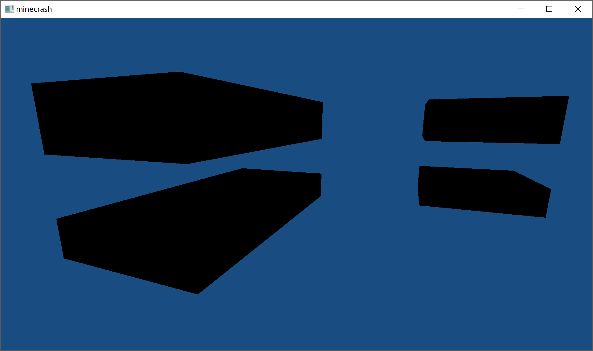

它照理说应该在renderer初始化的时候就被赋值了:

```java
public class Renderer {
	// ...
    private final Vector3f ambientLight = new Vector3f(.3f, .3f, .3f);
    
    public void init(Camera camera) throws Exception {
        shader = new Shader();
        // ...
        shader.createUniform("ambientLight");
        // ...
        shader.setUniform("ambientLight", ambientLight);
    }
    // ...
}
```

如果把`fragment.fsh`改成这样:

```c++
void main() {
    setupColours(material, outTextureCoord);

    vec4 diffuseSpecular = calcDirectionalLight(directionalLight, vertexPos, vertexNormal);

    fragColor = ambientC * vec4(ambientLight, 1) + diffuseSpecular;
    fragColor = vec4(.3f, .3f, .3f, 1);
}
```

就会得到正确的结果:

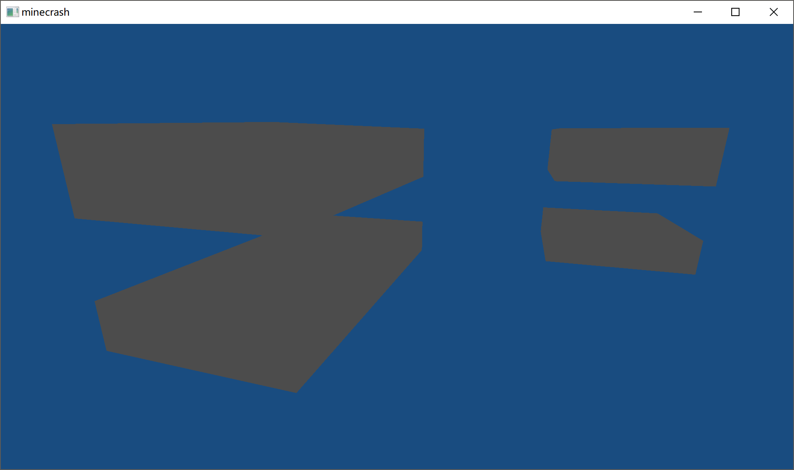

这到底是为什么呢...可能mc就是因为这个才放弃的光影?

## 2019/07/03

看起来好像是因为`setUniform`距离`setDirectionalLight`太远了导致的，因为我跟着lwjglbook的代码，把光照部分放进`renderLight()`函数里就好了...

太玄学了...不过好在最后还是把光照跑出来了。顺手就写了个日夜交替:


夜晚的时候方块的各个面还是不太好分辨，回头稍微改改。

---

然后一整天都花在完成课内，摸鱼，以及优化日夜交替上了。说好的阴影也没来得及做。

首先是通过`glEnable(GL_CULL_FACE)`减少了一半左右的需要渲染的面数。

一开始因为当初`TextureManager`是乱写的，于是经常会出现定义顺序是顺时针从而导致有些面在应该渲染的时候却没有被渲染的惨状。图我就不贴了，实在是有点精神污染。

之后是对日夜交替的优化，不多说，直接贴一张最新的成品:


首先是增加了背景颜色的变化。这主要还是通过根据当前时间来混合颜色而做到的:

```java
    public static Vector3f mixColor(Vector3f colorA, Vector3f colorB, 
                                    double mixRatio) {
        assert 0 <= mixRatio && mixRatio <= 1;
        float r = (float) (colorA.x + (colorB.x - colorA.x) * mixRatio);
        float g = (float) (colorA.y + (colorB.y - colorA.y) * mixRatio);
        float b = (float) (colorA.z + (colorB.z - colorA.z) * mixRatio);
        return new Vector3f(r, g, b);
    }
```

然后，仔细观察夜晚时的方块，相比之前的版本，不同的面会有不同的亮度。

这是通过对`fragment.fsh`进行简单修改得到的:

```c++
void main() {
    setupColours(material, outTextureCoord);

    vec4 diffuseSpecular = calcDirectionalLight(directionalLight, vertexPos, vertexNormal) * 0.8;

    float mixRatio = 0.0f;
    if (originVertexNormal == vec3(-1, 0, 0) || originVertexNormal == vec3(1, 0, 0))
        mixRatio = 0.15f;
    else if (originVertexNormal == vec3(0, 0, -1) || originVertexNormal == vec3(0, 0, 1))
        mixRatio = 0.3f;

    fragColor = mix(ambientC * vec4(ambientLight, 1) + diffuseSpecular, vec4(0, 0, 0, 1), mixRatio);
}
```

其中的两个`if`是判断当前正在渲染的面的法向量，简单翻译一下就是:

- 如果是`left || right`，那么相对于顶面会降低0.3的亮度。
- 如果是`front || back`，那么相对于顶面会降低0.15的亮度。

其实仔细一看的话，今天并没有做什么事情...

顺便，队友开始学习怎么使用perlin噪声来产生地形了。目前的效果是这样的:

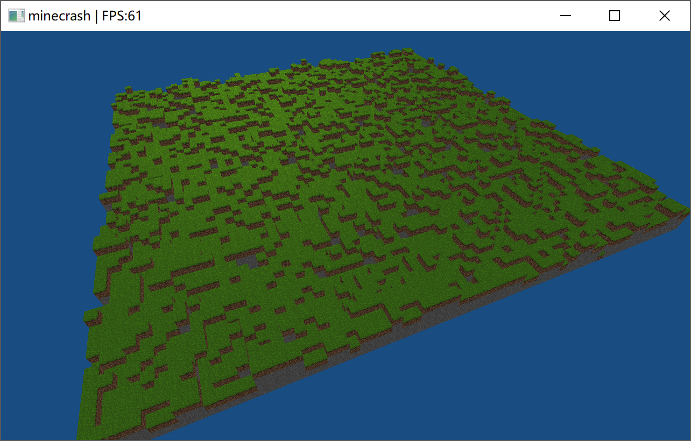

因为这是一个分支，所以暂时还没有最新的日夜交替效果。

我接下来会继续研究实现动态阴影，并且抽空研究怎么使用perlin噪声生成地形。

要做的还有很多，像是:

- 动态阴影
- 破坏方块时的粒子效果
- 水，岩浆，以及对它们的渲染
- 物品系统
- 背包系统
- 合成系统
- 声效
- 生物模型及其动画
- 优化Chunk渲染
- 存储与读取Chunk
- 动态光源

## 2019/07/04

稍微熬了会夜把Shadow Mapping看懂了。不过距离实现还有不少距离。

来简单讲一下原理:

1. 首先以光源作为原点，计算每个fragment到光源原点的距离。这样，得到的距离一定是这个方向上最小的。因为在同一方向上，任何大于这个距离的点都不会被光照到。
2. 以camera视角进行计算。对于每个fragment，除了计算camera视角的坐标外，还要计算在光照坐标系下的坐标。如果这个坐标对应的光照方向的距离大于最小值的话就说明该fragment处在阴影内。

于是这要求我们新建一堆东西，包括对texture类进行修改以支持空材质供shadow map使用，或者是全新的shadow.vsh和shadow.fsh。考虑到工作量，我决定还是留到白天再做。

---

然后接下来一整天都浪费在这个东西上面了，并且做出来的成果，虽然有，但全是bug:

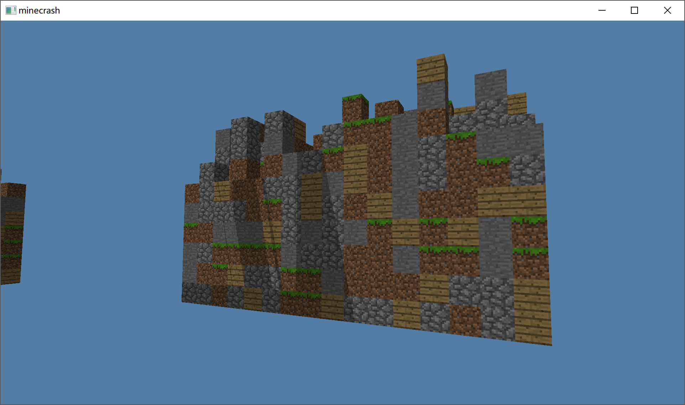

这玩意可以说就是照抄教程吧。毕竟原理懂了之后就只剩下实现了。

但是因为教程的结构和我们的项目的结构不一样，所以即便是抄也得搞明白教程的每个语句在做什么才行。

然后就出现了这种莫名奇妙并且怎么都找不到原因的bug。

根据vertex shader的源码，也许可以通过排除法来确定可能导致问题的变量:

```glsl
layout(location = 0) in vec3 position;
layout(location = 1) in vec2 textureCoord;
layout(location = 2) in vec3 vertexNormalVector;

out vec2 outTextureCoord;
out vec3 vertexNormal;
out vec3 vertexPos;
out vec3 originVertexNormal;
out vec4 lightViewVertexPos;

uniform mat4 projectionMatrix;
uniform mat4 modelViewMatrix;
uniform mat4 modelLightViewMatrix;
uniform mat4 orthoProjectionMatrix;
```

首先，材质能够正常渲染，说明`modelViewMatrix`和`projectionMatrix`是没有错误的。

其次，跟教程的`orthoProjectionMatrix`对比输出后发现是一样的，所以`orthoProjectionMatrix`也是正确的。那么最大的嫌疑就落在`modelLightViewMatrix`上了。但是，没有办法确定它是否是错的。教程中放置了一个平面和一个旋转的方块来作为演示，而我不可能在同样的位置放一个方块来确定我是否正确。即便可以，需要的时间也太多了。

## 2019/07/05

莫名其妙又到了一周的结尾。越发感觉做大作业的时间要不够了...

花了太多时间在课内的垃圾小项目上了。这种项目讲道理做了什么也学不到。不是很懂学校老师都在想什么。

以后就用ACM风格写，反正也不用维护。

---

关于阴影，虽然后来发现距离正确的阴影已经很近了（只是阴影本身在随着光照转动），但是却总是不知道到底错在了哪。换句话说就是不知道为什么阴影会跟着转。

最神奇的是把scene.fsh的输出换成`fragColor = vec4(vec3(texture(shadowMap, (lightViewVertexPos * 0.5 + 0.5).xy).r), 1)`后，可以清楚的发现其实`shadowMap`的输出结果是正确的。

不过最终还是暂时放弃了做阴影，先花了些时间把队友的初版地图生成器Merge了。

当区块数增加后，FPS也下降到了30多。要知道当时只有$4 \times 4 = 16$个区块啊。

于是我就花了点时间把`Chunk.generateMesh()`给写好了:

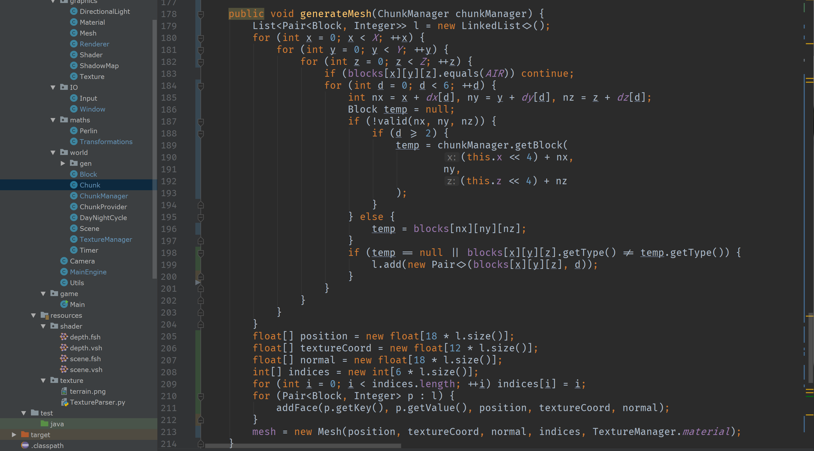

由于现在每个区块暂时还是$16 \times 16 \times 16$的大小，所以现在100个区块只需要渲染100个Mesh就可以啦！而之前的话，只要是与空气接触的方块，每个都会被调用一次render函数。100个区块，就是至少16000个`render()`，肯定是吃不消的。更不用说那些地形崎岖的区块了。

配合`glEnable(GL_CULL_FACE)`，FPS已经回到60了，可喜可贺:

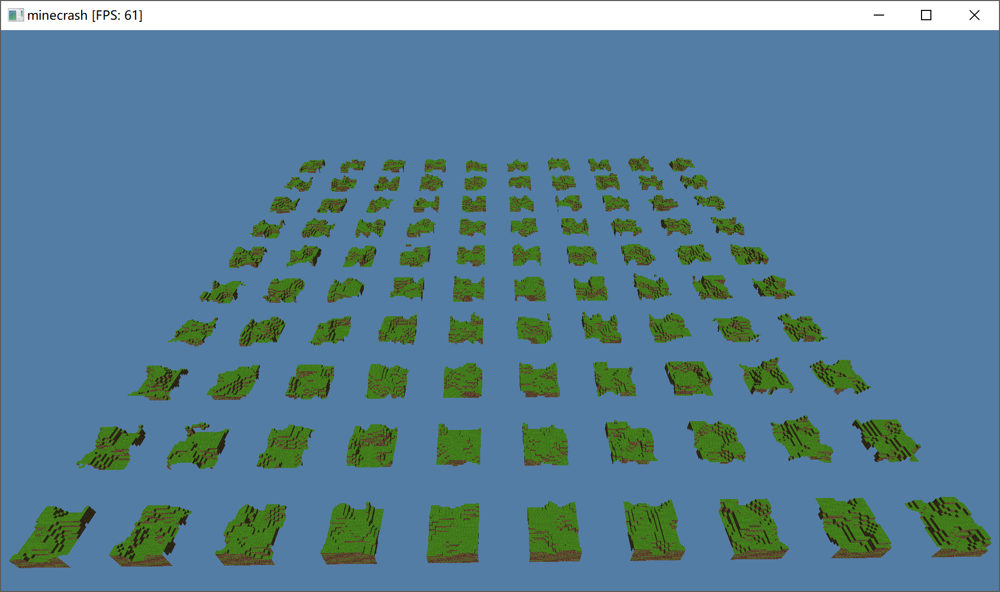

可以注意到几乎每个区块的侧面都没有被渲染。这是通过`ChunkManager.getBlock(x, y, z)`做到的，它可以跨区块获取方块数据。有了这样的优化后，渲染的面数相比之前又少了非常多。

但是我不能理解的是为什么区块之间隔了这么远。

既然我记录了每个Chunk的Chunk坐标，那么它的世界坐标显然是`new Vector3f(x << 4, 0, z << 4)`吧?

找了半天bug之后发现原来是因为block本身存的是世界坐标...所以chunk的世界坐标只要设成`0, 0, 0`就行了...

贴一张400个区块的截图！

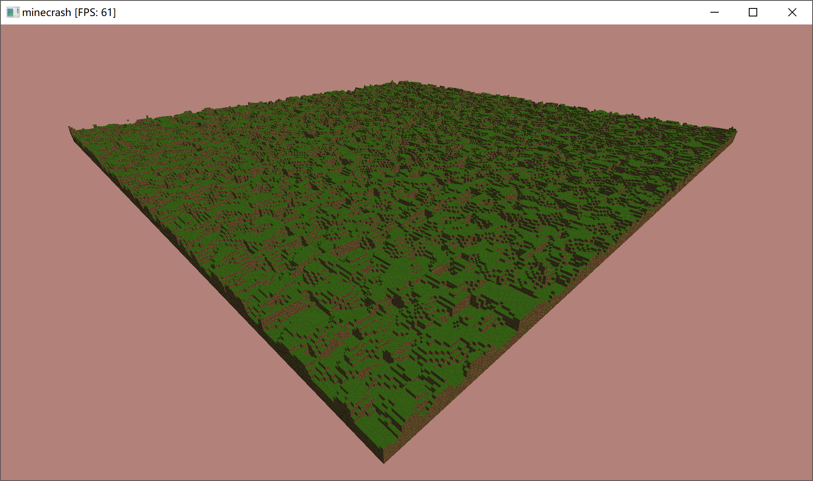

接下来该回到阴影啦！虽然阴影真的很烦人，但是它能够做到的效果是真的非常迷人的。

我已经迫不及待想要看到夕阳投下的阴影笼罩这片丘陵的样子了。

## 2019/07/06

最后发现问题出在了calcShadow上，于是在凌晨搞出了第一个可以正常跑的shadow:

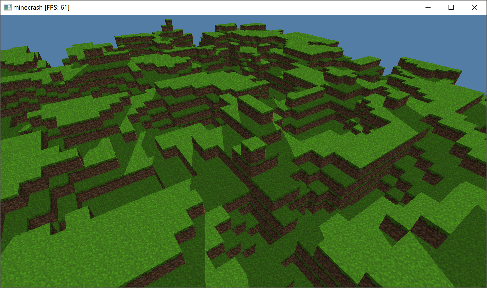

完全重写了原本教程里的`calcShadow(vec4)`，并且做了最最简单的shadow acne去除工作:

```c++
float calcShadow(vec4 position) {
    vec3 projCoords = position.xyz / position.w;
    projCoords = projCoords * 0.5 + 0.5;
    float closestDepth = texture(shadowMap, projCoords.xy).r;
    float currentDepth = projCoords.z;
    return currentDepth - closestDepth > 1e-3 ? 0.0 : 1.0;
}
```

这代码的可读性简直高到爆炸了好吗！！

可能会有人想问`currentDepth - closestDepth > 1e-3`为什么不直接写成`currentDepth > closestDepth`，对此我就贴一张图:

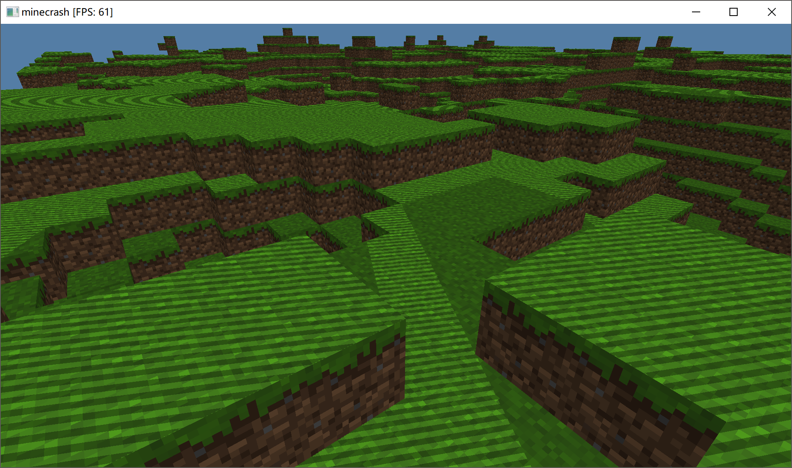

*~~感受Shadow Acne的力量吧！~~*

其实细微处还是有不少问题存在的，不过这些就留到稍微靠后一点再优化。先考虑怎么正确的设置`directionalLight`的`viewMatrix`，毕竟让阴影动起来可能更重要，也更震撼。

肝了一小段时间之后做出了动态的阴影，顺带做成了GIF。为了限制文件大小只能把画面和质量都砍了...

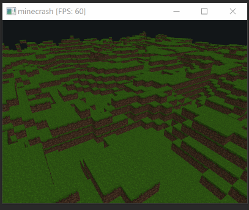

不过意境在那就足够了，对吧。; )

---

能够睡到自然醒，然后躺在床上玩手机直到饭点再下床，真是难得的奢侈啊。

根据[这个教程](https://www.opengl-tutorial.org/intermediate-tutorials/tutorial-16-shadow-mapping/)的优化方法，把阴影的边缘改得至少能够让人接受了:

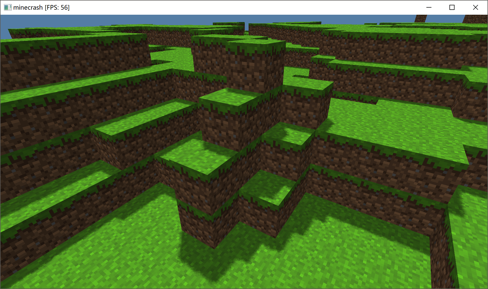

阴影的效果加上之后，总归还是让人感觉非常不满意，因为相比原版MC少了平滑光照。

这使得方块之间的关系还是不够明确。所以我去查了一下，最后得知只需要实现Ambient Occlusion就可以啦。

> 下一步本来应该是研究地形生成，但是可能应该先往光照，阴影，skybox方面走一走。至少卖相还是要好看点的嘛233

至于Skybox就先放一放吧23333

## 2019/07/07

网上的教程一般都是通用的环境光吸收，也就是SSAO。

不过要实现SSAO的话，需要先把着色器部分改成Deferred Shading，目前来说有点没必要。

于是就采用了相对来说更加投机取巧的办法，也就是根据voxel的特性，直接根据方块所处位置周围的情况来确定AO就可以了。这甚至可以在生成chunk的时候就顺带完成。

 贴一张结果:

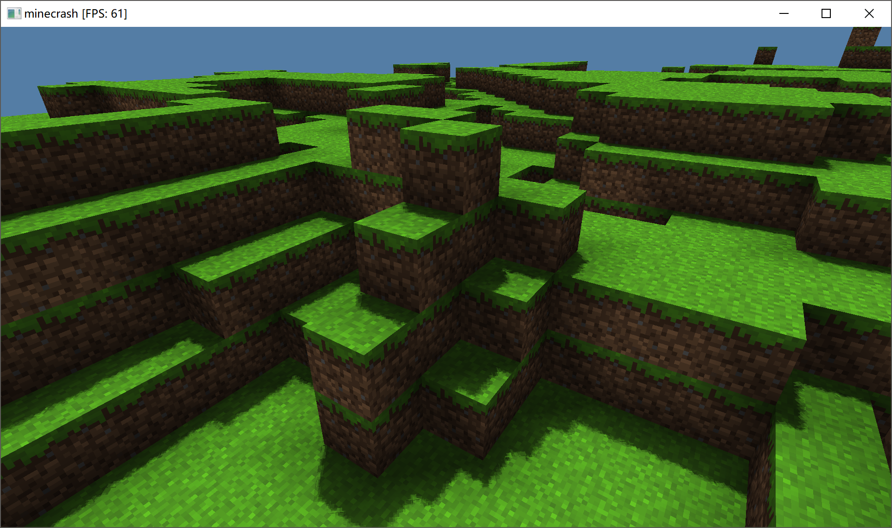

看起来有质感多了！相比之下，用于实现它的代码是真的写的毫无质感:

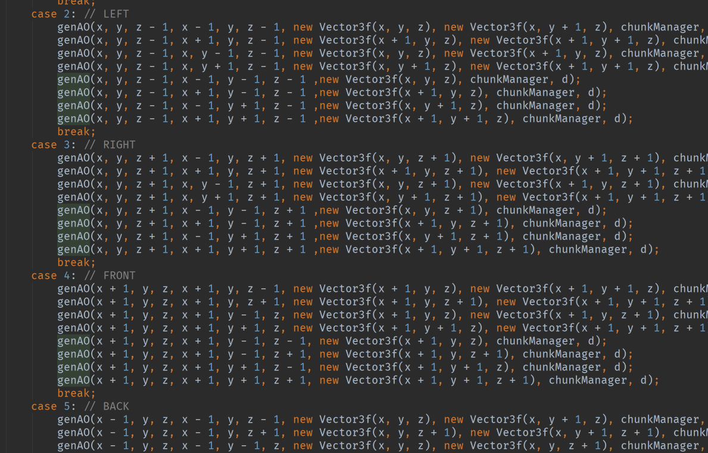

下一步就该把太阳和月亮放进天空啦！

---

然后就把自己的脸给打了，跑去研究了一下Simplex Noise然后整出了这个:


FPS瞬间爆炸啊！！

太可怕了，这种程度的地形对MC来说不是塞牙缝的吗！！

自闭了，看来优化之路还远得很啊...

贴一下全景图:


---

跑完步回来近距离欣赏了一会，发现为了能够让Shadow Map正常渲染远处的影子，所以正投影矩阵必须开得特别大。这样，就会导致阴影的质量非常低:

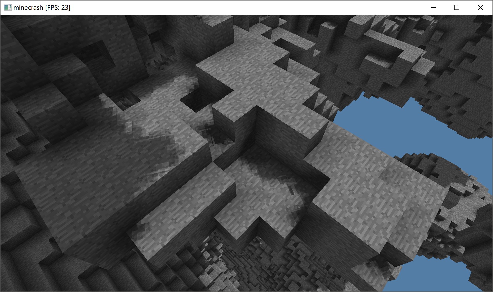

有三个解决方法:

- 实现Cascaded Shadowing
- 把Shadow Map的材质开得更大一点
- 把正交投影矩阵范围改小点

考虑到实现Cascaded Shadowing实在是过于繁琐 ~~（其实就是懒+心累）~~ ，直接把后两个优化做了。

在一周的最后，来好好欣赏一下这一周的努力的成果吧。

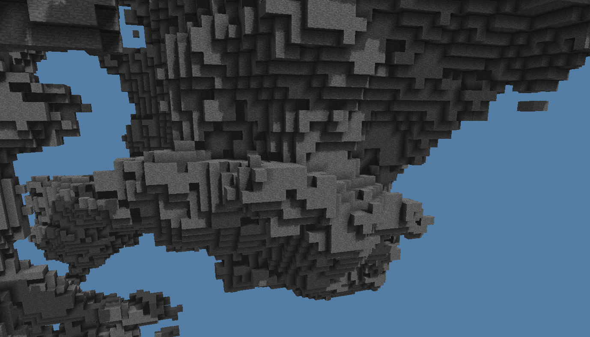

## References

- 关于光照:
    - https://en.wikipedia.org/wiki/Lambert%27s_cosine_law
    - https://en.wikipedia.org/wiki/Phong_shading
- 关于阴影: 
    - https://ahbejarano.gitbook.io/lwjglgamedev/chapter18
    - https://www.opengl-tutorial.org/intermediate-tutorials/tutorial-16-shadow-mapping/
    - https://learnopengl.com/Advanced-Lighting/Shadows/Shadow-Mapping
- 关于perlin noise和simplex noise: 
    - https://flafla2.github.io/2014/08/09/perlinnoise.html
    - https://en.wikipedia.org/wiki/Perlin_noise
    - http://webstaff.itn.liu.se/~stegu/simplexnoise/simplexnoise.pdf
- Ambient Occlusion:
    - https://0fps.net/2013/07/03/ambient-occlusion-for-minecraft-like-worlds/
    - https://john-chapman-graphics.blogspot.com/2013/01/ssao-tutorial.html
    - https://learnopengl.com/Advanced-Lighting/SSAO
    - https://en.wikipedia.org/wiki/Screen_space_ambient_occlusion

