## 2019/07/15

明天就要开始写文档了，所以今天很可能就是最后一天开发了。

突然对自己之前那些摸鱼的日子感到后悔，但是后悔又有什么用呢?

按照惯例，首先开幕雷击:

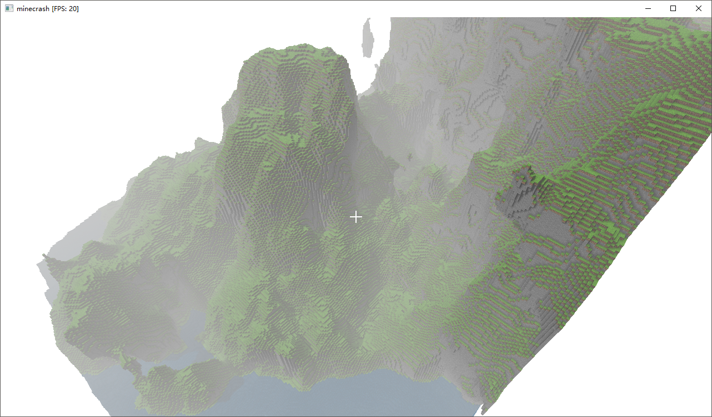

这是前三周的成果。

早上起来先加了Frustum Culling，也就是把视野范围外的区块直接抛弃掉。这样就可以减少GL调用。

不过FPS没有什么实质上的提升。后来看了一下是因为要正确的渲染阴影还是需要把所有的mesh都渲染一遍才行。正是这一步骤使得FPS降到了20。

稍微查了一下，有一种叫shadow frustum culling的方法，通过它我们可以去除掉那些不会对阴影产生贡献的mesh。不过这要求我们正确地实现CSM中计算正投影和光照视角矩阵的代码，而这两个都被我橄榄了。被我无脑橄榄的结果是，几乎没有任何区块能被剔除掉。

所以只能先修一下CSM了，果然不能投机取巧啊...

---

为了寻找正确的Ortho实现（没错就是懒），找到了PPSM的论文。很难懂啊。而且也没怎么仔细讲要怎么实现OrthoProjectionMatrix。

改了一天都没搞出正确的正投影矩阵。

最大的感想大概就是，人类的尝试大多是以失败而告终的。

不过，在一天的最后，还是搞出了一个非常有用的优化的:

```java
    public void renderSolid(FrustumCullFilter frustumCullFilter) {
        for (int i = 0; i < (Y >> 4); ++i) {
            if (isEmpty[i]) continue;
            if (frustumCullFilter == null || frustumCullFilter.insideFrustum((x << 4) + (X >> 1), (i << 4) + 8, (z << 4) + (Z >> 1), 13.856406460551018f)) {
                if (solid[i] != null) {
                    solid[i].render();
                }
            }
        }
    }

    public void renderTransparencies(FrustumCullFilter frustumCullFilter) {
        for (int i = 0; i < (Y >> 4); ++i) {
            if (isEmpty[i]) continue;
            if (frustumCullFilter == null || frustumCullFilter.insideFrustum((x << 4) + (X >> 1), (i << 4) + 8, (z << 4) + (Z >> 1), 13.856406460551018f)) {
                if (transparencies[i] != null) {
                    transparencies[i].render();
                }
            }
        }
    }
```

看到`isEmpty[i]`了吗?

这减少了非常多无用的GL Call。现在我们的帧率又回到了60:

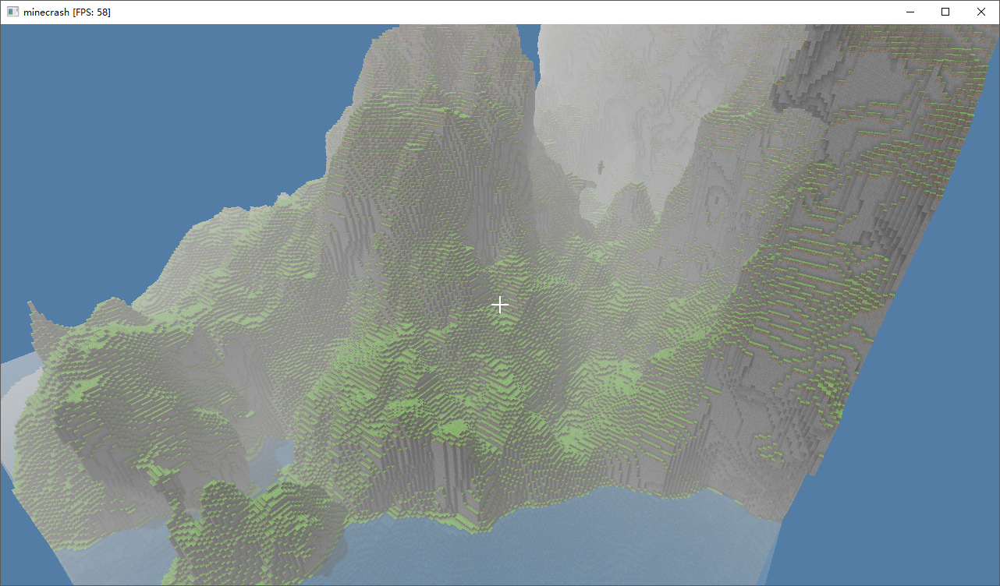

动图看起来是这样:

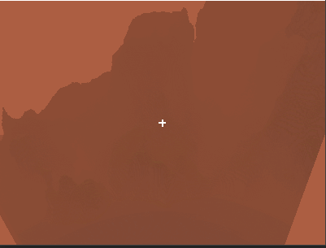

看起来质量应该很低...没办法了，毕竟动图的size不能太大呀...

大概还是能够看出晨雾是最浓的。

准备在写文档之前最后再搞一下物品栏和物品系统。

## 2019/07/16

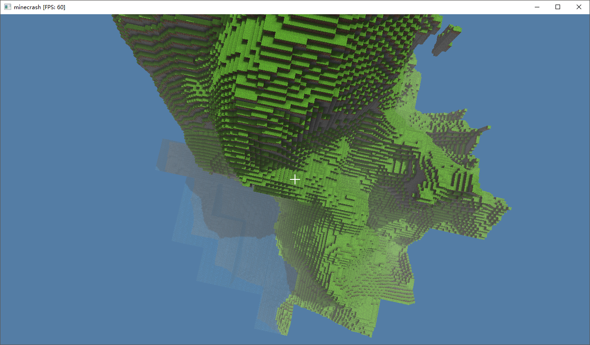

但是先搞的不是物品栏，而是队友那边的动态地图。也确实没办法，因为单线程的缘故，移动的时候都会很卡...

先把这个修复完再开始写文档吧...

---

因为实在太慢了，打算用多线程优化一下。结果就凉了:

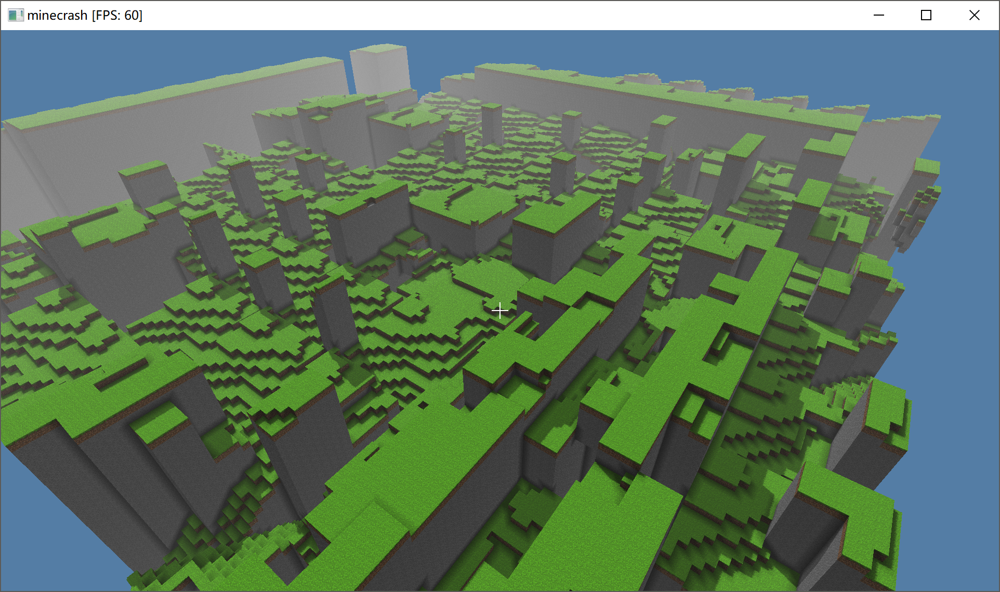

新枪战地图的感觉?

---

出了一堆莫名其妙的bug，果然是minecrash。总之最后直接重写了多线程生成地图，以及多线程生成Mesh的方法。

经过测算平均下来是提高了300%的速度。但是更新一次地图还是要100ms+，所以最后甚至提出并且实现了把生成mesh放到多轮update内去完成。

最后大约是走一段距离会小卡一下，感觉已经是我们的极限了。

## 2019/07/17

DDL是第一生产力！

实现了行走功能:

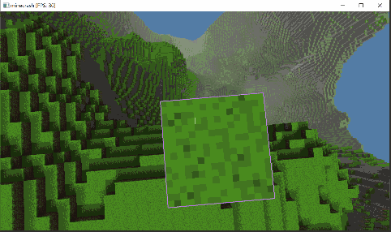

在测试行走的过程中，发现把生成Mesh放到多轮update中偶尔会产生NullPointerException。现在要先把这个Bug排除掉。

暂时用最简单的方式，也就是在出错的函数周围圈上同步解决了。但是这并不能说明这个bug已经被完全修复了。暂时还是不能够确定它产生的原因的。

之后是发现了另一个bug，也就是在判定碰撞箱是否与人物碰撞箱相交的地方，在第62格处会神奇的判断为不相交。我想这大概是精度问题?

---

花了一天时间把物品栏做好了。

首先是根据HUD的教程把物品栏加了进去:

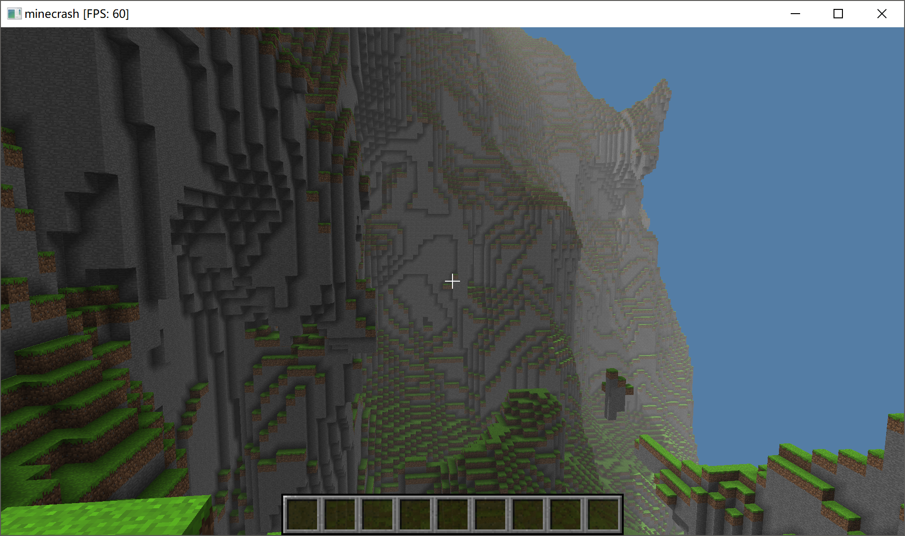

然后，把选择框加了进去，并且建立了鼠标回调函数来与之相连:

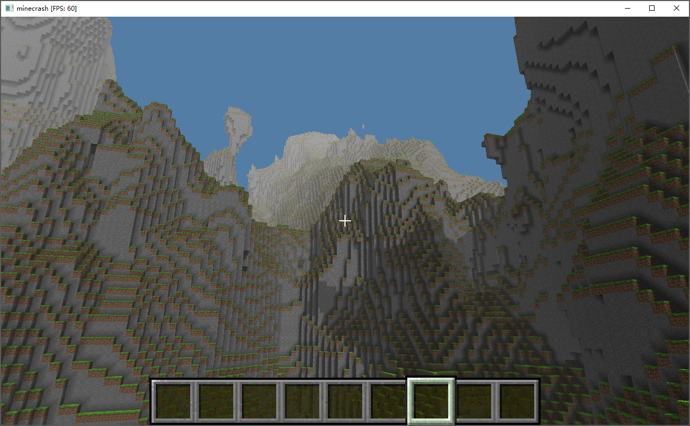

最后，由于时间关系简单地用面填充了一下物品栏，顺便把放置方块的逻辑和物品栏类连起来了。于是很愉快地 ~~种~~ 建出了minecrash的第一颗树:

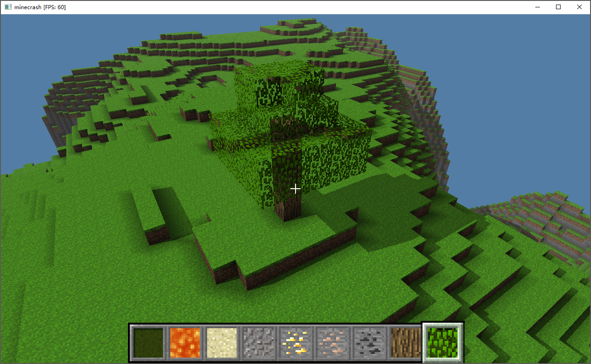

该写报告啦...可能minecrash也就到此为止了。

多少还是感到有点可惜的。

## 2019/07/18

今天发生了非常令人悲伤的事情。但是由于原则，我不能在这里多说什么。

RIP，京アニ。

---

在做答辩PPT了。最后来贴几张其中的项目展示部分的截图吧...

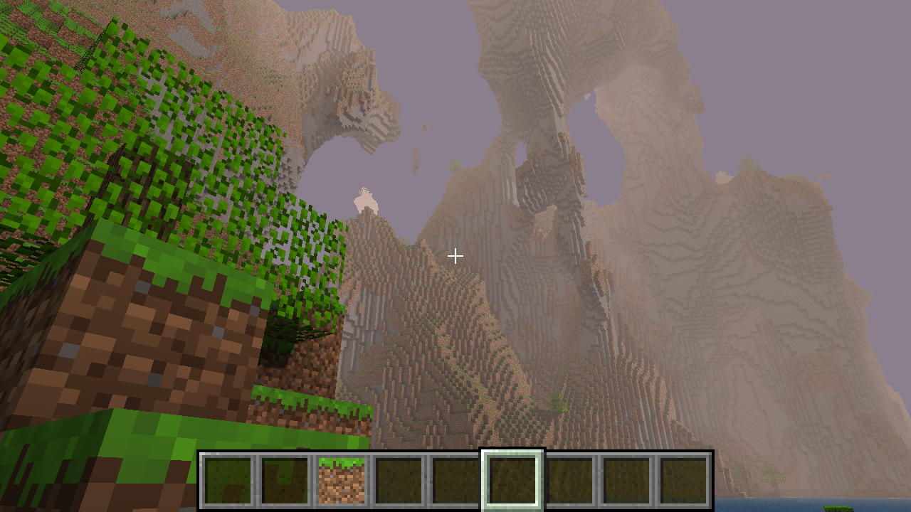

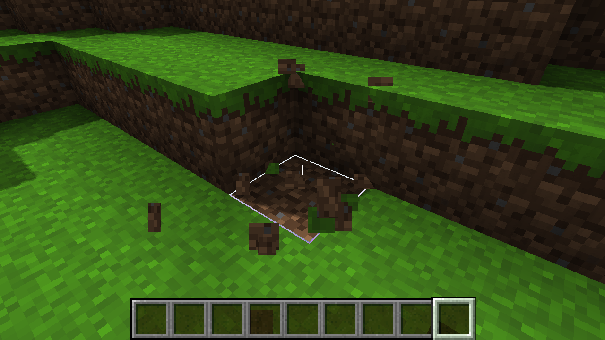

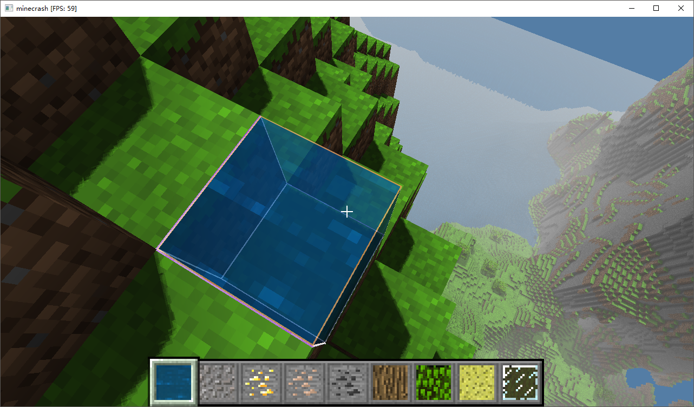

## 2019/07/19

顺利完成答辩。休息一天，明天就要回到ACM训练中了。

## 2019/07/20

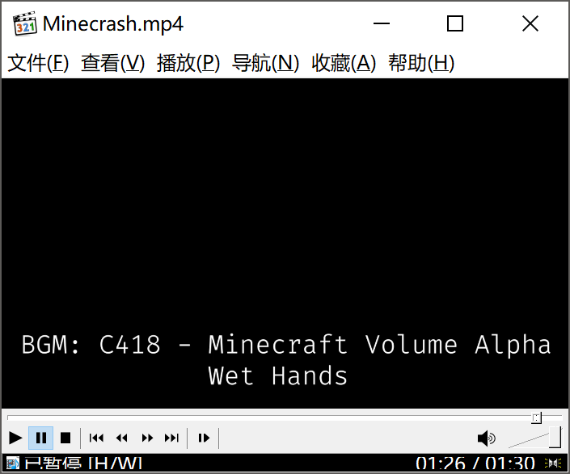

## Reference

- PPSM:
    - https://developer.nvidia.com/gpugems/GPUGems3/gpugems3_ch10.html
    - https://promethe.io/2015/01/21/exponential-cascaded-shadow-mapping-with-webgl/
- HUD:
    - https://ahbejarano.gitbook.io/lwjglgamedev/chapter12
