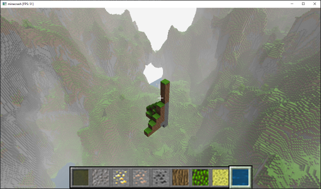
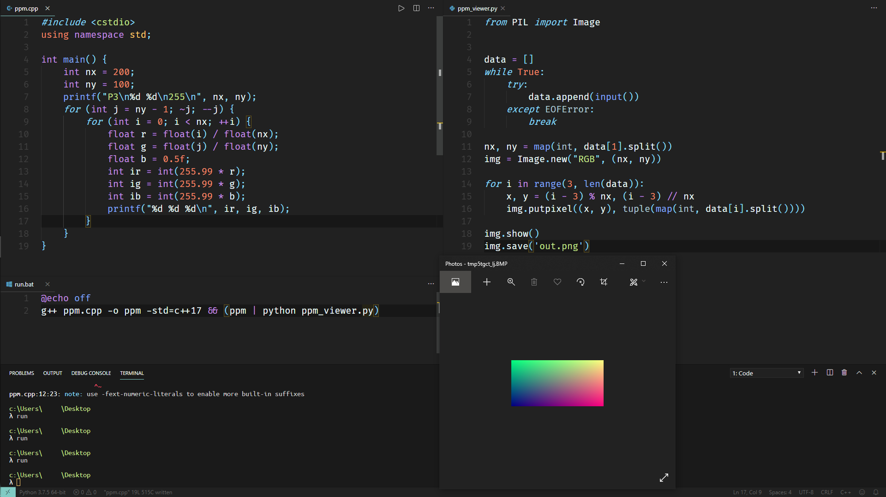
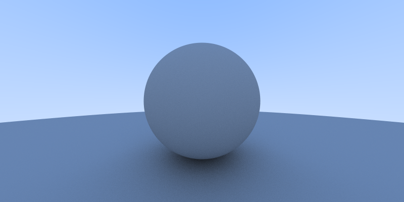
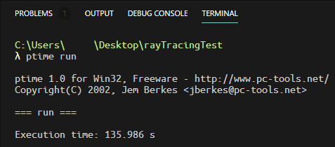

这个项目已经完成整整一个月了。但是我还不想让它就此止步。

所以我决定在这后日谈里，不定期地贴出更新的内容。

由于升学和课内的压力，我想可能近期（指未来半年到一年）不会有特别多的闲暇时间可以用于更新。且更且珍惜吧！

## 2019/08/19

更新了`CameraSelectionDetector`的算法:

```java
    private Vector3f selectBlock(ChunkManager chunkManager, Vector3f center, Vector3f dir) {
        Block block;
        Block selectedBlock = null;
        float blockClosestDistance = Float.POSITIVE_INFINITY;
        final float distance = 5.5f;

        for (int x = (int) (center.x - distance); x <= (int) (center.x + distance); ++x) {
            for (int y = (int) (center.y - distance); y <= (int) (center.y + distance); ++y) {
                for (int z = (int) (center.z - distance); z <= (int) (center.z + distance); ++z) {
                    block = chunkManager.getBlock(x, y, z);
                    if (block == null) return null;
                    if (block.getBlockID() == TextureManager.AIR) continue;
                    min.set(block.getPosition());
                    max.set(block.getPosition());
                    max.add(1, 1, 1);
                    if (Intersectionf.intersectRayAab(center, dir, min, max, nearFar) && nearFar.x <= 5
                            && nearFar.x < blockClosestDistance) {
                        blockClosestDistance = nearFar.x;
                        selectedBlock = block;
                    }
                }
            }
        }

        if (selectedBlock == null) return null;
        return selectedBlock.getPosition();
    }
```

这样的话每次需要访问的方块数就变成了恒定的$10\times 10\times 10 = 1000$块。虽然看起来性能比之前的600块要更差，但是那个数据是没有把空气方块计入在内的。

值得注意的一点是，先前的检测方法就算是距离特别远的方块也可以被选中，并且效率相对来说还算不错。而新的检测方法则绝对不可以用在检测距离过远的方块上。现在的方法对于距离为$n$的候选距离，需要检测的方块数是$\mathcal{O}(n^3)$级别的。而前一种方法通过对区块等进行剪枝，可以确保就算是远距离的方块也可以用较少的访问次数就可以确定选中的方块。

## 2019/11/1

学了JavaEE之后，发现maven打包成war还挺方便的。既然`mvn package`可以产生可用的`war`，那应该也能产生独立的jar包吧！这样我就能提供游戏下载了。

可惜现实还是太残酷了，花了几个小时之后，虽然可以使用maven进行打包了，但是打包出来的jar，即便是把依赖都装进去，照样找不到`lwjgl.dll`。考虑到第二天还有事就睡了。

## 2019/11/5

打算翘了编译去上高级C语言，想着利用没课的时间先继续CS143，然后不知道怎么就开始修起minecrash了。

首先是修复了方块选择器的bug:

```java
        for (int x = max((int) (center.x - distance), 0); x <= min((int) (center.x + distance), Chunk.getY()); ++x) {
            for (int y = max((int) (center.y - distance), 0); y <= min((int) (center.y + distance), Chunk.getY()); ++y) {
                for (int z = max((int) (center.z - distance), 0); z <= min((int) (center.z + distance), Chunk.getY()); ++z) {
                    // ...
                }
            }
        }
```

否则对于超出边界的block，`ChunkManager`自动返回`null`，而根据`if (block == null) return null;`，所以站在世界的边界时，是选不中任何东西的。

何等愚蠢的逻辑漏洞啊。简直是在玷污前ACMer这一称号。

之后稍微调整了一下工程文件的结构，并且对所有文件的import顺序做了修正。同时也发现了不少设计上的缺陷，比方说fog在一天中的浓度，居然是在`DayNightCycle.java`中计算的。这种逻辑难道不应该封装在`fog`类内吗? 同样的道理，既然很多天气因素都是根据昼夜来计算的，那显然可以写一个`timeParser.java`之类的，返回四个`boolean`，分别表示当前是*日出，白昼，日落，黑夜*，以及一个`double`，表示当前时间阶段的进度。而光照角度等都应该根据`timeParser.java`返回的值进行计算。这样，要修改光照的逻辑，也只需要对光照类的对应部分进行修改就可以了。 再看看现在，不论是改雾的浓度也好还是光照角度光照颜色也好全部都要在一个函数里完成，是多么愚蠢的设计啊。

## 2019/11/9

闲逛的过程中发现了这种浮空的岛屿，虽然有点像彩蛋一样，但是正常来说应该把这种情况消除才对。



于是可以简单地梳理一下想要做的事情:

- 优化区块生成算法，确保移动时不会卡顿
- 实现远距离投影的影子的边缘模糊效果，即soft shadows
- 实现skybox
- 实现体积云
- 实现体积光
- 实现月光与影子
- 将渲染替换为deferred shading
- 加入对`.obj`文件的支持
- 修复跳跃时头会卡进头顶方块里的bug
- 对代码结构进行重构

想要在更远的将来实现的事情:

- 背包系统
- 合成与物品栏
- 无限高度
- 球形的世界与外太空
- ~~*mine* kerbal space *crash* program~~

甚至给自己找了一点读物，有的还是小学期见过的那种:

- http://codeflow.org/entries/2013/feb/15/soft-shadow-mapping/ 
- https://developer.nvidia.com/gpugems/GPUGems2/gpugems2_chapter17.html 
- https://developer.nvidia.com/gpugems/GPUGems/gpugems_ch13.html 

## 2019/12/6

稍微修改了一下`Input.java`，现在它已经支持使用Xbox One S手柄进行控制啦！

```java
    private void updateGamePad() {
        ByteBuffer buttons = glfwGetJoystickButtons(GLFW_JOYSTICK_1);
        assert buttons != null;

        if (buttons.get(GLFW_GAMEPAD_BUTTON_LEFT_BUMPER) == GLFW_PRESS && !lastControllerKeys[GLFW_GAMEPAD_BUTTON_LEFT_BUMPER]) {
            scrollY += 1;
            lastControllerKeys[GLFW_GAMEPAD_BUTTON_LEFT_BUMPER] = true;
        }
        if (buttons.get(GLFW_GAMEPAD_BUTTON_LEFT_BUMPER) == GLFW_RELEASE) {
            lastControllerKeys[GLFW_GAMEPAD_BUTTON_LEFT_BUMPER] = false;
        }

        if (buttons.get(GLFW_GAMEPAD_BUTTON_RIGHT_BUMPER) == GLFW_PRESS && !lastControllerKeys[GLFW_GAMEPAD_BUTTON_RIGHT_BUMPER]) {
            scrollY -= 1;
            lastControllerKeys[GLFW_GAMEPAD_BUTTON_RIGHT_BUMPER] = true;
        }
        if (buttons.get(GLFW_GAMEPAD_BUTTON_RIGHT_BUMPER) == GLFW_RELEASE) {
            lastControllerKeys[GLFW_GAMEPAD_BUTTON_RIGHT_BUMPER] = false;
        }

        if (buttons.get(GLFW_GAMEPAD_BUTTON_X) == GLFW_PRESS) {
            keyboardSpeed = FAST;
        } else {
            keyboardSpeed = SLOW;
        }

        FloatBuffer axes = glfwGetJoystickAxes(GLFW_JOYSTICK_1);

        float MOVE_ACTIVATION = 0.4f;
        float DIRECTION_ACTIVATION = 0.1f;
        assert axes != null;

        float axisLeftX = axes.get(GLFW_GAMEPAD_AXIS_LEFT_X);
        float axisLeftY = axes.get(GLFW_GAMEPAD_AXIS_LEFT_Y);
        float axisRightX = axes.get(GLFW_GAMEPAD_AXIS_RIGHT_X);
        float axisRightY = axes.get(GLFW_GAMEPAD_AXIS_RIGHT_Y);

        if (axisLeftX > MOVE_ACTIVATION || axisLeftX < -MOVE_ACTIVATION) {
            rightSpeed += axisLeftX * ACCELERATION_FACTOR;
        }
        if (axisLeftY > MOVE_ACTIVATION || axisLeftY < -MOVE_ACTIVATION) {
            frontSpeed -= axisLeftY * ACCELERATION_FACTOR;
        }
        if (axisRightX > DIRECTION_ACTIVATION || axisRightX < -DIRECTION_ACTIVATION) {
            dx -= axisRightX * GAMEPAD_FACTOR;
        }
        if (axisRightY > DIRECTION_ACTIVATION || axisRightY < -DIRECTION_ACTIVATION) {
            dy += axisRightY * GAMEPAD_FACTOR;
        }
    }

```

很可惜，这里是贴不了截图了23333

## 2019/12/7

想加入光追支持，感觉会特别有趣！

简单看了一遍[raytracing in one weekend](https://raytracing.github.io/)的代码，感觉非常神奇。就只是做了最基础的反射折射吸收逻辑，就已经自带环境光遮蔽，镜面反射，散射，透镜，高光，阴影之类的效果，而不用像之前那样为了每种效果都要写动辄上百行代码。

虽然不得不说好像还是传统方法的速度更快一些就是了，但是光追的效果真的很好啊！简单明了的原理，出色的效果，听起来就像是ACM中的"正解"一样: 简洁与优雅并存。

于是简单跟着教程走了一下。顺带一提，命令行真的很好用:



然后花了一下午一晚上跟着教程手写了一遍光线追踪的代码。虽然完全看懂了每句话在干什么，但是渲染速度真的好慢啊...



暂时做到这一步，每个像素点的光线采样是400个。这样一张，分辨率仅仅是$800 \times 400$，质量也不算特别完美的图片，就需要两分多钟才能渲染完成:



考虑到CPU是串行的，那么如果是并行的GPU呢?

假定编译等各种操作花了5秒钟（`run.bat`中包含了`g++`），也就是说纯渲染部分消耗了130秒，那么每个像素点花费的时间是

```python
>>> 130 / (800 * 400)
0.00040625
```

而相比之下，要达到60fps的话，需要把每一帧的渲染时间控制在:

```python
>>> 1 / 60
0.016666666666666666
```

看起来如果使用GPU的话，确实可以做到实时渲染?

不过这就是后话了。这样能够把一下午一晚上的时间花费在非常有趣的话题上的日子可能也不多了吧。

下次就是努力用GLSL写出Ray Tracing了。我真的很好奇minecrash搭载光追的效果，希望看起来会超棒！
