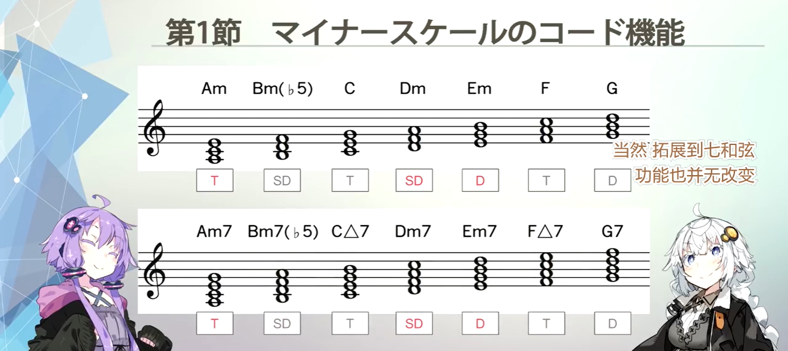
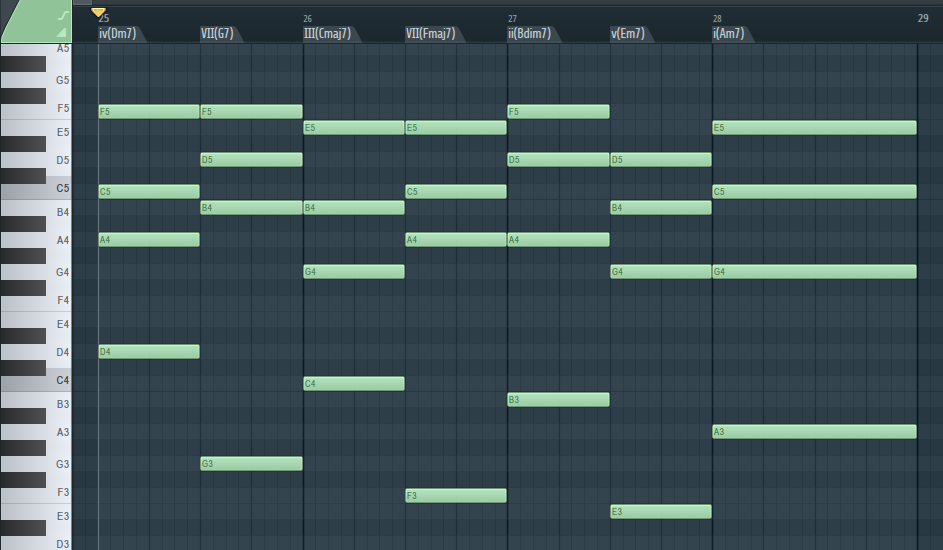
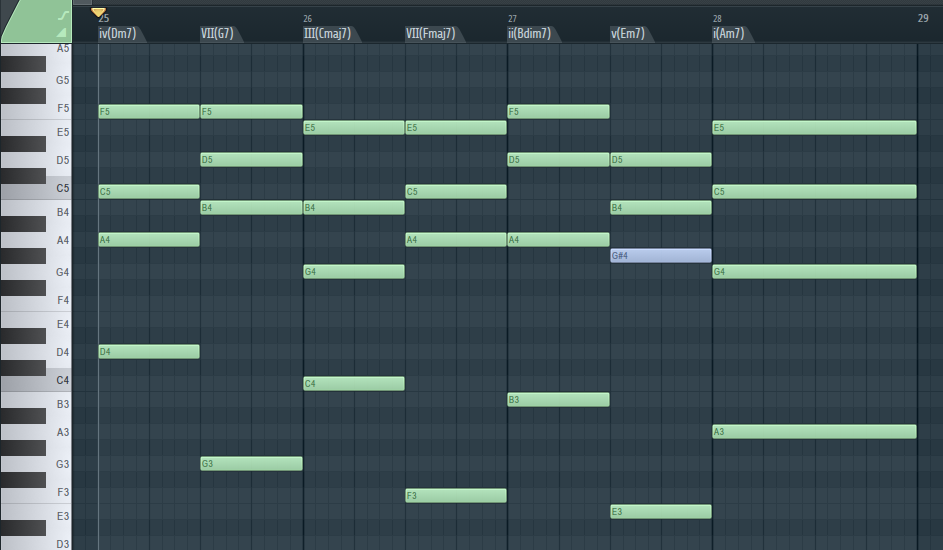
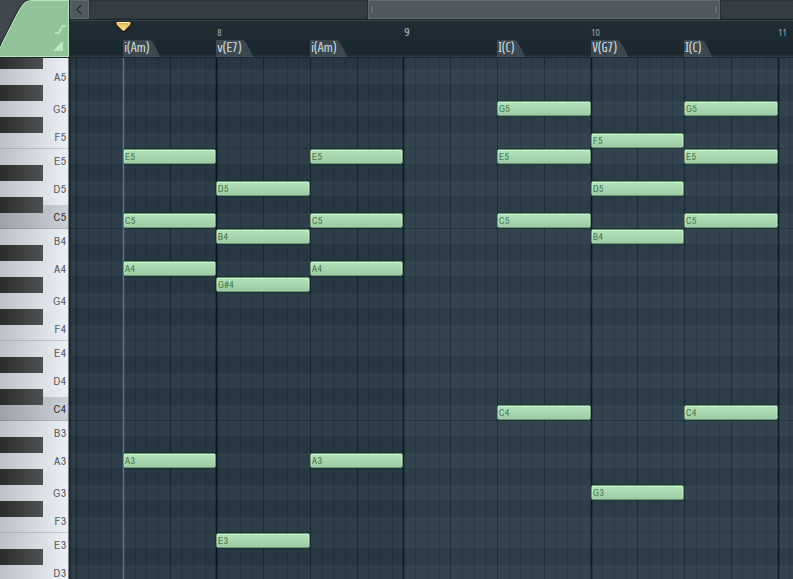
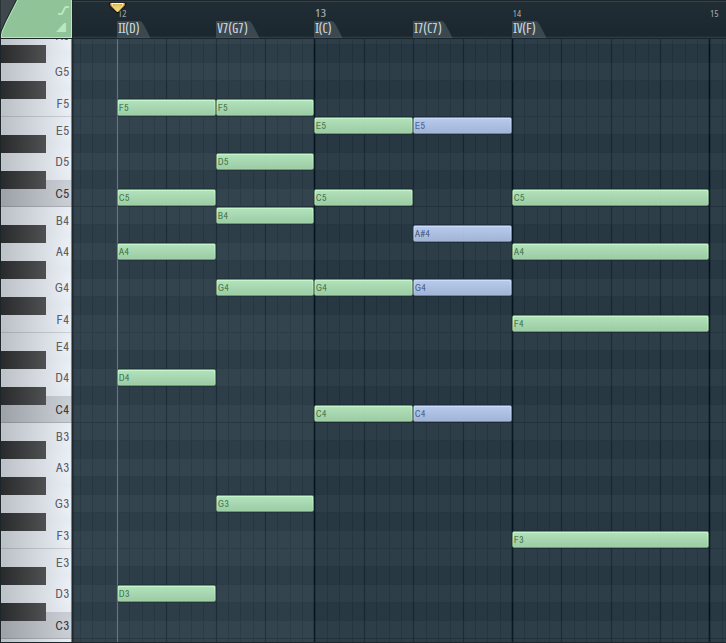
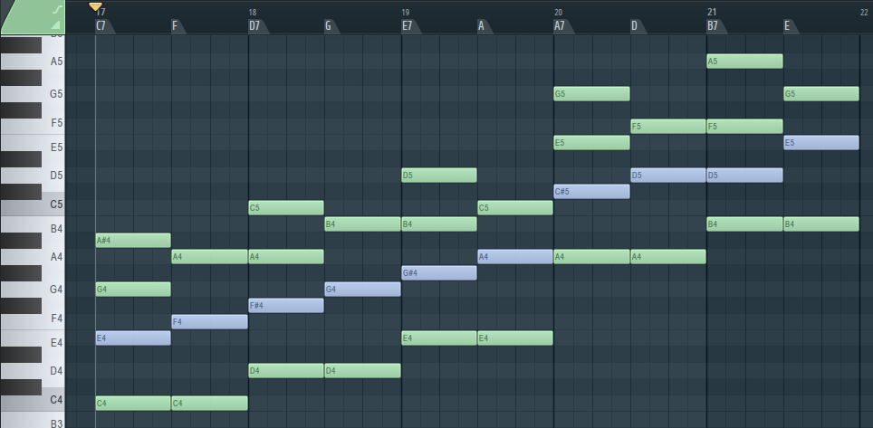
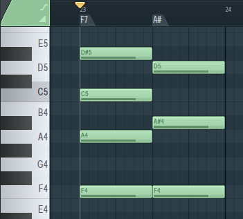

——虽然标题是这么说，但恐怕我的笔记并不是谁都能看懂：我是直接从应用篇（11p）看起了，毕竟有基础乐理和古典编曲的加成，上手应该没有太大问题。但是对于阅读该笔记的观众来说，可能不太友好，做不到让谁都能明白。

## Dominant Motion（属进行）

**属进行**，在C大调中就是普通的$\mathrm{G}^7 \to \mathrm{C}$的进行，也就是**属七和弦进行到主和弦**。

属七和弦听起来急切地想要解决到主和弦是因为：

- G到C的进行是全四度或者全五度的进行。这样的进行是**强进行**。
- $\mathrm{G}^7$内包含的三全音（叠两个小三度）非常不和谐（因为本质上是纯五度减一个半音，约等于在纯五度里面加了个小二度）
- $\mathrm{G}^7$内的B和F有分别解决到稳定的C和E的倾向。其中E稳定的原因是因为它是稳定的$\mathrm{C}$大三和弦的一部分。

## 小调中的属和弦

为了方便起见，这里就使用C大调的关系小调A小调来进行说明，这样就可以只使用白键。

### 小调的和弦功能

我们很清楚大调的和弦功能，也就是T，D和SD。首先能确定的是$\mathrm{I}$是T。类似的，$\mathrm{V}$是D。最终，介于T和D之间的SD是$\mathrm{IV}$。由于$\mathrm{iii, vi}$与$\mathrm{I}$共同音有两个（猜想主要是因为有主音C），所以它们是T。

当然，由于$\mathrm{iii}$和$\mathrm{V}$有两个共同音，就像$\mathrm{vi}$和$\mathrm{IV}$有两个共同音，所以在有T的功能的情况下似乎也可以分别带有一些D和SD的功能。

因为$\mathrm{ii}$和$\mathrm{IV}$有两个共同音，所以是SD。$\mathrm{vii}$和$\mathrm{V}$有两个共同音，所以是D。

神奇的是，小调中各级和弦的功能与大调是一样的。直接从视频中截取如下：

但是，如果不按级数来看（和弦级数，不是泰勒级数之类的），而只是按照纯粹的和弦来看（类似$\mathrm{F}^{\Delta}$而不是$\mathrm{VI}$），则会发现在C大调中是SD的$\mathrm{F}^{\Delta}$居然是T。

关系大小调中同一个和弦居然有着不同的功能，这是我之前从来没有想到过的事情。

虽然目前还不清楚要怎么加以利用（比方说关系大小调怎么转调？这样的问题还完全不明白），但是猜想可以通过有意地强调和弦功能来强调欢乐或忧伤的情绪。（也可能是强调主音？完全不明白...）

视频中说在写和弦的时候，可以将和弦在关系大小调中的不同功能考虑进去（像是$\mathrm{Em}$分别是T和D，$\mathrm{F}$分别是SD和T，$\mathrm{Bm}$分别是D和SD）。因此，先前是大调的T，同时可以被当作小调的D，从这里开始当作平行小调写，想办法强调小调的T，这样也许就能无缝衔接地在大小调之间游走了。

### 小调中的属七和弦

在A小调中，为了实现类似于C大调中$\mathrm{G}^7 \to \mathrm{C}$这样的属进行，我们首先需要强进行，也就是E -> A。

然而，E对应的七和弦$\mathrm{Em}^7$毕竟不是属七和弦，听起来效果其实满差的：

因为$\mathrm{Em}^7$实在是太和谐了。即便是强进行，也救不了。

而A小调中的属和弦，却在7级上。

为了构造属七和弦，也就是强行构造出三全音来，我们可以把$\mathrm{Em}^7$改成$\mathrm{E}^7$：

请注意蓝色高亮的音符。

通过将G变成G#，我们构造了G#, B, D这样一组三全音，同时E, G#, B形成了E大三和弦，加上D就成为了$\mathrm{E}^7$。另外值得注意的一点是G#有着到主音A的倾向性。这样，几大满足属进行的要求都已满足，我们就能够快乐地在小调中实现属进行了。

### 和声小调

由于引入了调外音符G#，我们希望能够让它依然保持在调式内，所以发明了和声小调这个东西。本质上就是把小调的七音提升一个半音。

在需要用到$\mathrm{E}^7$时强行转调即可。其他时间依然只需要正常地使用自然小调就好。

## 副属和弦

先来看A小调和C大调中，$\mathrm{V}^7$到$\mathrm{I}$的解决。

注意到属七和弦的一个特性：不论是解决到大和弦还是小和弦都是可以的。

这说明了它的通用性。

事实上，我们可以将其他的Diatonic Chord强行改为属七和弦，来链接和弦进行：

图中被强行构造出来的的$\mathrm{C}^7$就是副属和弦。

强进行是向下跳跃五度或者向上跳跃四度（就像G跳到C那样，本质上只是因为取模之后音程跨度一样罢了），因此C向上跳跃四度就是F。

在这里加入强行构造的副属和弦之后，想要跳跃到$\mathrm{F}$的倾向更为强烈。相比之下，从$\mathrm{C}$直接跳跃到$\mathrm{F}$尽管并无不妥，但是没有那种急迫感与倾向性。

### 副属和弦大全

下图展示了所有的副属和弦：

上一节中小调中的属和弦中就出现了$\mathrm{E}^7$，其实是副属和弦哦！

当然，不存在$\mathrm{F}^7$，因为它向上跳跃纯四度将会落在A#上：

利用这一点也许可以转调哦！首当其冲的应该是A#大调，或者C#小调。当然我也没学过转调所以另说啦——

另外，对于连续出现的两个属七和弦，称之为**重属和弦**。$\mathrm{D}^7 \to \mathrm{G}^7$就是一个非常好的例子。小调中则是$\mathrm{ii}^7(\mathrm{B}^7) \to \mathrm{v}^7(\mathrm{E}^7)$。不论怎样都是2级到5级呢。

## 2-5-1进行

