## 前言

虽然在很久很久以前刚入门ACM的时候就已经知道辗转相除法的存在，并且也用GCD解了不少题，不过说实话辗转相除法的原理一直不是很清楚。

直到最近做到这样一道题: [Codeforces - 343A](https://codeforces.com/contest/343/problem/A)，本以为是一道憨批构造，结果构造了两个小时都没出来，立刻自闭。

看了题解之后当即觉得基础数论白学了。毕竟能够证明$\gcd(a, b) = \gcd(b, a \bmod b)$并不代表对其有直观的理解。

后来终于在中文维基上找到了辗转相除法的直观展示，出于加强记忆以及造福他人的缘由，决定自己也多做几个例子来展示。

## 图解

首先通过几个例子图解辗转相除法，以直观地进行理解其正确性。

在理解了其直观含义后，再对Codeforces - 343A进行讲解。

### 第一个例子

无中生有地想两个数字出来作为例子是很困难的（大嘘），所以我请出了我最信赖的随机数生成器（棒读）:

```python
>>> from random import randint
>>> print(randint(1, 20), randint(1, 20))
12 10
```

于是我们将通过一个$12 \times 10$的矩形来理解这一算法:

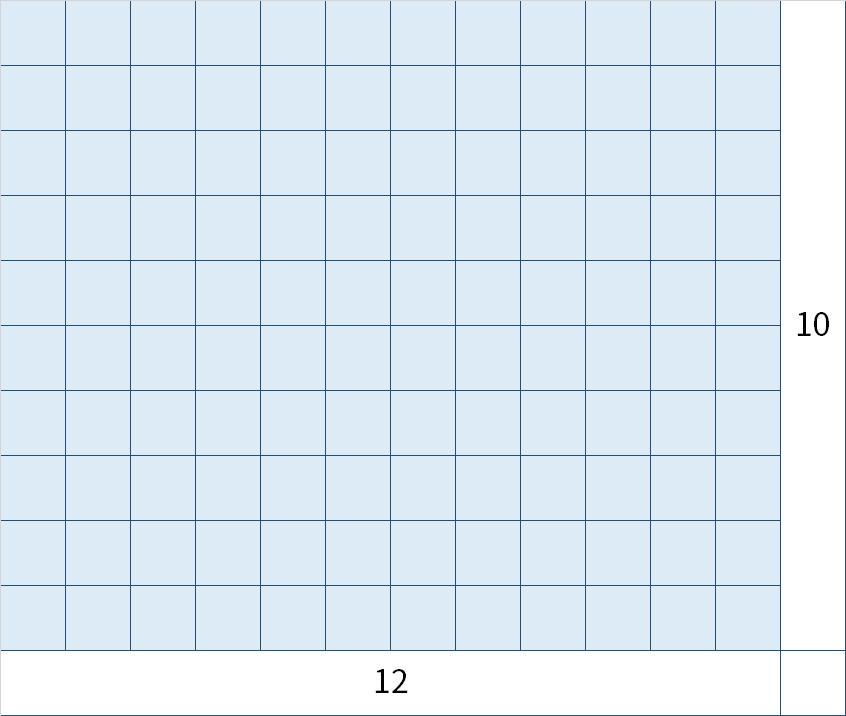

$\min(12, 10) = 10$，所以，我们从中削去$10\times 10$大小的矩形:

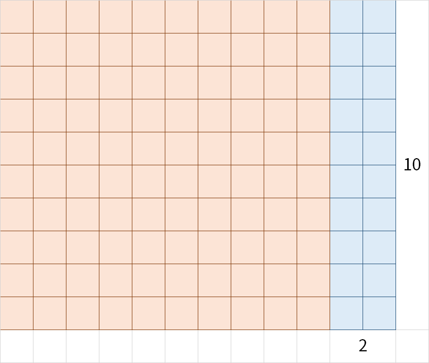

现在我们还剩下一个$2 \times 10$的矩形。可以认为问题被转化成了求$\gcd(2, 10)$。

$\min(2, 10) = 2$，所以我们从中削去尽可能多的$2\times 2$的矩形:

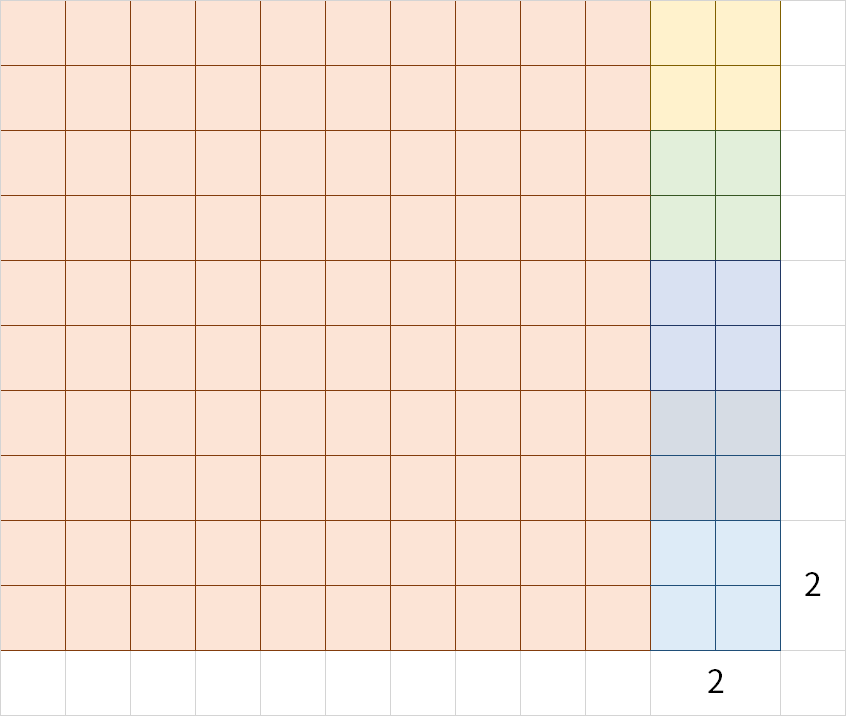

简直完美！最后还剩下$2\times 2$的矩形。这说明$\gcd(12, 10) = 2$，因为$\gcd(2, 2) = 2$。

### 第二个例子

上一个例子的$\gcd = 2$，所以这一次我们来看看$\gcd = 1$的例子:

```python
>>> print(randint(1, 20), randint(1, 20))
17 5
```


首先，重复上面的步骤，首先尽可能多地削去$5 \times 5$:

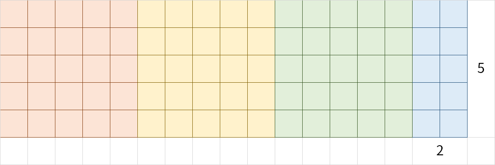

可以看到蓝色的部分变成了$2 \times 5$，等价于将问题转化为$\gcd(2, 5)$了。

现在我们继续削去$2 \times 2$:

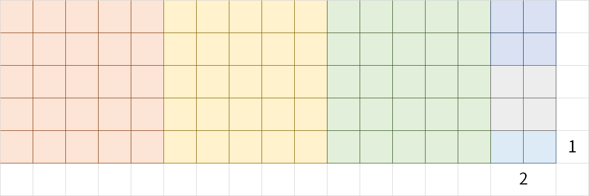

可以看到蓝色的部分变成了$2 \times 1$，等价于将问题转化为$\gcd(2, 1)$了。

现在我们继续削去$1\times 1$:


显然$\gcd(1, 1) = 1$，这说明$\gcd(17, 5) = 1$。

### 最后一个例子

只看到最大公约数为$1$和$2$总觉得还是不太够，所以这一次试试看$\gcd = 7$的:

```python
>>> print(randint(1, 60), randint(1, 60))
35 14
```

*（我才不会告诉你们为了凑出这俩数字随机了好多次呢）*

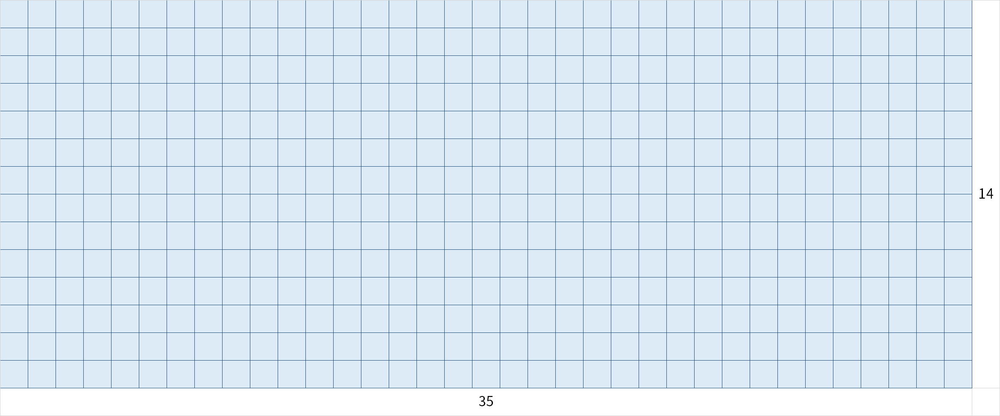

挖掉$14 \times 14$:

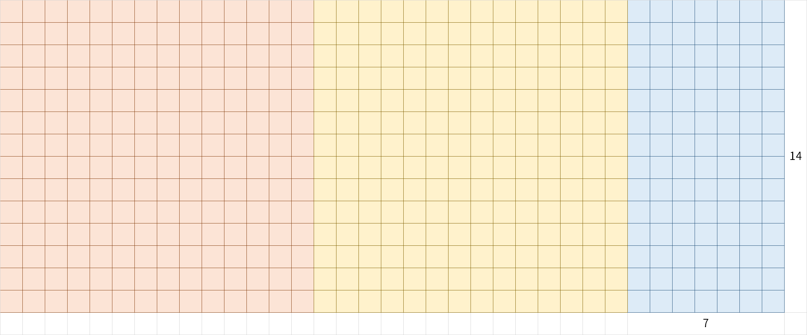

问题转化成了$\gcd(14, 7)$。挖掉$7\times 7$:

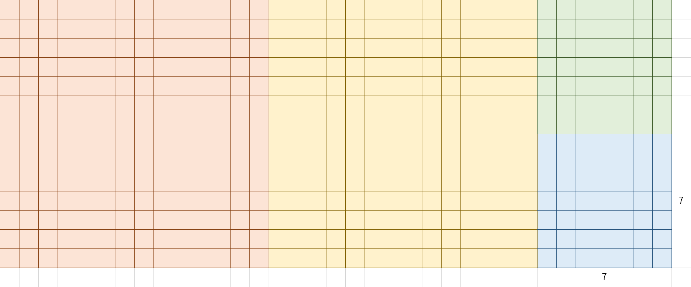

问题转化成了$\gcd(7, 7) = 7$。于是$\gcd(35, 14) = 7$。

## Codeforces 343A

### 题意

你有无限个阻值为$1\Omega$的电阻。

你要组成一个阻值为$\displaystyle\frac{a}{b}\Omega$的元件。

一个元件的定义为:

1. 一个电阻
2. 一个电阻与另一个元件串联
3. 一个电阻与另一个元件并联

请问最少需要多少个电阻?

### 输入

一行，两个整数$a, b ~ (1\le a, b \le 10^{18})$。

### 输出

一行，一个整数，代表答案。

### 解

首先，假定我们现在已经用$k$个电阻组成了一个阻值为$\frac{c}{d}$的元件。

那么通过增加一个电阻，也就是使用$k+1$个电阻，我们可以获得:

- 串联，$\displaystyle \frac{c}{d} + 1 = \frac{c+d}{d}$
- 并联，$\displaystyle \frac{\frac{c}{d}\cdot 1}{\frac{c}{d}+1}=\frac{c}{c+d}$

现在我们把它跟$\gcd$联系起来。

我们使用最后一个例子来加以说明，我们的目标分数是$\displaystyle\frac{35}{14}$。


我们从目标分数向回推，也就是说假定倒数第二步时的分数为$\displaystyle\frac{c}{d}$，那么显然有:

$$
\frac{c + d}{d} = \frac{35}{14}\\
\therefore c = 35 - 14 = 21
$$

所以上一步的分数是$\displaystyle\frac{21}{14}$，而这正等于上图去掉红色正方形之后的矩形:

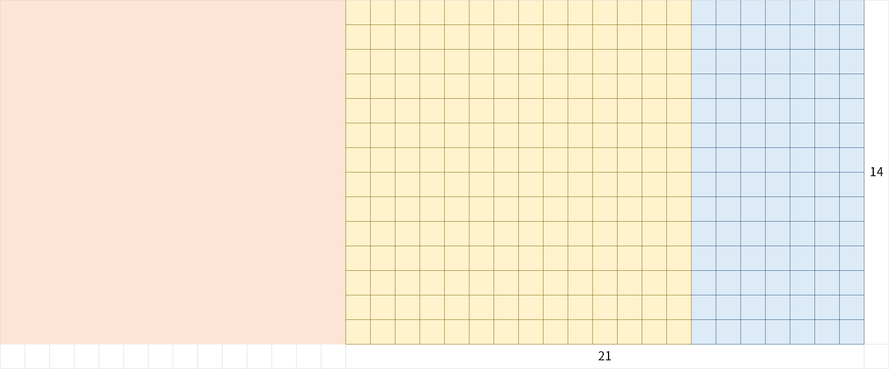

所以，如果把这一过程反过来考虑的话，可以认为我们通过在水平方向上增加了一个$14 \times 14$大小的正方形，使得分子增加了$14$。

再考虑倒数第二个例子:

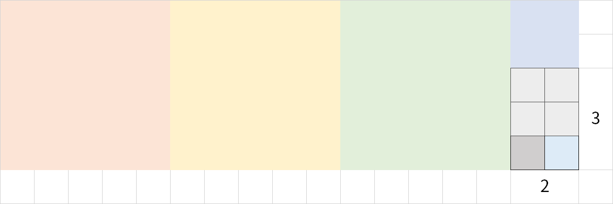

由于一行的宽度为$2$，一列的长度为$3$，所以现在我们拥有的分数是$\displaystyle \frac{2}{3}$。

当我们去掉淡灰色的$2\times 2$矩形之后，我们就会得到$\displaystyle \frac{2}{1}$:


所以，如果像上面一样反过来考虑的话，可以认为我们通过在竖直方向上增加一个$2 \times 2$大小的正方形，使得分母增加了$2$。

事实上:

- 在分子上增加一个$d$，等同于在水平方向上增加一个$d \times d$大小的正方形。
- 在分母上增加一个$c$，等同于在竖直方向上增加一个$c \times c$大小的正方形。

也就是说，每增加一个电阻，就等于逆向执行了一步辗转相除法: 从水平方向上，或是竖直方向上，增加一个正方形。

所以，最终的答案就是$\gcd(a, b)$所需要执行的**减法**次数。

注意，这里是减法，而不是**取模**次数。

这很好理解，因为从$\displaystyle \frac{7}{14}$到$\displaystyle \frac{35}{14}$需要增加**两个电阻**，而通过取模，从$\displaystyle\frac{35}{14}$到$\displaystyle\frac{7}{14}$只需要**一次运算**:$35 \equiv 7 \bmod 14.$

*当然，通过上面的论证你也会发现，其实答案就等于**最后所划分出来的正方形的个数**。*

### 代码

```c++
#include <cstdio>
#include <iostream>
#include <algorithm>
using namespace std;

using ll = long long;

ll gcd(ll a, ll b) {
    ll temp, cnt = 0;
    while (b) {
        cnt += a / b;
        a %= b;
        swap(a, b);
    }
    return cnt;
}

int main() {
    ios::sync_with_stdio(false);
    ll a, b;
    cin >> a >> b;
    cout << gcd(a, b) << endl;
    return 0;
}
```

## 正确性证明

上面只解释了为什么通过这种方法可以获得正确的解，但是并没有说明**为什么是正确的**。

首先引入$\text{Calkin-Wilf Tree}$:

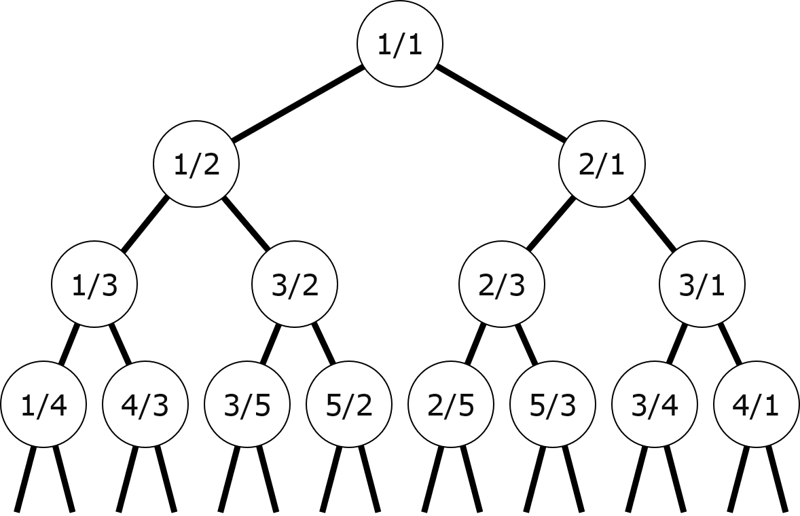

这棵树的特点是:

- 它是一棵二叉树，但不是二叉搜索树。
- 若当前节点是$\displaystyle \frac{a}{b}$，那么它的左子节点为$\displaystyle\frac{a}{a + b}$，右子节点为$\displaystyle \frac{a + b}{b}$。
- 这棵树包含了所有的分数。

显然，由左右子节点的定义可知，从父节点到子节点等同于一步逆向的$\text{Euclidean Algorithm}$:

- 向左子节点走，等于增加一个并联电阻 / 在竖直方向上放置一个$a \times a$大小的正方形。
- 向右子节点走，等于增加一个串联电阻 / 在水平方向上放置一个$b \times b$大小的正方形。

由树的性质可知，从一个节点到另一个节点的路径有且只有一条。所以，从任何一个分数，也就是树中的某个节点出发，到$\displaystyle \frac{1}{1}$，也就是根节点，**有且只有一条路径**。

这说明，**答案总是存在，并且唯一**。所以，题干中要求的"使用电阻数*最少*"，可以说只是迷惑人的。

因为答案是唯一的，所以我们求出来的值就一定是正确的，而不用去担心是否还有用更少电阻实现的可能。

同时你也应该注意到了，由于路径本身就说明了要增加的是并联电阻还是串联电阻，所以我们甚至可以画出对应的电路图来！

*P.S:Calkin-Wilf Tree是一颗二叉树这一点也在一定程度上直观地说明了为什么辗转相除法的时间复杂度是*$\mathcal{O}(\log n)$*级别的。*
