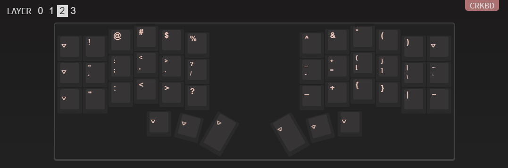

简单记录一下对键盘的看法。

## 键盘的基本属性

每个人都有各自的输入需求和偏好。如果多关注一些键盘相关的信息，你几乎总能看到人们在表达自己对不同配列的看法。例如，对于一位财务而言，数字键盘是必不可少的。因此你总能在60%，75%，87%的视频底下看到其他用户甩下一句“没有数字区狗都不用”。类似的句式还可以扩展到“没有f区怎么打dota/lol/xx游戏”，“没有方向键怎么玩游戏”，“没有小键盘怎么输入密码”等等。

不同的人的“改变”耐受度也是不同的。例如你能在planck键盘的评论区看到无法接受直列的人，也能在alice键盘的评论区看到无法接受分裂键盘的人。不是每个人都有时间，精力，乃至耐心和专注力来帮助他们适应不同的键盘方案，哪怕其中一些设计是更符合人体工程学的。

将自身的需求与喜好想当然地强加到其他人的需求上是如此常见，而许多人又喜欢拉踩，以此进一步捧高自己的选择。这也是为什么键盘社区的讨论总是没什么价值的一大原因。如果社区用户能更好地明白这一点，即他人的喜好与需求与你无关，那么社区氛围恐怕也会好一些。

### 输入频率

根据信息论和霍夫曼树，我们知道输入频率越高的字符，它的编码长度就应该越短。

然而每个人要键入的东西是不一样的。对于英语国家的用户，他们可能会需要大量输入英文，偶尔夹杂数字和特殊字符。相比之下，中国用户可能会需要更多地输入数字，因为大多数人使用拼音输入法，而它需要用户使用数字来选择候选词。

对于财务，拥有数字键盘更趁手高效。对于程序员，能快速输入各种特殊字符和符号则更重要。

在编码长度这一点上，对于以104键为代表的标准键盘而言，其实是不存在这个概念的。因为，每个字符都有对应的按键，因此编码长度总是1。然而如果你把手指移动的距离也考虑在编码长度内，那么你会发现104键的编码长度是非常长的。

进一步地，将shift作为更广义的切层键看待，你将能明白40%的核心思路。

### 对改变的耐受程度与性价比

由于qwerty和104键悲剧性的高市占率，大多数人都会使用这种键盘。公共场所，公司，学校，连比赛配备的都是这种键盘。

比它更符合人体工学的键盘在这些年发展迅猛，有很多人为它发声宣传，然而它们的市场份额却一直很小。这是为什么呢？

哪怕是看看alice键盘这种其实并不怎么人体工学的人体工学键盘的讨论区，你也能看到很多人表示无法接受。而这种相比标准键盘改动不那么大的键盘，应该是最容易被接受的。

原因不难理解：重新学一把键盘不是简单的事情。这需要痛苦漫长的重新起步和长久的练习。许多人都反映刚上手时连键在哪都不知道。alice尚且如此，planck就更不必说。

这种挫败感是极为劝退的。此外，和事实标准的不兼容，也是巨大的成本。

对于并非需要大量输入的人群，这种迁移成本是需要再三考虑的。这不仅需要耗费资金，还需要时间和精力去磨合。实际的收益又有几何，这是用户自己需要考量的问题。市场占有率已经告诉了我们究竟有多少人会给出肯定的答案。

## 激进的优化

在可预见的将来，我将以程序员作为自己的首要职业。这意味着对键盘输入的优化将会带来巨大的收益。

以下是我的选择：

- 42键，corne分体直列键盘
- 使用colemak

任意一点都是极端困难的。这意味着：

- 用组合键输入特殊字符和数字将是常态
  - 输入中文不再像以前那样轻松
- 从头学习打字

它带来的好处是：

- 任何一个手指最多只需要移动根号2个键位的距离即可输入任何字符，包括小拇指
- 对个人而言，大约67%的速度提升（60wpm -> 100wpm）
- 更小的手部损伤风险
- 很酷！

对于需要大量键入例如`&, ', (), [], {}`等按键的程序员来说，这种键盘的优势是显而易见的：

上图是我的corne的upper层的设置。我只需要用右手大拇指按下`upper`键进入layer 2，就可以使用食指向上一格输入`&`，无名指向上一格输入`(`，中指不动输入`[`，中指向下一格输入`{`。同样是组合键，这比在任何60%+键盘上使用左手小拇指按下shift再输入`&, (`要更轻松，也比使用右手小拇指疯狂向右上方伸展来够到`[, {`要更舒适。更不用说backspace了。

切层只需要两个按键就能提供$2^2=4$层的功能。在42键的键盘上，在考虑到编码长度的情况下，2键以内能输入的字符数是$(42-2)\times3=120$个。代价是，你需要记住自己设定的额外两层按键，形成肌肉记忆。同时你要习惯用大拇指来切层：大拇指不再只是用来按空格的了。

colemak在这基础上，更多地只是锦上添花：对于英文输入，高频字符都在home row上，意味着手指上下移动距离也更短，更舒适。它带来的坏处是，常见的vim快捷键需要重新设定。在许多工具面前这相当于是额外的入门成本，因为你总需要比别人更多折腾才能用得开心。

## 总结

选购键盘时，认清自己的核心需求和偏好，以及耐受能力和成本。之后则是不断地试错，认清自己真正的喜好和需求。这是一个漫长的过程，但是当到达终点时，你会发现拥有一把趁手的工具是完全值得的。
